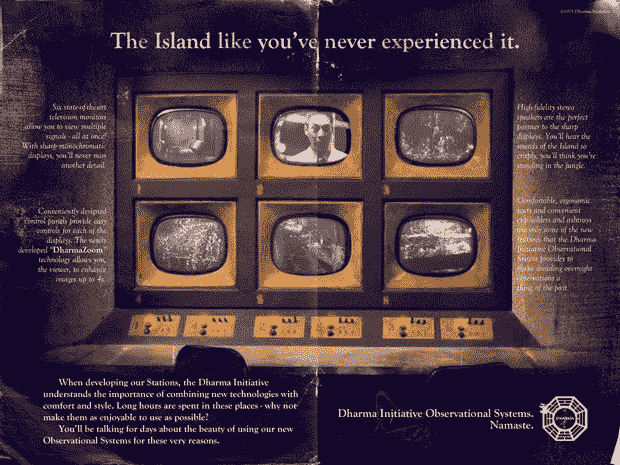

# 《迷失的四个理由》将作为一部糟糕的电视剧载入史册 TechCrunch

> 原文：<https://web.archive.org/web/https://techcrunch.com/2010/05/22/the-four-reasons-lost-will-go-down-in-history-as-a-bad-tv-show/>

 失落的这个星期天就要结束了。也是时候了。至少故事实际上结束了，而不是随波逐流，直到节目因为糟糕的收视率而被取消。但是，我仍然觉得有太多的松散的结束，明天不会回答。

这不是一个聪明的谜的迹象。这简直是糟糕的故事，所以我向你提交了《迷失》是一部糟糕的电视剧，不值得它在过去六季中得到所有关注的四个原因。

这是必须的***剧透警告*** 标签，尽管你无法避免下周失去的消息，所以你最好现在就忘掉它。

##  1。一个主要的对手从未建立

还记得前两季吗？赤脚的其他人是坏人。然后达摩组织和本接管了这个角色，其他人则换了阵营。然后，我们了解到达摩组织实际上只是书呆子嬉皮士，查尔斯·怀德莫尔接管了这个试图杀死岛上所有人的坏家伙。但是，等等，他只是雅各布的另一个棋子，真正的坏人是老斯莫奇，他以前似乎是这个岛的看门人。

挑剔的观众总是质疑这部剧开始时是否知道结局。虽然我肯定编剧们从一开始就知道整个故事，但他们可能不知道需要多少绒毛来填充一季。毕竟，电视网的核心商业模式是让观众观看广告，而成功的节目通常都是为了欺骗人们观看这些广告。

## 2.故事弧线永无止境

长期播出的电视节目的关键是同步的故事情节。理想情况下，一个弧应该结束，而另一个弧正在全面展开，下一个弧显然在地平线上。《迷失》从未结束任何故事情节，而是让观众悬而未决，同时分散他们的注意力，让他们疯狂地偏离主题。有时候，就像 Walt 的故事一样，arc 看起来似乎被很好地包裹起来，但不知从哪里来的，很明显事实并非如此。

《迷失》的编剧和创作者正在尝试新的东西。他们几乎违背了所有传统的电视节目指南，创造了一些表面上看起来完全不同的东西。结果有所不同，但与讲好故事无关。

## 3.《迷失》从未真正适合任何类型，因此错过了一个巨大的机会

科幻节目是给书呆子看的，只有家庭主妇看电视剧，女人讨厌动作片，但《迷失》试图吸引所有这三种人群，但没有完全投入其中一种。

科幻/奇幻节目都是关于神话和科学的。编剧本可以创造这个丰富而深刻的故事情节，用全新的方式讲述善与恶的故事，用新的符号和类比来完成。作者可能创造了另一个矩阵。但是他们没有。相反，这是一个关于发光的井的故事，它将人们变成烟雾怪物，出于某种原因，如果它离开这个神秘的岛屿，将会释放所有的地狱。

《迷失》一开始是一部动作片。这可能是有意的，因为男性和女性都从中得到了一些东西。但通过展示这些人上飞机前的蹩脚生活，它很快变成了一部准戏剧。我们知道凯特是个杀手，杰克是个混蛋，索耶是个懒惰的骗子，而 Eko 是个毒贩。但是个人倒叙只持续了一集，我们不得不忍受其他人的背景故事，然后才会循环回到某个特定的角色身上。

在这些随机的背景故事之间，真正的行动将会发生。但是当它变得越来越好的时候，标志性的失落的语调会逐渐加强，故事会从岛上跳到看着杰克在澳大利亚找到他的父亲。每集 20%是岛上发生的事情，40%是背景故事，40%是商业广告。

我们现在肯定地知道，大量的背景故事只是为了证明雅各布的选择是正确的，但肯定有更好的方法来混合一下。

当然，每个观众可能都希望《迷失》是一个不同的节目。我想要一个更科幻的主题。然而，其他人可能想要更多的凯特-杰克-索耶式的爱情。

## 4.这么多问题

在过去的六季中，有太多的问题没有得到解答。许多以前的故事弧像整个达摩计划现在看起来微不足道。一个人真的可以看完前两季和最后一季，了解整个故事。这期间发生的几乎所有事情都是无关紧要的。

1.   岛屿为什么会移动？
2.  谁制作了这个巨大的四趾雕像？
3.  为什么它只有四个脚趾？
4.  为什么这个岛是一块超级磁铁？
5.  雅各布和斯莫基的继母是从哪里来的
6.  谁告诉了雅各布这个岛的秘密？
7.  达摩组织是如何建造大型建筑的？
8.  达摩组织是怎么知道这个岛的？
9.  理查德怎么能离开这个岛呢？
10.  周围有很多尸体，为什么斯莫奇需要洛克的尸体？
11.  为什么这个岛治愈了一些人，却没有治愈另一些人？
12.  为什么达摩女在岛上不能怀孕？
13.  为什么斯莫奇不能飞过声纳围栏？
14.  为什么一圈灰烬能抵御烟雾？
15.  为什么斯莫奇会放过一些人？
16.  沃尔特在最后的游戏中扮演什么角色？
17.  这些数字有什么意义，它们与雅各布有什么联系？

还有很多问题。很悲哀，真的。《迷失》具备了一部伟大电视剧的特质，但是有太多的细节需要明天去完成。一个很好的经验法则是，如果一部剧在大结局后需要一个问答环节，那么编剧们没有做好他们的工作。

【酷炫复古达摩广告[热流星](https://web.archive.org/web/20221007221138/http://www.flickr.com/photos/hotmeteor/sets/72157615214095434/)