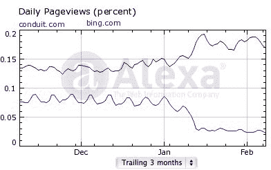

# 必应的崛起和 Conduit 的流量下降之间有趣的巧合 TechCrunch

> 原文：<https://web.archive.org/web/http://techcrunch.com/2011/02/10/the-funny-coincidence-between-bings-rise-and-conduits-declining-traffic/>

# 必应的崛起和 Conduit 的流量下降之间有趣的巧合

去年 12 月，工具栏初创公司 [Conduit](https://web.archive.org/web/20230203071323/http://www.conduit.com/) 宣布放弃谷歌搜索[，转而支持必应](https://web.archive.org/web/20230203071323/http://blog.conduit.com/2010/12/01/bing-%E2%80%93-it-has-a-nice-%E2%80%98ring%E2%80%99-to-it-2/)。

一月份，必应[在搜索市场的份额激增](https://web.archive.org/web/20230203071323/http://blogs.forbes.com/ericsavitz/2011/02/08/bing-january-a-bell-ringer-for-microsofts-search-engine/)，上升了 2 个百分点，达到 12.8%。

你不会认为管道是上涨背后的主要力量。但数据显示确实如此。

Conduit 不仅抛弃了谷歌，转而支持必应。他们也改变了搜索的方式。他们之前把谷歌搜索结果放在自己的域名上。现在，当有人从管道工具栏搜索时，用户的结果会直接显示在 Bing.com 上。因此，Conduit 正在丢失所有这些页面浏览量，并将它们发送到 Bing。

看看来自 Alexa 的 Bing 和 Conduit 的对比:

康姆斯克显示出大致相同的镜像效应。1 月份，必应在全球范围内的页面浏览量比 12 月份增加了 1.38 亿次，而 Conduit 同期损失了 1.65 亿次。

巧合，还是因果？管道搜索交易可能比宣布时任何人意识到的都要重要得多。