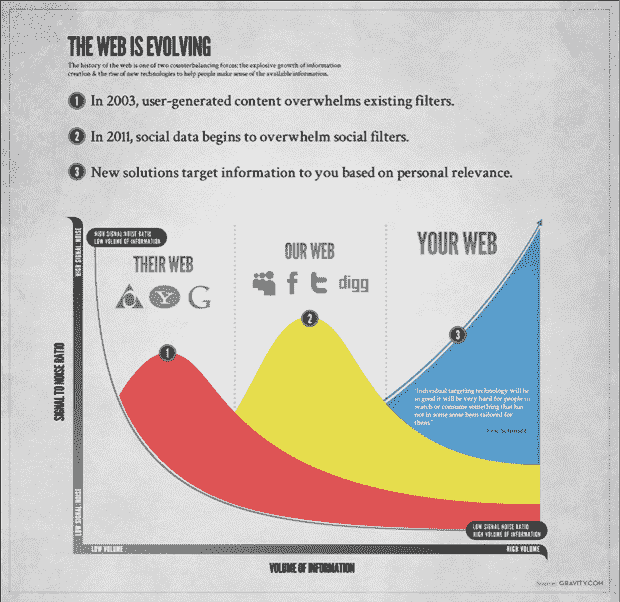

# 未来将是个性化的 

> 原文：<https://web.archive.org/web/http://techcrunch.com/2010/11/16/the-future-will-be-personalized/>

当我和我的伙伴们加入 MySpace 时，我们非常幸运地站在了这场改变我们使用互联网方式的社会革命的前沿。一个新的浪潮正在到来，再次改变了网络:个人革命。

**信息过载**

今天，我们生活在一个不断被信息淹没的世界里。每天有超过 9000 万条推文，每分钟有 34 小时的 YouTube 视频上传，每个脸书用户平均有 130 个朋友，这些朋友变得越来越活跃。当内容农场充斥搜索结果时，当传统网站(如《纽约时报》和《ESPN 》)上每天都有成千上万篇文章时，我们也会经历这种情况:其中只有少数文章符合我们的个人兴趣。

信息的泛滥并不是一个新现象。随着组织信息的新技术与创造和传播信息的新技术的斗争，网络上的信噪比发生了很大的波动。

他们的网络:互联网的早期

早期，内容是由专业人士创作和组织的。起初，它被包含在像美国在线这样的网络中，美国在线是互联网的先驱之一。随着互联网的开放，雅虎！与雅虎一起出色地组织了开放网络！目录。但最终信息量甚至超过了目录的负荷，像谷歌这样的搜索公司引入了一种更好的方法来找到我们感兴趣的内容。通过了解网站如何相互链接，谷歌应用新的科学来寻找问题本身的解决方案。它工作得非常好，每个网站都是为这个框架优化的搜索引擎。

**我们的网络:当代**

2003 年，用户生成的内容通过 MySpace 和 YouTube 等网站成为主流，创建的信息量急剧增加。

*“每两天，我们创造的信息量就和 2003 年一样多。”谷歌首席执行官埃里克·施密特*

搜索引擎并不是为了有效地组织这些社交和实时数据而设计的。因此，像脸书和 Twitter 这样的创新公司通过授权我们信任的朋友和人们为我们组织信息，创造了一个社交过滤器。这个新的过滤器让我们获得了比我们想象的更多更好的信息。就像搜索一样，它非常有效，每个网站都为此框架进行了社交优化。

阅读这篇文章的许多人都是社交技术的狂热用户。像我一样，你可能开始在你的社交流中经历信息过载。那里有很棒的内容，但是越来越难找到了。用工程术语来说，信噪比在下降(或者，作为推论，工作回报比在上升)。而且，随着越来越多的人在社交和实时网络中变得更加活跃，这个问题只会变得更糟。

**你的网络:未来**

想象一下，打开任何网页或应用程序，呈现给你的都是完全个性化的体验。去 ESPN.com，看看关于你喜欢的运动和你关注的球队的报道。查看您的每日 Groupon，寻找符合您兴趣的交易。从 Foursquare 接收关于您想去的餐馆的更新。这就是事情的发展方向。这是从你试图找到正确的信息到正确的信息找到你的转变。

过去，我们缺乏数据和技术来实现这种个人体验。但这种情况正在迅速改变。淹没我们社交流的大量社交数据不仅提出了问题，也提出了解决方案。使用自然语言处理和语义分析来评估你的推文、状态更新、喜欢、分享和签到，有可能建立对你是谁和你感兴趣的事情的整体理解。

一旦网络知道了你的兴趣，它就可以开始改变…任何网站或应用程序都可以利用你的兴趣来给你一个个人体验。

音乐遵循类似的进化路径。音乐发现已经从由专业人士(DJ，MTV)策划发展到被社交媒体(混合磁带，播放列表)介绍，再到围绕你的个人兴趣组织(Pandora)。

所有这一切并不意味着编辑走开或者你朋友的推荐不重要。相反，这是一个完全聚焦于你的新镜头。

****

**建立个人网络:进入重力兴趣图**

自然语言处理和语义技术领域令人难以置信的学术和商业研究为我们今天的成就奠定了基础。在个人网络成为现实之前，我们还有很长的路要走。Gravity 将是未来几年致力于个人网络的众多公司之一。当用户连接到服务时，我们的平台将允许合作伙伴个性化他们的体验。我们平台的基础是我们称之为兴趣图的东西，它是你兴趣的在线表示，包括你的依恋强度及其随时间的轨迹。

为了立即查看您的兴趣图并帮助我们调整算法，我们希望您能玩玩 twin Interest(gravity.com/labs)并向我们发送反馈。

***编者按:**这是[重力](https://web.archive.org/web/20230202215205/http://www.crunchbase.com/person/amit-kapur)[的联合创始人兼首席执行官阿米特·卡普尔](https://web.archive.org/web/20230202215205/http://gravity.com/)的客座博文。*