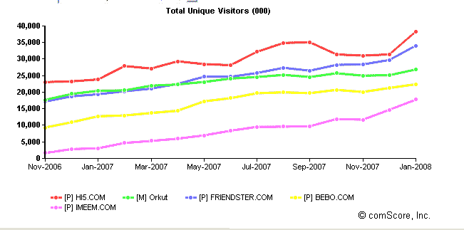
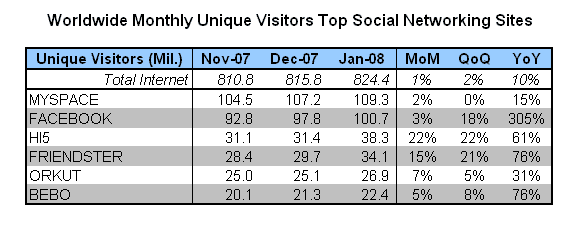

# 社交网络全球竞赛升温。关注 Hi5、Friendster 和 Imeem 

> 原文：<https://web.archive.org/web/https://techcrunch.com/2008/02/27/the-global-race-among-social-networks-heats-up-keep-an-eye-on-hi5-friendster-and-imeem/>

在争夺全球顶级社交网络的竞赛中，MySpace 和脸书旗鼓相当。根据 comScore 的数据，2008 年 1 月，MySpace 仍然是全球最大的社交网络，拥有 1.09 亿独特访问者。但脸书紧随其后，有 1.01 亿人。(与此同时，美国脸书的数据至少显示出增长可能放缓)。

当 MySpace 和脸书在争夺第一名的时候，回到第二组，一些有趣的冲刺和混战正在进行，值得关注。第二组中的每个人(Hi5、Freindster、Orkut、Bebo、Imeem)在全球独一无二的访问者方面都是领导者的三分之一到四分之一，所以我在上面的图表中隔离了他们的表现(很难看出你是否包括第一和第二名，MySpace 和脸书)。

今年 1 月，Hi5(红色，第 3 名)和 Friendster(蓝色，第 4 名)都试图摆脱谷歌的 Orkut(绿色，第 5 名)和 Bebo(黄色，第 6 名)。后两者保持着更稳定的步伐。紧随其后的是 Imeem(7 号，紫色)，超过了 multiple(8 号，未显示)。下图显示了除最近两个统计数据之外的大部分统计数据——2008 年 1 月，Imeem 的全球访问者人数为 1780 万，年增长率为 477%(乘以 1760 万，比上一年健康增长 203%)。

对于 Hi5 和 Friendster 来说，全球增长是他们游戏计划的重要组成部分。例如，Friendster，对我们大多数美国人来说已经不再受关注，但它现在是亚洲最大的社交网络。排名前五的国家是菲律宾、印度尼西亚、马来西亚、美国(从未离开的传统成员，加上这里亚洲人的新增长)和新加坡。Friendster 通过为亚洲流行歌手推出粉丝个人资料页面，自 9 月以来推出了四种新语言(汉语、T4 语、日语、韩语和西班牙语),并让开发人员为其网站创建应用程序。

那么，这是否意味着 Friendster 和 Hi5 的价值超过了传闻中 Bebo 以 10 亿美元的价格卖出的价格？不一定。这取决于其成员的实际构成、点击率和其他财务因素。一般来说，广告客户喜欢根据地理位置来定位他们的广告活动，对于针对人均消费能力低于美国、日本或欧洲的人群的广告，他们会支付更少的费用。因此，对广告商来说，并不是所有的会员都有同样的价值，因此对潜在的收购者来说也是如此。但随着社交网络在美国变得饱和，每个人都将不得不把目光投向海外以保持增长。

