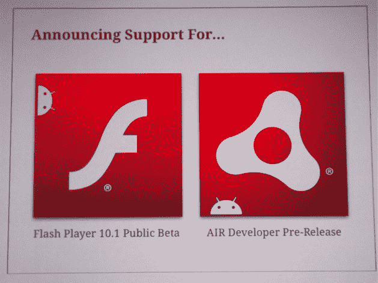
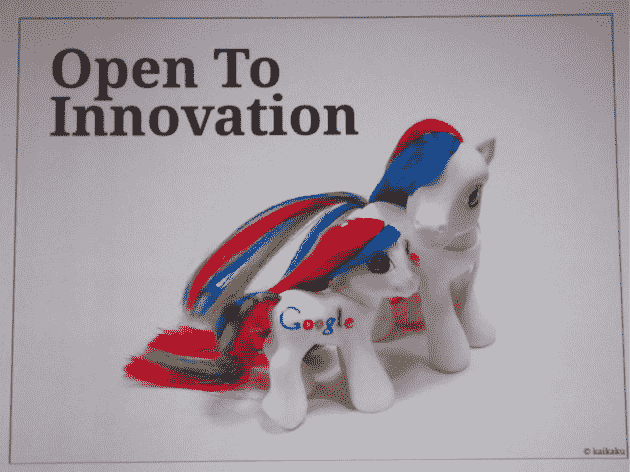
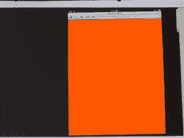

# 手套正式摘下:谷歌 Vs 苹果

> 原文：<https://web.archive.org/web/https://techcrunch.com/2010/05/20/the-gloves-are-officially-off-google-vs-apple/>

# 手套正式摘下:谷歌对苹果

在今天早上的 I/O 主题演讲中，谷歌的维克·冈多特拉展示了 Android 2.2，Froyo 的所有简洁的功能，但房间里最大的大象是苹果和两大巨头之间日益紧张的关系。冈多特拉享受了对 iPhone 制造商的几次抨击，嘲笑苹果不支持 Flash(iPad 相对较慢的加载时间)，并试图控制移动生态系统。他的开场白定下了基调:谷歌不想要一个人[控制](https://web.archive.org/web/20230316224513/https://techcrunch.com/2010/05/20/live-blogging-the-second-google-io-keynote-the-day-of-android-and-google-tv/)移动的未来。嗯，那会是谁呢？

谷歌试图表达一个明确的信息:苹果是封闭的，我们是开放的。冈多拉至少说过十几次“开放”这个词。这个主题在整个主题演讲中反复出现了几次，在某一点上，冈多拉转向观众，简单地说:“事实证明，在互联网上，人们使用 Flash…开放意味着你是包容性的，而不是排他性的。”

冈多特拉还利用他的演讲反驳了史蒂夫·乔布斯之前的评论，最尖锐的是，乔布斯最近声称:“在移动设备上搜索还没有发生。搜索并不流行，人们不像在桌面上那样在移动设备上搜索。”根据 Gundotra 的说法，事实并非如此，他宣称谷歌在过去的两年里在所有智能手机上的搜索量增长了 5 倍。“人们喜欢谷歌搜索，”冈多特拉说。

当然，iPad 和新的 iPhone 操作系统也未能幸免于 Gundotra 的攻击。在几次演示中，冈多特拉将 iPad 的速度与 Android 2.2 进行了对比测试。令人惊讶的是，Android 2.2 的表现一直都很出色，而且经常是大幅度的。冈多特拉展示了一台运行 Nickelodeon 的 iPad，它挂在橙色屏幕上，而 Android 2.2 驱动的设备快速通过。他说他给女儿看了带点唱机的 iPad，当她看到空白的橙色屏幕时，“她说爸爸我能玩你的安卓吗？”

谷歌还展示了其新的云/消息 API，该 API 将允许开发者发送消息来触发 Android 意图。“这不是一个推送通知 API，旨在弥补操作系统中多任务等功能的缺乏，”冈多特拉微微一笑说。哦，太好了。

用最好的 zings 更新。

关于安卓即将推出的无线音乐下载功能与苹果的无线同步功能的对比:“我们发现了一个非常酷的东西，它叫做互联网。”