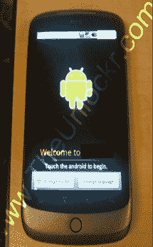

# 解锁的谷歌手机(已证实及更多细节)

> 原文：<https://web.archive.org/web/https://techcrunch.com/2009/12/12/the-google-phone-unlocked-confirmed-and-more-details/>

# 解锁的谷歌手机(已确认及更多细节)

昨晚，我们开始看到来自谷歌员工和其他人的一些[推文，内容是关于一款新的基于安卓系统的谷歌手机，这款手机显然是在一次“全体会议”上分发的。现在](https://web.archive.org/web/20230304122058/https://techcrunch.com/2009/12/11/google-phone-zomg/)[谷歌证实](https://web.archive.org/web/20230304122058/http://googlemobile.blogspot.com/2009/12/android-dogfood-diet-for-holidays.html)它确实在和全球员工一起“狗粮”测试一款新的安卓设备。

但这不仅仅是另一部安卓手机。看过这款手机的非常可靠的消息来源称，这是我们上个月第一次报道的谷歌手机(尽管不知情的人说我们在做梦)。它将被打上谷歌的标签，由谷歌作为解锁手机出售，这可能会改变一切。正如我们在最初的帖子中所写的:

> 谷歌正在打造自己的品牌手机，他们将直接或通过零售商销售。他们早就计划在假期推出这款手机，但现在已经推迟到 2010 年初了。这款手机将由一家主要的手机制造商生产，但将只有谷歌品牌(微软对他们的第一款 Zunes 做了同样的事情，这款手机是由东芝制造的)。
> 
> 在手机的功能设计上不会有任何谈判或妥协——谷歌决定了它的每一个细节。Android 操作系统的分裂不会导致一些应用程序无法使用。就像苹果的 iPhone 一样，这款手机将是谷歌对手机的纯粹愿景。

这款手机本身由 HTC 制造，谷歌提供了大量投入。这似乎是 HTC Passion 或相关 HD2 的定制版本( [Unlocker 在 10 月份获得了一些泄露的图片](https://web.archive.org/web/20230304122058/http://theunlockr.com/2009/10/16/what-new-htc-android-phone-is-this/)，这些图片是同一款手机)。**更新**:这里有一张[更近的图片](https://web.archive.org/web/20230304122058/https://techcrunch.com/2009/12/12/nexus-one-google-phone-picture/)。

以下是我们目前所知的关于这款手机的细节:它将被称为谷歌手机(Google Phone)(**update**，官方名称为“Nexus One”)，将于 2010 年 1 月初发布。它不会被任何一家运营商出售，而是一部解锁的 GSM 手机。在美国，这意味着 T-Mobile，可能还有 AT & T，他们与 iPhone 的独家协议即将到期。它将运行安卓 2.1

一位看到手机投入使用的人说，手机“真的，真的很快”。它运行在骁龙芯片上，有超高分辨率的有机发光二极管触摸屏，比苹果手机薄，没有键盘，还有两个麦克风。手机背面的麦克风有助于消除背景噪音，它还有一个“奇怪的”手机大摄像头。如果你不喜欢触摸屏键盘，语音到文本的功能应该可以让你直接对着电话口述电子邮件和笔记。