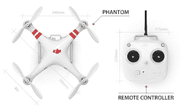
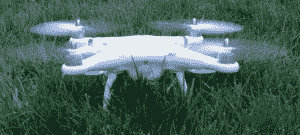

# 启用 GPS 的 DJI 幻影四轴飞行器制造了 AR。无人机看起来像玩具

> 原文：<https://web.archive.org/web/https://techcrunch.com/2013/04/01/the-gps-enabled-dji-phantom-quadcopter-makes-the-ar-drone-look-like-a-toy/>

 回到 2010 年，我们自己的约翰·比格斯恰如其分地[描述了](https://web.archive.org/web/20230313195222/https://techcrunch.com/2010/10/20/review-parrot-ar-drone/)鹦鹉的 AR。无人机是“他很久很久以来见过的最酷的东西。”此后，Parrot 推出了 [AR。无人机 2.0](https://web.archive.org/web/20230313195222/https://techcrunch.com/2012/03/01/parrot-ar-drone-2-priced-at-300-available-for-pre-order/) 虽然它仍然是一个非常酷的小工具，但自 2010 年以来，四轴飞行器已经走过了很长的路。上个月， [DJI](https://web.archive.org/web/20230313195222/http://www.dji-innovations.com/) 公司的人，他们主要致力于开发商业用途的无人驾驶航空系统，给我送来了他们的一款面向消费者的带 GPS 功能的 [DJI 幻影](https://web.archive.org/web/20230313195222/http://www.dji-innovations.com/products/phantom/overview/)进行评测。

大多数四轴飞行器都是针对业余爱好者的，需要大量的组装和至少一些驾驶遥控飞机的经验。幻影标价为 849 美元，但目前的零售价约为 680 美元，大部分是预组装的，非常容易飞行，这要归功于它内置的指南针和 GPS 模块。由于内置了 GPS，无人机总是知道自己相对于你的位置。因此，根据你飞行的模式，你给出的每一个输入都会被解释为与你相关，而不是与飞机的前部位置相关(这里有一个视频[解释这是如何工作的](https://web.archive.org/web/20230313195222/http://www.youtube.com/watch?feature=player_embedded&v=qubl3_NOHg4))。

GPS 模式的另一个很酷的地方是，即使刮风，无人机也可以在指定位置悬停。由于其内置的自动驾驶仪，它会自动校正风力(然而，当你试图拍摄视频时，你可能会想关闭这种模式，因为不断的校正会显示在你的视频中)。

如果幻影失去了与你的遥控器的连接，如果它飞到了够不着的地方，或者你的遥控器电池没电了，无人机本身的电池电量很低，或者因为你关闭它来看看自动驾驶仪是否真的工作，这个自动驾驶仪也会启动。一旦故障保护模式启动，无人机将简单地飞到 60 英尺，飞回它第一次起飞和降落的地方。我真的试过了，效果出奇的好。无人机降落在离我发射的地方只有 3 英尺的地方。当你在无人机上花了 700 美元，在 GoPro 3 Silver 上花了 300 美元左右，这是一个很好的功能。

幻影是 AR.Drone 之类的东西的明显进步。它的通信距离不到 1000 英尺，最大水平速度约为每秒 32 英尺，下降速度接近每秒 20 英尺。速度很快，如果你只是在学习如何驾驶它，感觉会更快。

这些[规格](https://web.archive.org/web/20230313195222/http://www.dji-innovations.com/products/phantom/specifications/)表明这不仅仅是一个玩具，而且实际上可以用于一些[非常令人印象深刻的](https://web.archive.org/web/20230313195222/http://www.youtube.com/watch?feature=player_embedded&v=ShVG-oU-wag)空中摄影。事实上，自从幻影今年早些时候推出以来，一个完整的生态系统已经围绕着它涌现出来，为车主提供从[改进的螺旋桨](https://web.archive.org/web/20230313195222/http://tppacks.com/store/index.php?route=product/product&path=60&product_id=64)到[外壳](https://web.archive.org/web/20230313195222/http://www.tradecraftcases.com/shop/dji-phantom-toughcase/)和[多轴相机万向架](https://web.archive.org/web/20230313195222/http://www.quadframe.us/products/gopro-2-axis-gimbal-for-phantom)的一切。顺便说一下，万向节不是必须的，但如果你想拍摄真正稳定的视频而没有所谓的“果冻”效应(这里有一个非常极端的例子)，万向节和一些平衡良好的售后转子肯定会有所帮助。

这是我周末用幻影和 GoPro 3 White 拍摄的视频:

【YouTube http://www.youtube.com/watch?v=0VBOSfbhacY？feature = player _ detail page & w = 640 & h = 360]

Phantom 的电池续航时间不到 15 分钟，所以鉴于包装中只包括一块 2200 毫安时的电池和一个充电器，你可能想至少再买一块。

如果你决定买一个，顺便说一句，在你打开它之前，确保你阅读了说明书并且观看了这个系列的视频。幻影可能看起来像一个玩具，很容易飞行，但这是一项非常高端的技术，在你第一次飞行之前，有一些事情你需要知道和做。

随着 [2013 NAB Show](https://web.archive.org/web/20230313195222/http://www.nabshow.com/) 即将到来，可以肯定 DJI 将在未来几天发布几款新产品，我们将确保密切关注这家公司。