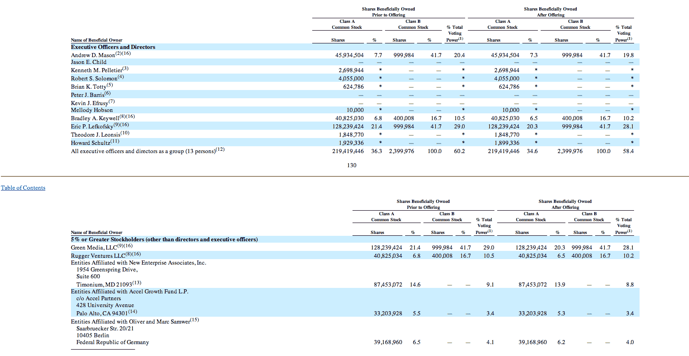

# Groupon IPO:每个人都值多少钱？

> 原文：<https://web.archive.org/web/https://techcrunch.com/2011/11/04/the-groupon-ipo-whats-everyone-worth/>

# Groupon IPO:每个人都值多少钱？

| **个人** |  | **股份** |  | **身价** |  | **投票%** |
| 首席执行官安德鲁·梅森 |  | 46,934,488 |  | $1,220,296,688 |  | 19% |
| 前首席技术官 Kenneth M. Pelletier |  | 2,698,944 |  | $70,172,544 |  |  |
| 前首席运营官罗伯特所罗门 |  | 4,055,000 |  | $105,430,000 |  |  |
| 布莱恩·k·托蒂 |  | 624,786 |  | $16,244,436 |  |  |
| 董事会成员梅洛迪·霍布森 |  | 10,000 |  | $260,000 |  |  |
| 联合创始人布拉德利·a·基威尔 |  | 624,786 |  | $1,071,850,988 |  | 10.2% |
| Lightbank 风投 Eric P. Lefkofsky |  | 129,239,408 |  | $3,360,224,608 |  | 28.1% |
| 董事会成员西奥多·j·莱昂西斯 |  | 1,848,770 |  | $48,068,020 |  |  |
| 星巴克主席霍华德·舒尔茨 |  | 1,899,336 |  | $49,382,736 |  |  |
| 新企业联合公司 |  | 87,453,072 |  | $2,273,779,872 |  | 8.8% |
| 加速增长基金有限责任公司 |  | 33,203,928 |  | $863,302,128 |  | 3.4% |
| MyCityDeal 的奥利弗&马克·萨姆尔 |  | 39,168,960 |  | $1,018,392,960 |  | 4% |

在三年内从卖带手电筒的拖鞋发展成为拥有 1 万名员工的企业后，Groupon 今天进行了首次公开募股，大张旗鼓地进行了公开募股，结果却引起了相反的反应。此次发行的定价为 20 美元，经历了 28 美元的强劲开盘，经过一天的交易后，收盘时略有回落，收于 26 美元。

虽然 Groupon 的联合创始人和高层管理人员在早期的一轮融资中拿走了数亿美元，但他们在今天的游戏中仍然引人注目，Groupon 最新 S-1 的股份分配就是证明。最大赢家？Lightbank 创始人埃里克·莱夫科斯基(Eric Lefkosky)现在是亿万富翁的三倍，拥有 28.1%的投票权。相比之下，首席执行官安德鲁·梅森现在拥有价值 12 亿美元的 Groupon 股票。

风险投资公司 Accel Partners(T21)和 Samwer 兄弟在 IPO 后也处于令人羡慕的地位，他们各自从 Groupon 股票中净赚了大约 10 亿美元。可以很有把握地说，这个名单上的每个人都有一个关于出售股票的六个月的惯例锁定期，只有上帝知道那时股票会以什么价格交易。

当我们都在等待的时候，这里有一段我和梅森的视频，那时他~~很酷~~也不是那么喜欢植物。[你好安德鲁:]