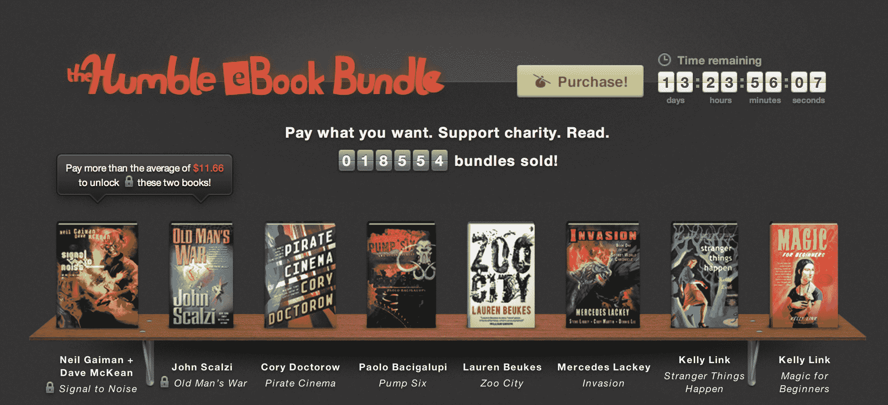

# 谦逊的电子书包与多克托罗、盖曼和斯卡齐 TechCrunch 的作品一起回归

> 原文：<https://web.archive.org/web/https://techcrunch.com/2012/10/09/the-humble-ebook-bundle-is-back-with-works-by-doctorow-gaiman-and-scalzi/>

# 谦逊的电子书包又回来了，里面有多克托罗、盖曼和斯卡齐的作品

【YouTube = https://www . YouTube . com/watch？v = UiEcVIGlDYU & feature = player _ embedded]

每个人都喜欢的电子书包慈善在线销售又回来了，你有 13 天的时间从像尼尔·盖曼、约翰·斯卡尔齐和科利·多克托罗这样的人手里买到 8 本科幻小说。

这套书已经卖出了 18，000 多本，你可以下载无 DRM 的 epub、mobi 或 PDF 格式的书籍。你也可以直接把它们发送到你的 Kindle 上。这一捆价值 52 美元，但迄今为止平均捐款额为 11 美元，这意味着你可以花 12 美元收到斯卡齐的书和一本盖曼的漫画小说。

书籍包括*海盗电影、【泵六】和其他故事、《动物园之城》、《入侵:秘密世界编年史》、《怪事发生》、《T3》和*初级魔法*。

销售支持[美国科幻作家](https://web.archive.org/web/20221208073427/http://www.sfwa.org/)、 [EFF](https://web.archive.org/web/20221208073427/https://www.eff.org/) 和[儿童游戏](https://web.archive.org/web/20221208073427/http://www.childsplaycharity.org/)。再加上一点(或很多，你的选择)给作者。*