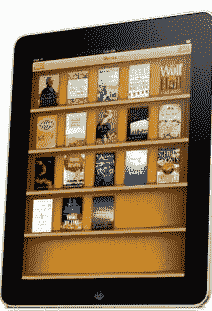

# iPad vs . Kindle:亚马逊应该如何应对？

> 原文：<https://web.archive.org/web/https://techcrunch.com/2010/01/27/the-ipad-vs-the-kindle-how-should-amazon-respond/>

***编者按**:这是 [Joff Redfern 写的一篇客座博文。雷德费恩是制作个性化故事书网站](https://web.archive.org/web/20221205092326/http://www.linkedin.com/in/joffr)[FlattenMe.com](https://web.archive.org/web/20221205092326/http://www.flattenme.com/)的联合创始人。他以前是雅虎的产品副总裁，管理雅虎 Buzz 和工具栏。*

**亚马逊 Kindle:未来之路**

我是最近的 Kindle 粉丝男孩。我喜欢即时阅读环保书籍，喜欢纸质的展示，喜欢它像平装本一样握在手中的感觉。我也深深钦佩 Kindle 的简洁——“几分钟内，任何一本书，任何一种语言”。但是随着苹果公司发布 iPad，Kindle 的竞争环境发生了变化，颠覆性技术本身也遭到了破坏。

如果我运行 Kindle，我今天会回答这个问题:“我们是在创新出版业还是娱乐业？”Kindle 只是为了我的阅读娱乐还是为了看、听、玩游戏、浏览、分享照片以及与朋友和家人交流？最终，答案取决于消费者偏好、竞争对手和以年为单位的时间。

作为一名产品人员，这是一个非常有趣的问题——亚马逊应该选择哪条路？随着时间的推移，这可能会推动 Kindle 不仅仅是一个阅读器。。。

**同样的价格，越多越好**

随着价格趋同，消费者会更喜欢多功能娱乐平板电脑而不是单一用途的阅读设备吗？这是一个宗教问题；双方将被抽出。我从我个人技术习惯的演变中寻找答案。

当我想管理我的联系人时，我从纸质通讯录开始，升级到数字通讯录，升级到 Palm V，升级到黑莓，然后升级到 iPhone。从根本上说，我试图解决如何管理和沟通我的联系人。每一次升级，我都获得了更多的功能，而每台设备的价格却没有根本的不同。

如果消费者最终能够以低于 200 美元的价格获得一款娱乐平板电脑，同时具备优秀阅读器的核心功能(屏幕、内容目录、易于购买)，他们会想要更多。

价格下降。随着时间的推移，价格将不再是购买决策的考虑因素。

如今，Kindle 比 iPad 享有价格优势。它的价格几乎是一半，起价为 260 美元，而 iPad 为 500 美元，尽管同等屏幕的最便宜的 Kindle DX 为 489 美元。已经很接近了。当类似 iPad 的设备价格下降到消费者不感兴趣的程度时，会发生什么？

摩尔定律和商业模式创新将推动类似 iPad 的设备定价低于 200 美元。不现实？iPhone 8GB 的零售价格在 3 年内下降了约 83%,从 599 美元降至 99 美元。

还要记住，娱乐平板电脑使用的数学与 Kindle 不同。设备定价将得到多种收入来源的“补贴”——书籍、音乐、电影、游戏、应用程序、广告等的下载。今天我可以“免费”得到一部手机，我的 iPad 有一天也会“免费”吗？

**竞争对手正在打平台战。是 Kindle？**

苹果、谷歌和微软在各自的移动平台上都有大量投资。特别是，苹果是移动设备之王。正如乔布斯今天宣称的，“苹果现在是世界上最大的移动设备公司”。

苹果的这一热潮吸引了 10 万多名开发者和出版商加入其 iPhone(现在是 iPad)生态系统。除了苹果高管斯科特·福斯特尔今天展示的内容之外，这些应用已经可以在 iPad 上以各种方式娱乐我们。

亚马逊[知道](https://web.archive.org/web/20221205092326/http://www.beta.techcrunch.com/2010/01/20/amazon-kindle-free/)这一点。上周他们宣布一个开发者 API 即将到来。所以问题仍然是 API 有多健壮，开发者社区会上钩吗，或者游戏结束了吗？

如果你运行 Kindle 你会怎么做？