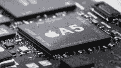

# iPhone 5/4S:完整的谣言纲要 

> 原文：<https://web.archive.org/web/http://techcrunch.com/2011/10/03/the-iphone-54s-the-complete-rumor-rundown/>

苹果距离宣布下一代 iPhone 不到 24 小时。与以往的发布会不同，这次发布会将是私密的小型发布会，在苹果总部举行，而不是像莫斯康中心这样的大型场所。最重要的是，史蒂夫·乔布斯不是这部剧的主角；虽然，如果谣言是可信的，他可能会客串。苹果公司的新任指挥官兼首席执行官蒂姆·库克预计将在今年最大的互联网流量日之一发起冲锋。

苹果发布这款最新的 iPhone 相当迟缓，比传统的夏季发布日期晚了整整两个月。然而，如果谣言是可信的，那么，新 iPhone 将与旧 iPhone 非常相似——除了不相似的地方。我们在这里收集了所有的谣言，并陈述了每个谣言的可行性。有些是大开眼界，有些是现实主义，有些是纯粹的 fanboy 幻想。

* * *

**iPhone 4S 将会是一款不太贵的 iPhone**

**论证**

*   大量泄露的 SKU 系列 iPhone 原型[仅由塑料制成，而不是在巴西发现的玻璃和铝。](https://web.archive.org/web/20230203142931/http://gizmodo.com/5845797/gizmodo-exclusive-looks-like-there-will-be-a-cheaper-iphone-4-made-in-brazil)
*   苹果将以 100 美元或更低的价格销售新的 iPhone，从而彻底颠覆 Android 和 Windows Phone 7。
*   对于大多数用户来说，iPhone 4 仍然拥有足够的计算能力。

**异议**:

*   未经证实的泄密是不可信的

**判断**:这一次，星星似乎排成了一行。尽管已经上市超过 15 个月，iPhone 4 仍然是一款热门手机。苹果只需要将目前的硬件重新包装成一个更便宜的机体，就可以彻底摧毁竞争对手。

* * *

**重新设计，更薄的 iPhone 5**

**论据**:

*   在过去的几个月里，无数更薄的外壳被泄露，据称都是为下一代 iPhone 制造的。
*   每一款后续的 iPhone 都比前一款更薄。
*   苹果喜欢在产品之间保持设计线索不变，所以下一代 iPhone 看起来会和 iPad 相似。

**异议**:

*   没有，这是一个相当可靠的说法

**判断**:苹果从未发布过比上一款更厚的产品，也不会从下一款 iPhone 开始。

* * *

**大屏幕**

**论证**:

*   与最近来自摩托罗拉、三星和 LG 的超级手机相比，iPhone 4 的 3.5 英寸屏幕很小。
*   泄露的外壳预示着下一代 iPhone 将会更长更宽。如果 iPhone 的尺寸越来越大，更大的屏幕是合乎逻辑的。
*   我们自己的研究表明，更大的屏幕是“可能的”

**异议**:

*   大屏幕可能会干扰为小屏幕设计的应用程序

**判断**:苹果不能忽视当前屏幕尺寸更大的流行趋势。只要手机更薄，更大的屏幕不会让手机有任何变大的感觉。

* * *

**窄边框玻璃**

**论据**:

*   苹果一直在推动其 LCD 实现的极限。
*   仅仅使用更大的屏幕，窄边框玻璃就能给苹果提供一些吹嘘的东西。

**异议**:

*   制造成本可能会提高，这会降低利润率
*   会导致更多破碎的屏幕

**判断**:现在还不太可能。苹果突破了极限，但只是在财务上可行的情况下。

* * *

**NFC 芯片**
**参数**:

*   NFC 是下一件大事，并且已经成为领先的 Android 手机的一项功能
*   配备 NFC 功能的 iPhone 将进一步推动移动支付的发展

**异议**:

*   目前的 NFC 无线电是独立的微芯片，没有集成到统一的通信芯片中，这需要 PCB 空间和额外的电池电源
*   苹果可能会等到支付公司向他们提出一个有利可图的报价

**判断**:苹果倾向于只有在可行性被证明后才采用非专有技术。所以这是一个“不”

* * *

**双核 A5 CPU**

**论据**:

*   苹果倾向于在每一个 iPhone 版本中包含一个更快的 CPU
*   iOS 5 可能会受益于更快的双核 CPU

**异议**:

*   更强大的 CPU 往往会缩短电池寿命

**判断**:下一款主流 iPhone 很有可能会有 A5 CPU。然而，苹果可能会坚持使用 A4 来更新中端机型，就像传闻中的 iPhone 4S 一样

* * *

**新首页按钮**

**论据**:

*   泄露的表壳和表圈显示一个细长的开口/按钮
*   触摸感应挡板支持新的控制、多点触摸手势

**异议**:

*   彻底改变苹果“保持简单，愚蠢”的设计
*   可能会破坏当前的应用

**判断**:不要围绕这个谣言开始设计你的下一个 Kickstarter iPhone 保护套项目。苹果可能会坚持使用传统的 home 键。

* * *

**8MP 摄像头**

**论证**:

*   每发布一款新的 iPhone，MP 数量都会增加
*   一张 800 万像素的照片[之前出现过](https://web.archive.org/web/20230203142931/https://techcrunch.com/2011/09/07/the-mystery-of-the-8mp-iphone-4-sushi-picture/)带有 iPhone 5 的元数据
*   不幸的是，百万像素是不同手机之间的比较点

**异议**:

*   更高的百万像素数量不一定能提高图像质量。苹果知道这一点。希望如此。

**判断**:摄像头传感器在尺寸上不断缩小，而 MP 计数却在增加。预计会有更高计数的传感器，但不一定是 8MP 版本。

* * *

**CDMA/GSM 双模电台**

**论据**:

*   下一代 iPhone [将使用高通戈壁基带](https://web.archive.org/web/20230203142931/https://techcrunch.com/2011/08/22/iphone-5-dual-mode-cdma-gsm/)，并运行在 GSM 和 CDMA 网络上
*   双模手机已经出现在开发者的使用统计中
*   将允许苹果只生产/销售一个版本，降低生产成本
*   允许苹果销售完全解锁的 iPhone。从 Apple Store 购买一个并激活它
*   运营商独立是一个巨大的卖点

**异议**:

*   双模移动无线电仍然非常罕见
*   R&D 成本可能使其在财务上不可行

**判断**:不好说。对苹果和消费者来说，好处都是巨大的，但双模无线电并没有被广泛使用。苹果倾向于使用高可用性，因此，高利润的组件。

* * *

**扩展语音控件**
**参数**:

*   下一代 iPhone [将拥有强大的语音控制](https://web.archive.org/web/20230203142931/http://9to5mac.com/2011/09/26/the-new-iphone/)，由苹果[去年以 2 亿美元收购的 Assistant 构建](https://web.archive.org/web/20230203142931/https://techcrunch.com/2010/04/28/apple-siri-200-million/)
*   语音控制会比安卓的导航路径更自然
*   这些功能需要强大的硬件，比如传闻中的 A5 CPU，这为 iPhone 4 用户创造了一个卖点

**异议**

*   没有，真的。对于 iOS 来说，这似乎是合乎逻辑的一步。

**判断**:很难预测未来的 iOS 功能，但更强大的语音控制可能已经在路线图上了。

* * *