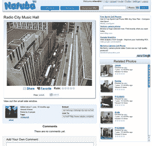

# iPhone 有了自己的照片分享网站 

> 原文：<https://web.archive.org/web/https://techcrunch.com/2008/05/05/the-iphone-gets-its-own-photo-sharing-site/>

# iPhone 有了自己的照片分享网站

Natuba 是一个新的照片分享网站，目标用户是 iPhone 用户，重点是移动上传。它来自理查德·尤(Richard Yoo)，Rackspace 和 Serverbeach 的前首席执行官。

拥有 Natuba 帐户的 iPhone 用户可以通过电子邮件将他们的快照发送到一个特殊的地址来添加到网站上。描述可以包含在主题行中，所有照片都被注入到[公共活动流](https://web.archive.org/web/20221006200215/http://www.natuba.com/photos/date/)中。他们也包括在个人资料页面上，是“给我惊喜吧！”一次随机显示网站中一张照片的页面。

想法和执行都很简单，可能有点太简单了。~~没有标签~~，更不用说没有地理标签(如果 iPhones 已经有 GPS，这将是这种服务的自然功能)。我希望看到网站增加评级功能，这样社区就可以展示最好的快照。毕竟，突出日常生活中最酷的小事件应该是网站的主旨；没有人想筛选平凡的事物。

我也希望能够跟踪我的朋友的贡献。为什么不额外增加一份脸书申请表呢？这样我就可以在我的社交网页上展示我的照片了。哦，还有 Twitter 的整合，这样我的贡献就可以自动在 Twitter 上发布了。好吧，显然还有改进的空间。

当然，Flickr 和其他照片服务已经具备了通过电子邮件上传照片的功能。这个网站没有理由不能从非 iPhone 设备上传(反正你可以直接上传到网站)。因此，从长远来看，它需要推出一些真正酷的功能，否则注定只能成为一个带有营销色彩的照片分享网站。

**更新:**这里我忽略了几件事。Natuba 确实有标签、FB 应用和评级。显然也集成了 Twitter，尽管我在任何地方都找不到它(据我所知，网站上也没有提到脸书的应用)。当我说“能够跟踪我朋友的贡献”时，我指的是某种聚合了所有人的流。你可以查看某个特定朋友的个人资料，但你似乎看不到这样的信息流。(**更新 2:** 惊喜惊喜，这种类型的流是在那里，虽然埋了不少)。此外，标签和评级可以更好地利用，也许可以在主页上突出显示它们。