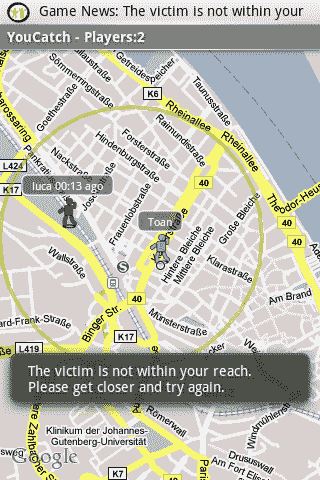

# 欢乐的喜悦:将“大型多人跨现实”游戏引入安卓手机 TechCrunch

> 原文：<https://web.archive.org/web/https://techcrunch.com/2008/10/27/the-joy-of-joyity-bringing-massive-multiplayer-trans-reality-games-to-android-phones/>

# 欢乐的喜悦:将“大型多人跨现实”游戏带到安卓手机上

是什么造就了一个伟大的[安卓应用](https://web.archive.org/web/20221208004412/http://www.beta.techcrunch.com/2008/10/23/android-market-takes-on-apples-app-store-games-still-rule-but-should-they/)？以一种有趣或有启发性的方式将虚拟世界与现实世界融合在一起的人。一款令人印象深刻的应用叫做 JOYity，它来自德国手机游戏初创公司[Zelfi](https://web.archive.org/web/20221208004412/http://www.zelfi.com/en/zelfi/)。JOYity 使用 Android 手机中的 GPS 让你玩游戏，并根据你在现实世界中的位置进行冒险。

JOYity 本身就是一个游戏平台。当你下载应用程序时，你可以玩三个游戏中的一个(YouCatch，Roads of San Francisco，City Race Munich)或者设计你自己的游戏。例如，在旧金山的道路上，你必须在城市中四处寻找线索。当你到达一个目的地时，一条文字或图片信息会告诉你下一步去哪里。这是一个有故事情节的寻宝游戏。你也可以设计自己的寻宝游戏，和大群人一起玩。

另一个伴随快乐而来的游戏是“追捕”。同一个城市的玩家报名参加一个游戏。每个人都同时扮演着猎人和猎物的角色。游戏分配给你一个你正在追捕的玩家，同时把你作为受害者分配给其他人。每个人的位置都会周期性地闪现在地图上。当你接近受害者 25 英尺时，你按下电话上的滚动球就可以杀人了。但是每次你按下按钮，你的位置也会显示给其他玩家。最后站着的人获胜。

下面是来自 [AppVee](https://web.archive.org/web/20221208004412/http://www.androidapps.com/) 的两段视频评论。首先是 JOYity 本身和旧金山的道路。第二个是 YouCatch，它展示了在纽约麦迪逊广场公园正在进行的比赛。AppVee 同样对 JOYity 印象深刻，将其描述为“大型多人跨现实游戏”。更多安卓视频评论，请看我们之前的帖子[这里](https://web.archive.org/web/20221208004412/http://www.beta.techcrunch.com/2008/10/26/more-android-video-reviews-barcode-scanners-skype-client-drawing/)和[这里](https://web.archive.org/web/20221208004412/http://www.beta.techcrunch.com/2008/10/22/android-video-reviews-from-appvee/)。JOYity 不在我最初的安卓应用前十名名单上，因为它还没有进入安卓市场，但它现在肯定会在名单上。

【YouTube http://www.youtube.com/watch?v=CDeG2FDjS1w&hl=en&fs=1]

[YouTube http://www.youtube.com/watch?v=yqpTM8eBl5Y&hl=en&fs=1]