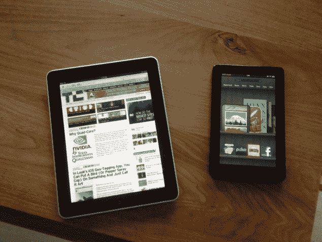

# Kindle Fire，它有什么用？TechCrunch

> 原文：<https://web.archive.org/web/https://techcrunch.com/2011/11/25/the-kindle-fire-what-is-it-good-for/>

当 Kindle Fire 几周前首次发货时，对它的评论褒贬不一。沃尔特叔叔称之为[好，但不是伟大的](https://web.archive.org/web/20230127221536/http://allthingsd.com/20111115/kindle-fire-a-grown-up-e-reader-withtablet-spark/)。NYT 的大卫·波格认为它“迟缓”，缺乏“优雅和速度”但是 Kindle Fire 仍然在[热卖](https://web.archive.org/web/20230127221536/https://techcrunch.com/2011/11/21/despite-poor-reviews-kindle-fire-on-track-to-be-2-tablet/)。一些评论者对它不是 iPad 感到失望，但这是错误的看待它的方式。Fire 是一款出色的媒体平板电脑,它在一些方面做得非常好，我将告诉你它们是什么。

过去两周我一直在使用 Kindle Fire(也就是说，当我的孩子或妻子没有带着它逃到另一个房间的时候)。这个设备通过了我的第一个测试:我的家人为它争吵。这种火经过了孩子的测试，也得到母亲的认可。水果忍者是我的孩子们的新爱好。即使是我两岁的孩子，她喜欢 iPad，也越来越喜欢 Kindle Fire，并想方设法让她妈妈离开房间，这样她就可以玩它了。我的妻子不同意这些，她正在读琼·狄迪恩最新的关于火灾的书。晚上大家都睡着了，我偷偷把它从床头柜上拿走，去看《发展受阻》的旧集。

Kindle Fire 专为寻找和消费数字媒体而设计:书籍、电影和电视节目、音乐、杂志、应用程序和网络。它的功能比 iPad 更有限，但在这些领域它有自己的优势。让我逐一讨论这些领域:

**阅读**

与 iPad 相比，更好的比较是与其他 Kindles 进行比较。我也一直在玩 Kindle Touch，屏幕的响应速度非常不稳定，让我使用起来很沮丧。每次翻页之间 E Ink 屏幕的闪烁也让我头疼。不，如果你要买 Kindle，就买 Kindle Fire。这是非常好的，即使是阅读电子书籍和杂志。《纽约客》杂志在上面看起来很棒。

是的，我知道背光屏幕不如 E Ink 对眼睛好，但我们在骗谁呢？我们许多人每天盯着屏幕 8 到 12 个小时。就我而言，我已经习惯了它，并发现背光屏幕比电子墨水更具可读性。直接从文本中突出段落或在网上查找内容也容易得多。

Kindle Fire 的电子书阅读器功能也超过了 iPad(正如你所希望的，来自亚马逊)。这主要是因为它的外形更小。它大约有一本大的平装本那么大。你可以用一只手拿着它，用拇指快速翻阅书页。这是一种比大尺寸 iPad 更愉快的阅读体验，相比之下，大尺寸 iPad 在长时间阅读时显得有点笨拙。不过，iPad 上的 Kindle 应用程序在其他方面都非常好。

**观看**

尽管它的屏幕尺寸较小，但 Fire 是一种优秀的视频观看设备。它直接连接到亚马逊的即时视频商店，在那里你可以购买或租用视频下载。选择相当不错，既有老的，也有最近的电影和电视节目。您可以直接播放电影，也可以下载供以后观看。我在流媒体方面没有问题。照片很清晰，我在很强的无线网络连接下看了整集，没有任何停顿。

你也可以通过网飞或 Hulu Plus 看电影，这两个网站都有 Fire 上的应用程序。但是，如果你是亚马逊的 Prime 会员(一年 79 美元的“吃到饱”运费)，你可以获得即时视频。这是一笔不错的交易，考虑到网飞仅流媒体计划每年花费 96 美元，并且你不能免费运送任何圣诞礼物。

在火上看视频的一个缺点是，这是一种孤独的体验。当你把它放在膝盖上独自观看时，小屏幕不会影响观看体验，但它不适合与他人一起观看节目或电影。这相当于从某人的肩膀上看视频。我不知道有什么简单的方法可以像你在 iPad 上用 Airplay 那样把视频投影到更大的屏幕上。

**听力**

坦率地说，我几乎没有注意到 Kindle Fire 上的音乐商店。选择没有任何问题，我为它分发兼容任何播放器的 MP3 歌曲的方式鼓掌。但是说到我购买的数字音乐，我只是太沉迷于 iTunes(或流媒体音乐服务)而不想去亚马逊音乐商店。想办法把音乐导入 iTunes 太麻烦了，我可以在 iPhone 上或通过我的立体声音响听音乐。

也许只有我一个人，但我不想插着耳机在火上听着一张专辑走来走去。你又不能带着它去跑步。通过 Fire 的外部扬声器收听，虽然对电影来说非常好，但不是理想的收听体验。音乐确实有意义的一个用例是，当你在火上阅读或浏览网页时，你想听点什么。

**浏览**

Fire 的 [Silk 浏览器](https://web.archive.org/web/20230127221536/https://techcrunch.com/2011/09/28/amazon-silk/)通过在云中预先缓存页面并更智能地交付页面，来加速在设备上的浏览。这款浏览器速度快，功能强，但据我所知，它并不比 iPad 上的浏览器快。我测试了大约半打网页。如果页面加载速度有差异，这是不明显的。

在网络浏览方面，iPad 更大的屏幕尺寸使其具有优势。你不像在手机浏览器上那样眯着眼，但你还是会眯着眼。我发现自己在阅读网页时会不停地捏和缩放。然而，Fire 上的选项卡式浏览是一个优势。

**玩**

最后，还有应用程序。Fire 只配备了几千个可供下载的[应用](https://web.archive.org/web/20230127221536/https://techcrunch.com/2011/11/09/several-thousand-apps-including-netflix-are-ready-for-kindle-fire/)，相比之下，iPad 有 20 多万个。但亚马逊做了出色的工作，确保这些首批应用程序中有许多是优秀的。像水果忍者和愤怒的小鸟这样的游戏，虽然不是 Fire 独有的，但会让人上瘾，并展示其图形功能。像网飞、Hulu Plus 和 Pandora 这样的媒体应用扩展了它的娱乐功能。脸书和 Twitter 等一些“应用”只是通过浏览器重定向到他们的 HTML5 移动网站，但我怀疑他们会及时获得成熟的应用。

更重要的是，这个商店比官方的安卓市场更有条理，也更容易浏览。如果 Kindle Fire 成为最受欢迎的 Android 平板电脑，正如我猜测的那样，那么它也可能成为 Android 应用程序的最大分销商。亚马逊的应用商店最终为 Android 带来了购物和发现体验，就像 iTunes 为 iOS 应用带来的体验一样。

最好的应用程序仍然在 iPad 上，并将继续首先出现在那里，但你不会因为使用 Kindle Fire 而放弃应用程序。随着越来越多的人涌向 Fire，一个鼓励购买媒体(包括应用程序)的设备，它们将变得越来越好。

人们不会因为 Kindle Fire 的任何规格而购买它。他们会购买它，因为它让他们轻松进入仍然陌生的数字图书、电影、杂志和应用领域。这些都是媒体。大火让人们很容易找到它们，更重要的是，也很容易为它们买单。你几乎不会再考虑它。

将你所有的媒体打包到一个 7 英寸的小设备中仍然是一件不可思议的事情。但不仅仅是你的媒体让它引人注目。这是对亚马逊庞大且不断增长的数字图书馆的访问，该图书馆拥有数百万本书籍、电影、应用程序和歌曲，所有这些都在你的指尖上，只需点击一下就可以看到。如果你最终真的买了一台 Kindle Fire，我保证你在媒体上的花费将远远超过该设备 200 美元的补贴价格。一旦你开始为 Fire 购买数字媒体，你将不会去任何地方。亚马逊会把你作为终身客户，如果它还没有的话。

看看下面我和约翰·比格斯做的关于 Kindle Fire 的[飞行或死亡](https://web.archive.org/web/20230127221536/https://techcrunch.com/2011/11/18/fly-or-die-the-kindle-fire/)。

