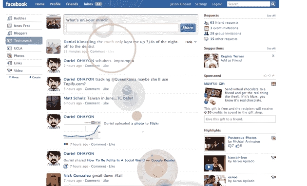

# Konami 代码再次来袭:脸书增加了一些亮点 

> 原文：<https://web.archive.org/web/https://techcrunch.com/2009/05/08/the-konami-code-strikes-again-facebook-adds-some-flare/>

# 科纳米代码再次罢工:脸书增加了一些耀斑

上，上，下，下，左，右，左，右，B，A，开始。

对于老派游戏玩家来说，很少有比 [Konami code](https://web.archive.org/web/20230123110827/http://en.wikipedia.org/wiki/Konami_Code) 更神圣的代码了——这是一种起源于最初的 NES 的作弊代码，后来已经进入了许多其他游戏。最近，一些热门网站也加入了这一行动，来自包括 [Digg](https://web.archive.org/web/20230123110827/http://www.digg.com/) 和 [Google Reader](https://web.archive.org/web/20230123110827/http://reader.google.com/) 等网站的恶作剧复活节彩蛋。

今天，脸书加入了这个俱乐部。输入代码将启用我称之为“[镜头光晕](https://web.archive.org/web/20230123110827/http://en.wikipedia.org/wiki/Lens_flare)的模式，每当你点击鼠标时，就会给脸书页面添加过度使用的 Photoshop 效果。只需使用键盘的箭头键输入上述代码(用“enter”代替“Start”)，然后单击页面上的任意位置。这是完全无用的，但看起来有点俏皮，并保证给你的朋友留下深刻印象。至少十秒钟。

去年夏天，谷歌阅读器[实现了](https://web.archive.org/web/20230123110827/http://www.crunchgear.com/2008/06/10/google-hearts-the-konami-code/)代码，在网站界面上引入了一个忍者。在一些游戏相关网站上输入它，如 [GiantBomb](https://web.archive.org/web/20230123110827/http://www.giantbomb.com/) 和 [GameSpot](https://web.archive.org/web/20230123110827/http://www.gamespot.com/) ，会带你到一个关于魂斗罗的页面(这个游戏普及了代码，因为没有它几乎不可能玩)。但在所有这些中，需要蛋糕的是 [ESPN](https://web.archive.org/web/20230123110827/http://www.espn.com/) ，当你输入代码时，它开始显示令人眼花缭乱的独角兽和彩虹。说真的。它已经被撤下，但是你可以在这里观看它的视频。

更多 Konami code 复活节彩蛋，请查看我们在 [CrunchGear](https://web.archive.org/web/20230123110827/http://www.crunchgear.com/2009/05/07/konami-code-enabled-website-listing/) 上的帖子。