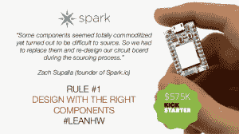
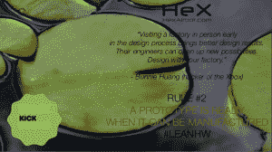
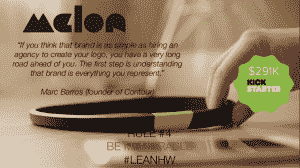

# 精益硬件创业:从原型到生产 TechCrunch

> 原文：<https://web.archive.org/web/https://techcrunch.com/2013/11/16/the-lean-hardware-startup-from-prototype-to-production/>

More posts by this contributor

**编者按:** *[Cyril Ebersweiler](https://web.archive.org/web/20230131084333/https://twitter.com/haxlr8r) 是先锋硬件创业加速器 [HAXLR8R](https://web.archive.org/web/20230131084333/http://www.haxlr8r.com/) (现在正在寻找[申请者](https://web.archive.org/web/20230131084333/http://www.haxlr8r.com/))的创始人，也是 [SOSVentures](https://web.archive.org/web/20230131084333/http://www.crunchbase.com/financial-organization/sos-ventures) 的合伙人。Benjamin Joffe 是 HAXLR8R 的创业生态系统专家、天使投资人和顾问。两人都投资于世界各地的公司，并在中国和日本投资了 10 多年。这是系列文章的第 1 部分。*

如果说印刷机是“任何人都可以阅读”，网络是“任何人都可以写作”，那么硬件生态系统的变化足以说明今天“任何人都可以构建”。这一理念——任何人都可以构建——是新“精益硬件创业”的基石。

然而，尽管取得了像 [Square](https://web.archive.org/web/20230131084333/http://www.crunchbase.com/company/square) 、 [Jawbone](https://web.archive.org/web/20230131084333/http://http//www.crunchbase.com/company/jawbone) 和 [Fitbit](https://web.archive.org/web/20230131084333/http://http//www.crunchbase.com/company/fitbit) 这样的成功，硬件初创公司仍然让企业家和投资者望而生畏。作为通过我们专注于硬件的加速器 HAXLR8R(以及 HAXLR8R 之外的许多初创公司)投资其中 30 多家公司的投资者，我们想分享一些关于硬件企业家的前景如何变化的想法，以及现在如何可能在硬件上“精益”。

# 精益硬件

硬件企业家面临的第一个挑战是，从你的第一个带有 3D 打印部件、胶带和纸板的原型到生产就绪。

史蒂夫·布兰克(Steve Blank)是精益创业运动的关键灵感来源，他有句名言:“没有一个商业计划能在与客户接触后生存下来。”如果您以精益的方式生产硬件，那么“任何硬件计划都无法在与工厂的接触中生存”应该是您的座右铭。

**用合适的组件设计**

硬件通常从“一包零件”开始。这不会缩短去工厂的时间。非标准组件几乎不可能大规模生产。如果你不想像电影中的史蒂夫·乔布斯那样和你的朋友们一起手工组装，你最好尽快找到合适的零件。

**当一个原型可以被制造出来的时候它就已经准备好了**
 
你得到正确的组件了吗？很好。但是你还没有完全完成:如果你的原型不能被制造甚至组装，你就完蛋了。幸运的是，工厂通常更清楚什么是可以做的，什么是不可以做的，并且可以帮助您解决问题。

当然，如果你能经常在现场与实际工作的人讨论它，而不是发送长时间的带有规格说明的电子邮件，效果会更好。因此，您可以更快地迭代原型的设计。

我们的许多初创公司看到了他们产品设计的演变，sous-vide machine [Nomiku](https://web.archive.org/web/20230131084333/http://www.nomiku.com/) 可能是从他们加入 HAXLR8R 到投入生产的这段时间里变化最大的一台(请在 TC 上阅读他们的故事[)。
](https://web.archive.org/web/20230131084333/https://techcrunch.com/2013/11/01/nomiku/) 
制造能力是一回事，但成本往往是决定性因素。阿里巴巴的报价并不是一个可靠的估计，也不是以对工厂合理要求的一半价格要求“苹果质量”。通过更好地了解您的材料清单和生产工艺，避免被收取过多费用或嘲笑。

**您的工厂是您最重要的合作伙伴**

好吧，这样你就有了正确的组件，你知道你的产品可以被制造和组装。你会选择工厂并自己处理关系吗？

为这个找借口很容易:这很复杂，在中国(或者墨西哥，或者其他地方)，你不会说当地的语言，这需要时间。…从哪里开始？总的来说，很吓人。
 
因此，很容易引入第三方来处理与工厂的关系。除了降低利润，问题是这些公司最终基本上既做审计又做咨询。你知道这样的结果。

你不可能长期做硬件而对制造一无所知。因此，虽然你可能需要建议来开始，但你需要在项目管理和质量控制方面的专业知识来获得长期的成功。而且如果你还有疑问:所有经历过 HAXLR8R 的创业公司都学会了怎么做，你也可以。值得注意的是，我们的 30 家初创公司与 30 家不同的工厂合作，以最大限度地满足他们的需求。人各有志！

## “不是每件产品都能在玩具工厂生产。你的工厂会让你成功或失败，所以要明智地选择。在您和您的主要供应商之间不要有第三方。”—Zach“hoe ken”Smith，MakerBot 联合创始人(HAXLR8R 技术总监)

**值得纪念**
好的产品有好的技术和设计，还要有好的分销和好的品牌。你的品牌能包含你的价值观、使命、产品，并在多种语言中令人难忘吗？

例如，Axio 是一家为你的大脑提供可穿戴技术的公司，也是 HAXLR8R 的第二批成员之一，它对 [Melon](https://web.archive.org/web/20230131084333/http://www.usemelon.com/) 进行了彻底的品牌重塑，重新审视了它的名称、徽标、方法、应用程序以及外观和感觉。

**选择正确的商业模式**

纯硬件正面临快速商品化的风险，现在许多产品都包含“智能”连接和服务层。做硬件即服务意味着选择正确的商业模式非常重要。

在 HAXLR8R， [Spark](https://web.archive.org/web/20230131084333/http://www.spark.io/) 一开始制造开源硬件和软件，然后是基于设备的订阅，然后是硬件和软件的许可。最近，[的 Vibease](https://web.archive.org/web/20230131084333/http://www.vibease.com/) 、[的可穿戴智能振动器](https://web.archive.org/web/20230131084333/https://techcrunch.com/2012/09/01/vibease-the-long-distance-relationship-you-always-wanted/)，在其收入模式中增加了一个音频记录库的内容销售。

生态系统的变化使得以更低的启动成本创办硬件公司变得更加可能。期待看到许多新的成功的硬件创业公司，因为“智能”产品逐渐取代了我们生活中的物品！

[slide share id = 27735247 & style = border:1px solid # CCC；border-width:1px 1px 0；边距-底部:5px&sc=no]