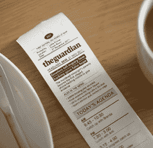

# 小打印机将您定制的数字内容放在一张纸上 

> 原文：<https://web.archive.org/web/https://techcrunch.com/2011/11/29/the-little-printer-puts-your-customized-digital-content-on-a-slip-of-paper/>

# 这个小打印机把你定制的数字内容放在一张纸条上

这些天来，我们的集体轨迹似乎是从印刷向数字的迁移。书籍、日历、待办事项和报纸都是数字革命的受害者，至少在纸质形式下是如此。但并不是每个人都随着纸张的消亡而消沉。

认识一下小打印机，伯格云的最新发明。很可爱，对吧？

根据[产品页面](https://web.archive.org/web/20230214062040/http://bergcloud.com/littleprinter/)，当它不在你的办公桌上对你微笑时，这个小打印机会弹出收据大小的纸片，上面载有你的定制信息、新闻和友好的八卦。使用你的智能手机(Android 或 iPhone)，你可以订阅 Berg Cloud 的许多“发布”选项中的一个，无论是日常谜题、朋友的生日提醒、你最喜欢的新闻来源的头条、待办事项列表、Foursquare 签到、“Partworks”(这是关于你选择的艺术流派的日常课程)，还是锻炼核对列表。

 当你准备好出发时，只需按下打印机顶部的小按钮，今天的新闻就准备好了，等着你。
演示视频中还有一张名为“每日一图”的图片，标题是“今天来自你朋友的最受欢迎的照片”不过，尚不清楚这些数据来自哪里。

虽然一张收据大小的纸条可能不会破坏你摄取信息的方式(数字化)，但这小小的每日信息纸条还是有一些额外的好处。首先，像“每日一词”、“零件加工”和“每日一图”这样的东西贴在冰箱或公告栏上会很棒。Little Printer 还提供了一种在真实纸张上记录日常数字生活的方式，而不是用二进制代码。这听起来可能像是某种储物症的早期阶段，但有一天，我敢打赌，我们会真正感激我们记录在纸上的东西。

另外，它真的很可爱。

预购要到 2012 年才开始，届时 Little Printer 将推出测试版。

[via [DVice](https://web.archive.org/web/20230214062040/http://dvice.com/archives/2011/11/cute-little-pri.php)