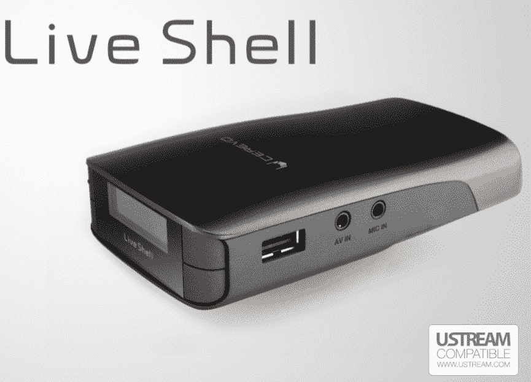
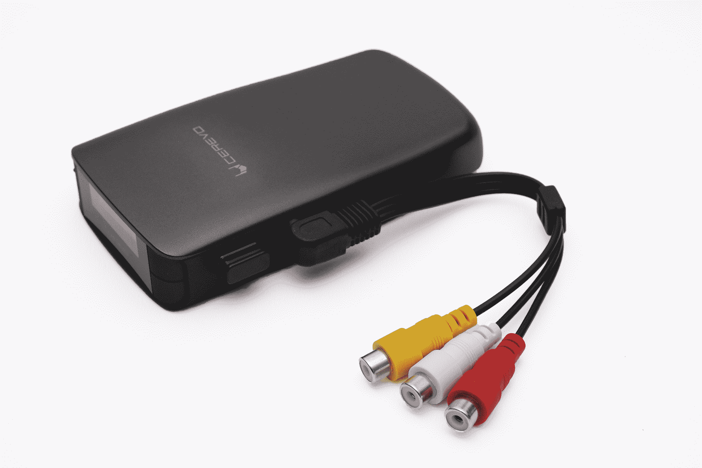
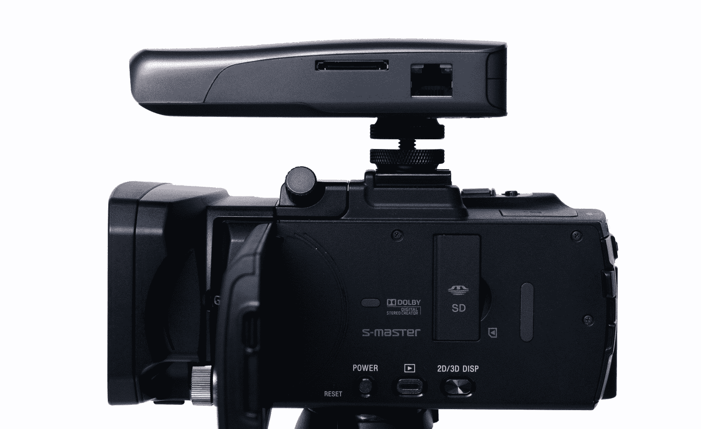
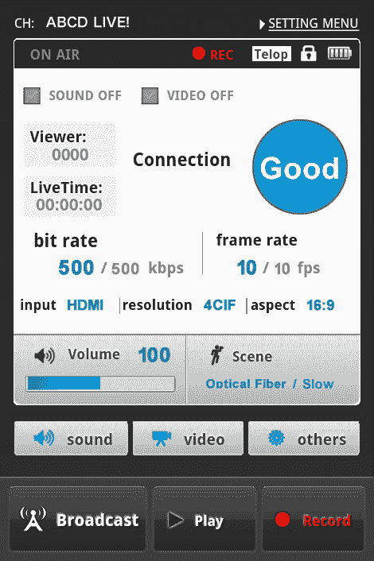

# “直播外壳”让您无需电脑即可通过 Ustream 直播视频 TechCrunch

> 原文：<https://web.archive.org/web/http://techcrunch.com/2011/10/18/the-live-shell-lets-you-broadcast-live-video-via-ustream-without-a-pc/>

# “Live Shell”可以让你在没有电脑的情况下通过 Ustream 直播视频

总部位于日本的创业公司 Cerevo 昨天揭开了所谓的[“Live Shell”](https://web.archive.org/web/20230204022529/http://s.cerevo.com/)【JP】的面纱，这是一款可以在不使用 PC 的情况下通过 Ustream 向网络传输直播视频的小型设备。这是对 T2 公司去年推出的类似“Livebox”的重大改进。

Live Shell 的尺寸仅为 68×120×26 毫米，重 106 克，并获得了 Ustream 的官方批准(它具有“Ustream 兼容”标志)。它通过 IEEE 802.11b/g/n Wi-Fi、移动路由器或以太网连接到网络。

该设备配有 HDMI、USB 和复合接口，可以以最高 1.5Mbps 的速度直播 704×528 分辨率的视频。

 

在 Cerevo 的网站上建立账户后，用户只需将相机插入 Live Shell，就可以使用 3 节电池开始 3 小时的流媒体播放(买家还会获得一个交流适配器)。可以通过网络或智能手机上的 Cerevo 站点管理广播(参见下面的智能手机仪表板)。

Cerevo 已经接受预购，并计划在今年内开始销售这款设备(暂时只在 T4 和日本销售)。Live Shell 将花费 350 美元(这台相机使用该设备从 Cerevo 的秋叶原办公室直播视频)。