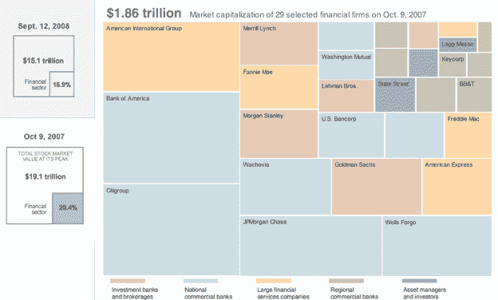
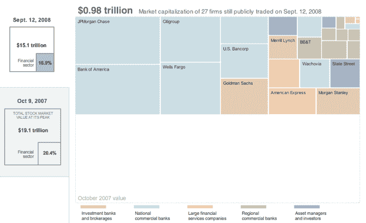

# 华尔街的混乱:四万亿美元付诸东流 

> 原文：<https://web.archive.org/web/https://techcrunch.com/2008/09/16/the-mess-on-wall-street-four-trillion-dollars-down-the-drain/>

# 华尔街的混乱:四万亿美元付诸东流

**2007 年 10 月 7 日**

**二 00 八年九月十二日**

过去一年，尤其是过去几天，如此多的主要金融机构倒闭，其规模之大令人难以理解。有时候你需要一个好的视觉来透视事物。《纽约时报》在其网站上有一张互动图片，几乎说明了一切。它显示，自去年 10 月以来，美国股市的总市值蒸发了 4 万亿美元。其中，近 1 万亿美元来自金融部门的下滑。

图中的每个方框都与当时和现在最大的金融公司的市值成比例。当你把鼠标放在方块上时，你可以看到每家公司在 2007 年 10 月 9 日到 2008 年 9 月 12 日之间损失了多少。以下是一些按市值计算的个人损失:

> **花旗**:2367 亿美元到 978 亿美元。
> **美国银行**:2365 亿美元到 1502 亿美元。
> **AIG**:1798 亿美元至 323 亿美元
> **高盛**:977 亿美元至 613 亿美元
> **美国运通**:748 亿美元至 450 亿美元。
> **摩根士丹利:**731 亿美元到 411 亿美元。
> **房利美**:648 亿美元到 7 亿美元。
> **美林**:639 亿美元至 242 亿美元
> **房地美**:415 亿美元至 3 亿美元。
> **雷曼兄弟**:344 亿美元到 25 亿美元。
> **华盛顿互惠**:311 亿美元到 29 亿美元

总的来看，当你意识到像美国银行和 Citgroup 这样仍然屹立不倒的公司，比一些已经破产的机构(雷曼兄弟)或不得不接受救助的机构(房利美、房地美)的市值跌幅更大时，这是令人震惊的。对于今年已经失业或将要失业的大约 15 万名金融业雇员来说，前景是暗淡的。(尽管首轮资本和联合广场风险投资公司已经公开试图为他们的投资组合创业公司招募精选的少数人——特别欢迎量化分析师)。