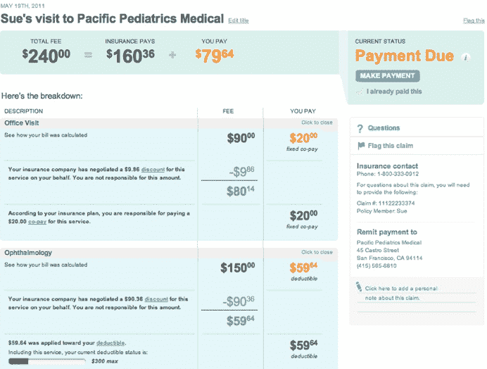

# Simplee 接手 Cake Health，首次增加账单支付功能 

> 原文：<https://web.archive.org/web/http://techcrunch.com/2011/09/20/the-mint-for-health-insurance-simplee-now-allows-you-to-pay-your-medical-bills-online/>

# Simplee 接手 Cake Health，首先添加账单支付功能

Simplee 是一个类似薄荷的医疗账单平台，今天推出了一项新功能，将有助于简化支付医疗账单的过程。

就像 Mint 和你的财务账户一样，你可以简单地访问你的医疗保险账户。然后，它会将您所有的医疗、牙科和药房账单显示在一个易于理解的仪表板上。Simplee 会告知您的总医疗费用、自付费用、自付额以及您和您的家人去看了多少次医生。如果你曾经看过一份保险单，这些信息在这些文件上不容易找到。但是 Simplee 为用户清楚地展示了一切。

Simplee 允许你直接通过它的平台向医疗服务提供者支付账单。在链接您的医疗和牙科计划，并连接借记卡或主要信用卡后，用户将在账单准备好审核和支付时自动收到自动通知。

Simplee 面临来自[蛋糕健康](https://web.archive.org/web/20230203071316/https://cakehealth.com/)的竞争，[上周向公众推出](https://web.archive.org/web/20230203071316/https://techcrunch.com/2011/09/12/cake-health-the-mint-for-health-insurance-launches-to-the-public/)。Cake Health 也将很快推出支付功能，目前正在测试少量用户的账单支付选项。

Simplee 实际上会跟踪你的保险公司的数据库，并在新账单可用时更新其平台。通过账单支付功能，您可以看到您负责账单的哪一部分，您的保险应该支付哪些费用，以及何时付款。

目前为 Aetna、Anthem、加州蓝十字蓝盾、伊利诺伊州蓝十字蓝盾、马萨诸塞州蓝十字蓝盾、得克萨斯州蓝十字蓝盾、CIGNA、Delta Dental、MetLife、UnitedHealthcare、Vision Service Plan (VSP)和 well point(BCBS 帝国)提供支持，其他计划即将上线。

