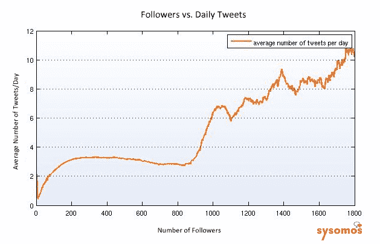
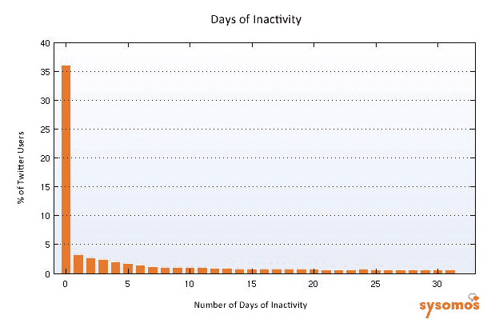
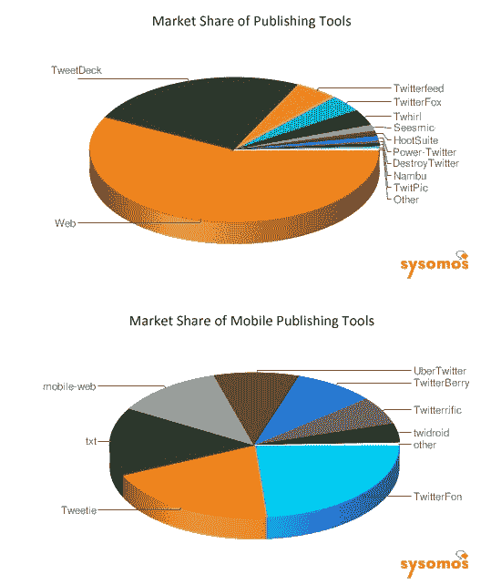

# 你的粉丝越多，你发的微博就越多。还是反过来？TechCrunch

> 原文：<https://web.archive.org/web/http://techcrunch.com/2009/06/10/the-more-followers-you-have-the-more-you-tweet-or-is-it-the-other-way-around/>

# 你的粉丝越多，你发的微博就越多。还是反过来？

哦，受欢迎的负担。我们已经知道，Twitter 上的大多数[人是绵羊](https://web.archive.org/web/20230326022229/https://techcrunch.com/2009/06/06/on-twitter-most-people-are-sheep-80-percent-of-accounts-have-fewer-than-10-follower/)，很少有追随者，也不怎么发微博。但是公羊队呢？如果你想在 Twitter 上领导一群人，你需要被听到。根据多伦多社交媒体分析公司 Sysomos 的一项新研究，拥有 100 名粉丝的人平均每天发 2.4 条推特，而拥有 1800 名粉丝的人平均每天发 10.2 条推特。转折点似乎在 800 名粉丝(每天 2.8 条推文)和 1000 名粉丝(每天 6.4 条推文)之间。

你的粉丝越多，你发的微博就越多。也许一旦人们吸引了足够多的观众，他们会觉得有义务让他们开心。更有可能的是，如果你真的有一些有趣的事情要说，你发的微博越多，你的粉丝就越多。事实证明，并不是每个人都把 Twitter 作为一种广播机制。许多人只是被动地收听并浏览他们的内容。Sysomos 研究了 1150 万个 Twitter 账户，并得出结论，前 10%的 Twitter 用户发布了 86%的推文(这与哈佛商学院的一项研究非常吻合，该研究估计前 10%的 Twitter 用户发布了 90%的推文)。它甚至比那更集中。Sysomos 的数据表明，Twitter 上排名前 5%的人发布了 75%的推文。

更广泛地说，Twitter 上 50%的人一周不到一次更新。但是 Sysomos 追踪的账户中有 36%每天都会发出推文。因此，Twitter 上大约有三分之一的人是相当活跃、专注的用户。而一半的人是更被动的电视迷，一周发不到一次微博。

这些数字实际上高于最近其他报告显示的活动。例如，TweetGrade 发现其样本中 29%的 Twitter 账户没有关注者。另一方面，Sysomos 发现零粉丝账户的比例要低得多:只有 7%。其中 21%的用户从未发布过推文(具有讽刺意味的是，65.5%的自称是社交媒体营销人员的人从未发布过更新)。这些差异可能是由于 Sysomos 收集这 1150 万个账户数据的方式造成的。它对 Twitter 进行了索引，从一组核心账户开始，然后扩展到所有的关注者和追随者。零关注者和零 Tweets 的死账户或垃圾账户不太可能被这种方式选中。所有的数据都是截至 5 月中旬的。

这项研究还分析了 Twitter 客户端的市场份额，包括桌面和移动客户端。超过一半的用户(55%)使用 Twitter 应用。最受欢迎的使用 Twitter 的方式是通过网站(45%)，其次是 TweetDeck(19%)。Twitterfon 和 Tweetie 是两个最受欢迎的移动应用程序，也是使用 Twitter 的第三大和第五大最受欢迎的方式，分别占 4.5%和 3.7%的市场份额。Twitterfeed 是第四大客户端，占有 3.8%的份额。Twitter feed 是人们向 Twitter 提交 RSS 订阅源的平台，今天被 Betaworks 收购。(以下是来自 [TwitStat](https://web.archive.org/web/20230326022229/http://twitstat.com/twitterclientusers.html) 的更多最新使用统计数据)。

