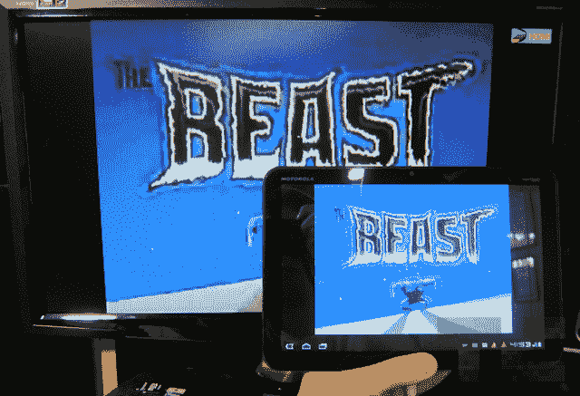

# 网飞应用程序(非官方)出现在蜂巢平板电脑上，以下是安装方法 TechCrunch

> 原文：<https://web.archive.org/web/http://techcrunch.com/2011/07/21/the-netflix-app-unofficially-arrives-on-honeycomb-tablets-heres-how-to-install-it/>

# 网飞应用程序(非官方)出现在蜂巢平板电脑上，下面是安装方法

向 XDA 开发者的力量致敬！现在可以在几乎所有的安卓设备上获得网飞流媒体，而无需任何黑客攻击、寻根或其他废话。这与网飞的官方立场相反，即只允许特定平板电脑上的应用程序在硬件层面符合特定的 DRM 要求。这是刚刚宣布的联想 IdeaPad 最大的卖点，现在还没有定论。

所有需要的是一个特定的 APK 文件，你就可以开始运行了。我在摩托罗拉 Xoom 或东芝 Thrive 上安装或运行该应用程序，甚至通过 HDMI 输出视频都没有任何问题。电子书阅读器[说，它甚至可以在 Nook Color 上运行，尽管速度很慢。我还没有发现该应用程序在蜂巢平板电脑或 Android 2.x 手机上不工作的报告。点击查看 4 个简单步骤。](https://web.archive.org/web/20230203223542/http://blog.the-ebook-reader.com/2011/07/21/netflix-now-works-on-nook-color-xoom-galaxy-tab-other-tablets/)

这个漏洞最大的好处是你不需要 root 或者越狱你的蜂巢平板电脑。它似乎对每一个股票光盘都有效。

第一步。
点击 [XDA 开发者](https://web.archive.org/web/20230203223542/http://forum.xda-developers.com/showthread.php?t=1178048)下载 APK。你可能也想写封感谢信。

第二步。
将 APK 安装到您的设备上。你很可能需要用 USB 线把标签连接到电脑上，然后把文件放到一个文件夹里。记住位置。

第三步。
转到设置>应用>选中未知来源旁边的复选框，以允许安装非市场应用。

第四步。
使用文件管理器应用程序(市面上有很多)，导航到您放下 APK 的文件夹，然后单击(或按住并单击)进行安装。

就是这样。该文件将在几秒钟内安装并运行。当然，由于这是从非官方渠道，它可能不会像广告宣传的那样。但很可能会。