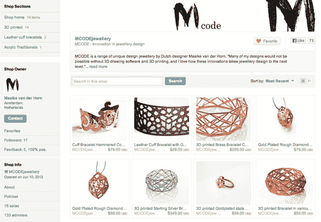
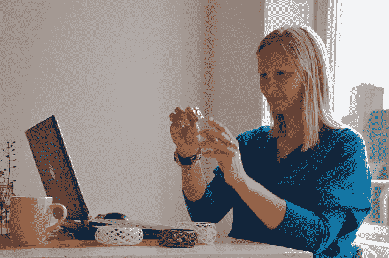

# 新“手工制作”(第二部分)

> 原文：<https://web.archive.org/web/https://techcrunch.com/2013/05/25/the-new-handmade-part-two/>

尽管 3D 打印技术已经存在了一段时间，但它现在才开始进入主流意识，这要归功于打印机本身越来越便宜的价格，以及关于 [3D 打印枪](https://web.archive.org/web/20221205105819/https://beta.techcrunch.com/2013/05/23/homeland-security-reportedly-warns-3d-printed-guns-are-impossible-to-contain/)和[救生医疗应用](https://web.archive.org/web/20221205105819/https://beta.techcrunch.com/2013/05/23/doctors-3d-print-an-emergency-airway-tube-to-save-a-childs-life/)的引人注目的头条新闻。虽然不太引人注目，但这项创新或许也在推动一个新的创意阶层，他们正使用 3D 打印机来制作艺术品。他们的“手工”商品，包括珠宝、家居装饰、礼品等，出现在手工艺者市场、 [Etsy](https://web.archive.org/web/20221205105819/http://www.etsy.com/) 和 3D 打印资源中心和在线商店、 [Shapeways](https://web.archive.org/web/20221205105819/http://www.shapeways.com/) 等网站上。

这些现代艺术家并不总是符合传统的模式——或者说刻板印象——艺术家应该是什么样子。他们不一定有工作室或工作室，也不总是有艺术背景或相关经验。有时，他们被所涉及的技术和科学所吸引，然后才发现他们更艺术的一面。

有时，他们只是在不相关的领域从事日常工作的普通人，他们发现 3D 打印是一种创造性表达自己的新方式，将他们的愿景和想法传达给比他们想象中可能的更广泛的受众。

这些是他们的故事。

*这是正在进行的系列的第二部分，该系列将展示由越来越容易获得的 3D 打印技术推动的一些艺术，以及作品背后的艺术家。在第一部分中，[我们介绍了一位受过正式训练的艺术家](https://web.archive.org/web/20221205105819/https://beta.techcrunch.com/2013/05/19/the-new-handmade/)，她在多年前第一次接触到 3D 打印技术后，受到启发，将 3D 打印用于自己的工作。*

*~ ~ ~*

第二部分:自学者

当荷兰设计师 Maaike van der Horn 想学习如何使用 3D 建模软件时，她转向了 YouTube。她说，这个网站上有很多指导你学习基础知识的教程，有时她会一遍又一遍地看这些教程，试图找到自己的路。

“如果你脑子里有一个想法，然后花一点时间——嗯，实际上是很多时间——你实际上可以走得很远，”她笑着说。

范德霍恩目前在一家欧洲航空公司担任市场研究员，但在过去的几年里，她一直试图学习一些完全不同的东西:她想成为一名金匠。

为了改变职业生涯，范德霍恩一直在荷兰 T4 的一所金匠学校接受兼职培训，以学习这门手艺。

“但我感到沮丧，因为我脑子里有所有这些关于我想做的东西的想法，但我意识到，用传统的金工技术和实践，我无法做出这些东西，或者可能只有在 20 年的经验后才能做出这些东西，”她说。

即使她成为了金工专家，锡焊和焊接技术也不允许她制作一些她今天能够使用 3D 打印制作的珠宝，而且由于这些限制，她最终制作的任何东西都不会是她的最初愿景——而是一些淡化的版本。

“你不可能做出如此复杂和非常几何化的物体，”她解释道。“你不可能这么精确。”

3D 打印提供了一个更好的选择。

范德霍恩在当地报纸上看到一篇文章后，第一次听说了这项技术，这篇文章谈到了网站[Shapeways](https://web.archive.org/web/20221205105819/http://www.shapeways.com/)——一个提供打印服务以及工具和帮助指导那些新技术使用者的网站，该网站[刚刚获得了由安德森·霍洛维茨领导的一轮 3000 万美元的 C 轮融资](https://web.archive.org/web/20221205105819/https://beta.techcrunch.com/2013/04/23/3d-printing-company-shapeways-raises-30-million-c-round-led-by-andreessen-horowitz/)。该网站很快成为范德霍恩的宝贵信息来源。

然后，她开始自学如何使用免费软件，如 SketchUp 和 T2 Blender，考虑到她从未接受过正式培训，也没有任何技术背景可以让她快速学会并适应新的软件程序，这一壮举更加令人印象深刻。事实上，在大学里，她学过心理学，即使在日常工作中，她也只用基本的办公软件。

但是 YouTube 教程和 3D 建模论坛已经让她走了很长一段路。有一次，当她真的陷入困境时，她雇了一个建模伙伴来帮忙，付给他 50 美元来解决一个特殊的问题。

范德霍恩对 Shapeways 赞不绝口，说这个网站让她很容易学会，而且材料和印刷成本的价格也很实惠。虽然她最初的努力有点困难——她的第一个打印对象是 2D 的一件物品——但她现在已经能够制作有趣、独特和复杂的形状了。

虽然她总是很狡猾——范德霍恩已经在她的房子里摆满了自制家具——但她真正喜欢的一直是珠宝。这就是她今天通过 Shapeways 制作的[，在那里她倾向于与金属打交道。不锈钢粉末，印刷，然后通过放置在金浴或青铜浴中固定，成为现代的可佩戴的珠宝，如戒指、耳环、项链和手镯。](https://web.archive.org/web/20221205105819/http://www.shapeways.com/shops/mcode)

“这真的贴近了我想做的事情的本质。但我喜欢金和银，现在还不可能在 Shapeways 直接打印银或金，”范德霍恩解释道。所以有时候，她用塑料打印珠宝，然后在当地铸造。“这是传统技术(铸造)和现代技术(塑料模型印刷)的结合。探索这两个世界如何融合在一起很有趣，”她补充道。

【T2

如今，她的大部分珠宝设计都是在厨房的桌子或沙发上完成的，用的是一台破旧的笔记本电脑，她想尽快换掉这台电脑。相比之下，她的金匠培训是在一个联合工作室里进行的，在那里，几名艺术家付费分享工具和设备，并分摊任何维修费用。

~~~~

**3D 艺术有灵魂吗？**

像许多早期的 3D 艺术家一样，范德霍恩的珠宝通过几何形状和锐利的线条反映了其技术基础。随着时间的推移，随着人们对这些技术越来越熟悉，这种情况可能会改变。与此同时，尽管范德霍恩自己总是被几何图形所吸引，但她仍然试图确保她的顾客看到她的珠宝来自于她——一位艺术家——而不是一台机器。

“许多人非常看重手工制作的、与艺术家有直接联系的东西。范德霍恩解释道:“挑战在于展示出我在设计中融入了自己的一部分。“你可以通过制作不那么几何化的东西来做到这一点，或者让每个分支都偏离它应该在的地方。或许你可以传达出一种感觉，即某种东西来自艺术家的内心，”她说。

现在她的商店已经有一年的历史了，她在网上 [和阿姆斯特丹当地市场](https://web.archive.org/web/20221205105819/http://www.etsy.com/shop/MCODEjewellery)销售商品。如今，她每个月都会出货 30 到 40 件商品，不过这取决于她参加的交易会和市场。

鉴于最近人们对 3D 打印的兴趣(有些人甚至会说是炒作)，我们问范德霍恩，她是否认为这项技术可以生产出具有长期价值的物品，就像她的金工技艺一样。

“这不仅仅是炒作，”范德霍恩断言道。“我确实认为我们正处于发展的开端，我们只是在探索任何人——像你我这样的人——能用这些技术做些什么。对我来说，这感觉像是新的工业革命。以前，我们都或多或少地依赖于拥有生产能力的工厂或跨国公司。”

“现在，”她补充道，“生产方式向任何人开放。”

