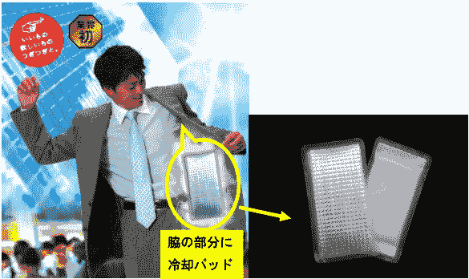
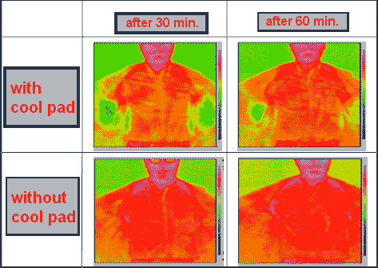

# “新冰衣”让出汗的人在酷暑中保持凉爽 

> 原文：<https://web.archive.org/web/https://techcrunch.com/2009/06/16/the-new-ice-suit-keeps-sweating-men-cool-in-the-summer-heat/>

# 这种“新冰衣”可以让出汗的人在炎热的夏天保持凉爽

东京的夏天令人难以忍受，因为在六月到九月期间，我和生活在这个城市的数百万人都要忍受炎热和潮湿。如果你是个男人，必须穿西装，那就更糟了。去年夏天，日本终于有了[除臭套装](https://web.archive.org/web/20230128123849/http://www.crunchgear.com/2008/07/30/cant-stop-stinking-in-the-office-try-these-deodorant-suits/)，这让事情变得简单了一些。今年，我们有内置冰袋的套装。

日本时装公司 Haruyama 宣布这些套装是世界上第一套此类套装。作为“新冰套装”的营销，购买者花了钱得到了特殊的冷却凝胶包。只要把它们放进腋下附近的内袋里，你就会立刻感到凉爽。

这样一来，你就会少出汗，少发臭。当你到了办公室，只要把冷却凝胶包放在冰箱里，你就可以准备回家了。上图显示了该系统的有效性。这是天才。

唯一的缺点是，新的冰服是日本独有的。在这里，它的价格是 520 美元，在全国 277 家商店有售。