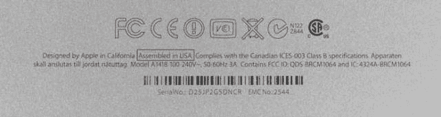

# 新款 iMac:由苹果在加州设计，在美国组装 

> 原文：<https://web.archive.org/web/https://techcrunch.com/2012/12/03/the-new-imac-designed-by-apple-in-california-assembled-in-usa/>

# 新款 iMac:由苹果公司在加州设计，在美国组装

你的下一台 Mac 电脑可能会在美国组装。苹果正在美国组装[的](https://web.archive.org/web/20221209025703/https://beta.techcrunch.com/2012/11/30/a-first-look-at-the-2012-21-5-inch-imac-and-how-it-compares-to-generations-past/)[至少部分](https://web.archive.org/web/20221209025703/http://appleinsider.com/articles/12/12/02/some-new-imacs-marked-as-being-assembled-in-america)新款超薄 IMAC，包含序列号和 FCC 标志的背面印章通常写着“由加州苹果公司设计”。在中国组装。”但是几个新型号的拥有者很快发现他们的机器是美国制造的。

苹果公司长期在美国生产产品。其位于加州 Elk Grove 的工厂于 1992 年开业，1995 年从配送中心改建为制造工厂。在 iMac 的全盛时期，它雇佣了 1500 多名员工，一周七天不停地生产电脑。这家工厂在 2004 年制造了最后一台电脑，当时负责全球运营的 SVP 蒂姆·库克整合了苹果的制造业务，这将是最大化效率和利润的成功之举。

萨克拉门托商业杂志[在 9 月](https://web.archive.org/web/20221209025703/http://www.bizjournals.com/sacramento/print-edition/2012/09/07/headcount-rising-apple-elk-grove-campus.html?page=all)注意到麋鹿林市的劳动力今年增长了 50%。这可能是 iMac 的秘密制造基地。

苹果公司尚未对调查结果发表评论。目前还不清楚新款 iMac 在美国何处组装，可能是在麋鹿林市。它可能是一家美国采购的第三方制造工厂。在今年五月的 D10 会议上，首席执行官蒂姆·库克承认苹果的优势不在制造业。他在与沃尔特·莫斯伯格的聊天中还提到，他希望有一天苹果能在美国组装产品

正如 iMac 背面的印记所示，这台电脑不是在美国“制造”的，而是在美国“组装”的。根据美国美国联邦贸易委员会，后者指的是包含外国制造组件的产品，其主要组件在美国进行组装，并发生实质性转变

在美国经济衰退之后，出现了一种战斗的呼声。制造业曾经是美国经济的核心，但在过去一代人的时间里，制造业工作岗位消失了。苹果并不是唯一将制造和组装外包给第三方的公司。富士康、仁宝和其他 OEM/ODM 在过去十年里经历了显著的增长，因为惠普、戴尔和苹果(以及许多其他公司)转向这些制造商制造他们的产品。但现在，随着美国试图夺回失去的东西，贴上“美国制造”(或组装)的小标签成为时尚。

并非所有新的 iMacs 都在美国组装。我们的审查测试人员贴有正常的“中国组装”信息。目前还不清楚，当电脑还在盒子里的时候，如何从中国模型中识别出美国制造的部件。但是总会有办法的。必须有一种方式向苹果表明，美国人更喜欢美国人组装的电脑。

