# 新款 iPad 让苹果平板电脑的统治地位变得前所未有的清晰 

> 原文：<https://web.archive.org/web/https://techcrunch.com/2012/03/14/the-new-ipad-review/>

即使你有完美的视力，让我在这里放纵一下。你知道吗，当你去做视力检查时，你被要求看着远处墙上的图表上的字母和数字的组合？你读了开头几行，然后意识到你实际上不能再往前走了。然后你戴上指定的眼镜(或隐形眼镜),你可以突然阅读每一个字母和数字。甚至那些你以前能读懂的现在也清晰多了。

这就是新 iPad 和旧 iPad 的对比。

这很奇怪，因为我从来不是那种认为最初的 iPad 和 iPad 2 的屏幕很差的人(但在后 iPhone Retina 世界里有很多这样的人)。我想这就像一个没有眼镜的世界——你永远不会意识到事物有多模糊，因为你总是这样看待一切。然后你戴上眼镜，你会想没有眼镜你是怎么过的。

一旦你看到并使用了新的 iPad，你就再也回不去了。

也许说老款 iPad 的屏幕比新款 iPad 看起来“模糊”是不公平的。更多的是沿着“模糊”的思路。在使用新 iPad 很长一段时间后，再切换回 iPad 2(或者 IP ad1，就此而言)，你会对每个应用程序图标周围出现的像素化云感到畏缩。文本看起来模糊不清。颜色会显得柔和。

iPad 2 仍然是当今市场上最好的平板电脑(当然，iPad 3 将于本周五正式上市)，新的 iPad 屏幕让它看起来像是过时的技术。这并不是说你不应该以新的 399 美元的价格购买 iPad 2，只是如果你走这条路，先不要看新的 iPad。会毁了你的 iPad 2。再说一次，这是我们现在谈论的最好的平板电脑。

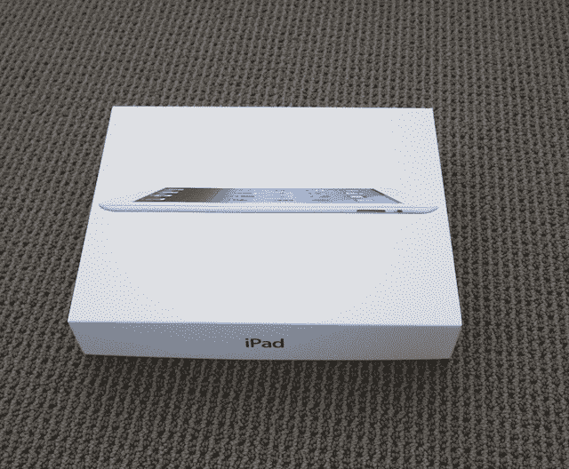

自从一年半前苹果在 iPhone 4 上推出“视网膜”显示屏以来，就有关于视网膜 iPad 的猜测。对一些人来说，这似乎是不可避免的。对其他人来说，这似乎[不可能](https://web.archive.org/web/20221207201313/https://beta.techcrunch.com/2011/01/17/wild-eyed-ipad-2-retina-display-speculation-ignores-one-thing-theres-no-content/)。

就没有内容了。制作成本太高了。对于便携式机器来说，它需要太多的能量。或者它会太厚而不能容纳所需的巨大电池。这些是仅仅一年前提出的论点。但是苹果做到了。

我们拥有的是一个 9.7 英寸的铝和玻璃平板，当被照亮时，会变成一个绝对令人惊叹的光和颜色的展示。乍一看，新 iPad 和 iPad 2 几乎没有区别。同样的智能套子甚至适合两者。但是设备*看起来*是什么样子并不重要。重要的是你在看什么:屏幕。

网页看起来几乎就像是在高质量的精美杂志上展示一样。照片看起来像照片——打印出来的那种。文字非常清晰，就像印刷品一样。

虽然屏幕是新 iPad 的最大卖点，但在我测试这款设备的一周里，我还享受了其他一些东西。

其中最引人注目的是 LTE 功能。简单说就是:快。非常快。比我的 WiFi 还快。

昨天，我用 LTE 测试了新 iPad 在威瑞森网络上的速度，下行 40 mbps，上行 40 mbps。这大约是我目前家庭有线宽带速度的两倍。另外，我把新 iPad 和我的 iPhone 4S 连接起来，和威瑞森的 3G 速度进行比较。下载速度大约快 40 倍。

(我的 LTE 速度测试范围从大约 15 mbps 到 42 mbps，从 10 mbps 到 20 mbps。大多数时候，我在这两个方面都处于较高水平。)

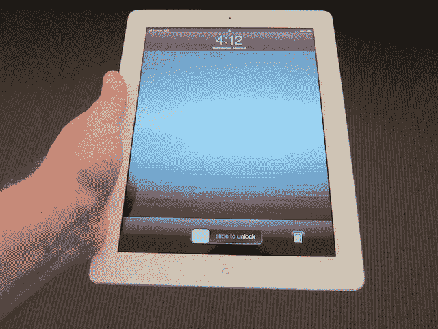

我从来不认为买 3G 版的 iPad 有什么意义，因为很多地方都有 WiFi，而在没有的地方，你可以把它拴在手机上。但我绝对会买 LTE 版的 iPad。同样，它比我通常连接的大多数 WiFi 网络都要快。

新 iPad 的威瑞森版本自带 LTE 热点功能，除了标准数据套餐外，没有额外费用。美国电话电报公司还不提供新 iPad 的共享功能，尽管他们显然在讨论这个问题。

苹果公司的[陈述了不在其产品中早期包含 LTE 技术的理由](https://web.archive.org/web/20221207201313/https://beta.techcrunch.com/2011/01/11/lte-iphone/)，包括设计和电池方面的考虑。他们显然已经用新 iPad 解决了这两个问题。据说电池寿命与 iPad 2 相同(WiFi 下 10 小时，蜂窝连接下 9 小时)。在使用它的过程中，我发现情况就是这样。LTE 消耗电池的速度可能会比 3G 快一点，但不会明显恶化。电池寿命总体来说还是很优秀的。

至于 LTE 成为产品设计的负担，苹果已经能够保持新 iPad 的外壳与上一次迭代几乎完全相同。它稍微厚一点(0.37 英寸对 0.34 英寸)，只有当你同时拿着两个时才能真正看出来。新 iPad 的重量也略高于 iPad 2 (1.46 磅对 1.36 磅——手机版)，但重量差异基本上无法区分。

那么，苹果是如何在增加 LTE 功能的同时保持电池续航时间不变，同时又不大幅改变设计的呢？看来他们在电池技术上有了相当重大的[突破](https://web.archive.org/web/20221207201313/http://www.zdnet.com/blog/hardware/new-ipads-most-revolutionary-feature-is-its-battery/18985)。虽然新电池显然不比旧电池大多少，但它可以容纳更多的电力(42 瓦小时对 25 瓦小时)。这样做的缺点是，我发现新 iPad 的充电时间要长得多。几个小时后——你可能想在一夜之间完成。

另一个我不得不假设与电池或 LTE 功能有关的轻微缺点是，与以前的 iPad 型号不同，新 iPad 在长时间使用后，左下角会明显变热。从来不热，只是暖和。但是，我从来没有在其他型号上注意到这一点。

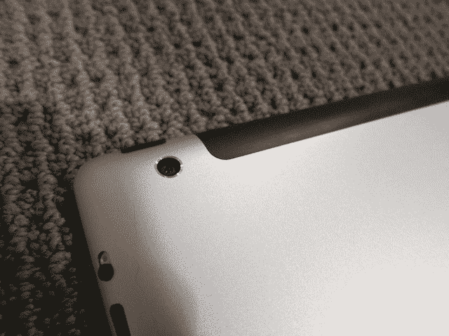

这款新 iPad 的另一大升级是:摄像头。此前，iPad 相机或多或少是静态摄影的一个笑话。苹果对此的解释是，它实际上只打算拍摄 720p 视频，但很多人会用它来拍照——结果 70 万像素的图像是好的，不是好的(见下文)。

看到这个用例，苹果包括了一个好得多的 500 万像素的五行镜头。它有一个/2.4 的光圈和一个混合红外滤光片。老实说，我不知道那一半是什么意思，我所关心的是，新 iPad 上的图像现在看起来非常好。新 iPad 上没有闪光灯，但无论如何 iPhone 上的闪光灯往往相当差。

这种新镜头还可以每秒 30 帧的速度拍摄 1080p 的视频(再次从 720p 提高)。它还具有视频稳定功能。

与此同时，前置摄像头仍然是普通的 VGA 质量的种类。但苹果公司认为这主要是为了 FaceTime(而且高质量的图像可能会导致延迟)。这里有一个悲伤的消息:尽管 LTE 网络速度非常快(甚至比我的 WiFi 还快)，但苹果公司表示，FaceTime 目前仍将只支持 WiFi。

速度方面，新 iPad 感觉非常快。但是 iPad 2 感觉非常快。这可能有一个很好的原因:报道称 A5 芯片与新的 A5X 芯片相似。一个关键的区别是图形功能。运行 Retina 显示屏需要很大的 GPU 马力。A5X 的四核显卡是关键。

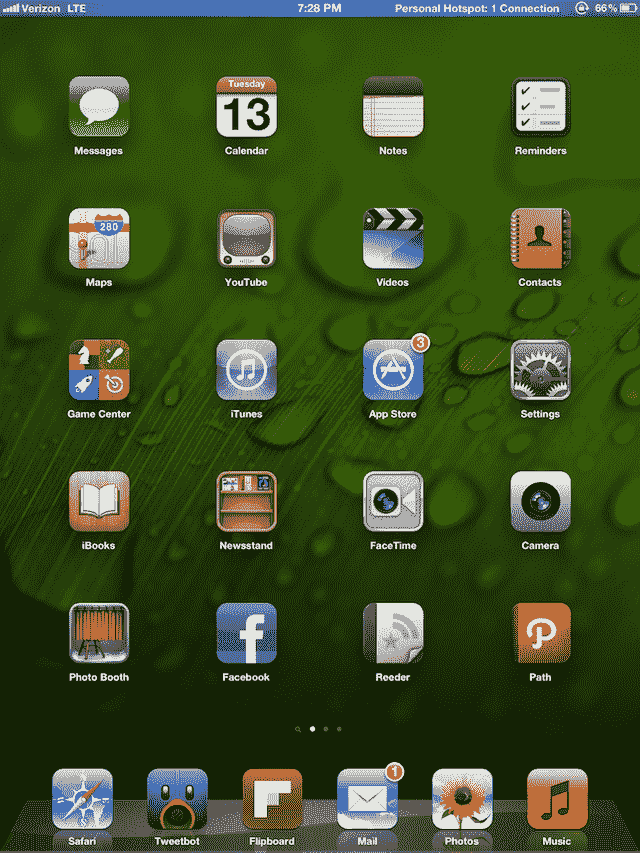

增强的图形也应该会给 iPad 游戏带来一些重大的进步。苹果在上周的主题演讲中展示了一些演示，但遗憾的是，这些游戏还没有上市。

据报道，新 iPad 还配备了两倍的内存(1GB 对 512MB)，苹果从未透露这一规格，但拆穿不会说谎。同样，我还没有注意到这方面的太大变化，但这只是早期，应用程序还没有针对新设备进行优化。

说到应用程序，苹果已经升级了几乎所有自己的应用程序，以适应视网膜。结果是应用程序看起来很棒，但仍然响应迅速。我测试了 iPhoto、Pages、Keynote、Numbers、iMovie、GarageBand 和其他一些工具。

iPhoto 是一颗耀眼的明星，因为它是苹果公司上周发布的全新应用程序。结合更好的相机，它可以很好地满足大多数照片编辑需求。在大图上拖动手指来调整亮度时，这里或那里会有轻微的延迟，但总体来说非常稳定。

如果你想在 iPhone 4S 上用更好的 800 万像素摄像头拍摄图像，你可以通过 Beam 功能轻松地将它们移到 iPad 上进行编辑。

在这篇评论的时候，我能找到的唯一一个视网膜可用的第三方应用是由 Tapbots 开发的 Twitter 客户端 [Tweetbot](https://web.archive.org/web/20221207201313/http://tapbots.com/software/tweetbot/) 。昨天被推送到 App Store，与 iPad 2 版本的差别是显而易见的。

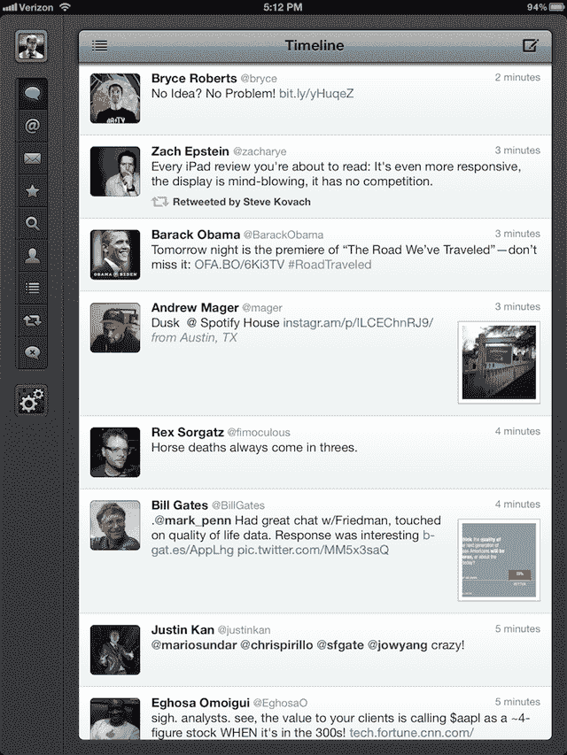

苹果告诉我，在周五 iPad 正式发布之前，应该会有更多支持 Retina 的应用程序发布。但是，除非你最喜欢的应用程序图形太多，否则它们看起来应该不会太差，因为 iOS 会自动升级新 iPad 上每个应用程序中的文本。即使是放大的 iPhone 应用程序在这个新屏幕上看起来也要好得多。

新的视网膜就绪应用程序的一个缺点是它们会占用更多的空间。苹果已经提高了无线下载的上限，但对于许多应用程序来说，你需要 WiFi 来下载。如果你在考虑新 iPad 的 16 GB 版本，你应该考虑一下这个存储要求。

另一件需要考虑的事情是:有了新 iPad，你显然会想要高清版本的电影和电视节目，而这些往往是标准清晰度版本的两倍。苹果将电影作为 iCloud 的一部分(他们之前添加了电视节目)缓解了这一点，但仍然需要注意。

那么高清电影在新屏幕上看起来怎么样呢？非常好，但不完美。请记住，新 iPad 的分辨率为 2048 x 1536——这比顶级的 1080p 电影(苹果现在提供)的质量要高得多。令人惊讶的是，iPad 的像素比我的 60 英寸高清电视还多，后者的分辨率为 1920 x 1080。但是除非好莱坞开始制作 1536p 的视频，这是极不可能的(尽管最终，它们会变得更高)，否则电影不会为视网膜做好准备。

在我测试的 iPad 上，我有三页应用程序、几百张照片、一部高清电影和一张音乐专辑。它真的没有那么多东西，但它占用了 20 GB 以上的存储空间。仅应用程序就超过了 10 GB。

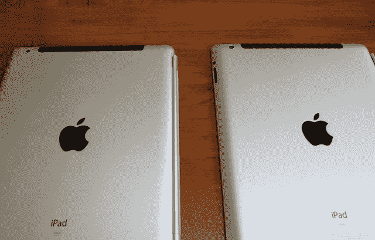

令人惊讶的是，Siri 是软件方面最缺乏的东西。当苹果的数字个人助理与 iPhone 4S 一起推出时，许多人认为它也会走向新的(更快的)iPad。出于某种原因，苹果选择不这么做，至少现在还没有(流行的说法是，他们仍在解决测试版产品的规模问题)。然而，Siri 的一个关键组成部分确实实现了飞跃:听写。点击虚拟键盘上的麦克风按钮可以让你说话，而不是在有文本输入框的地方打字。效果很好。

看到 Siri 在未来某个时候以软件更新的形式出现在这个版本的 iPad 上，我不会感到震惊。

撇开功能和技术方面不谈，新款 iPad 感觉如何？太神奇了。这是最好的设备，而且做得更好。它的价格和以前一样。除了一些小的吹毛求疵之外，真的没有什么不喜欢的。

在上周新 iPad 发布之前，几个人([包括我自己](https://web.archive.org/web/20221207201313/https://beta.techcrunch.com/2012/03/06/the-ipad-hd-is-wonderful/))预测了不可避免的事后失望。原因很明显:苹果是他们自己成功的受害者。因为 iPad 2 已经比竞争对手好太多了(你当然可以说 iPad 1 也是)，苹果唯一能打败的设备就是他们自己的。iPad 2 已经非常好了，很难超越。

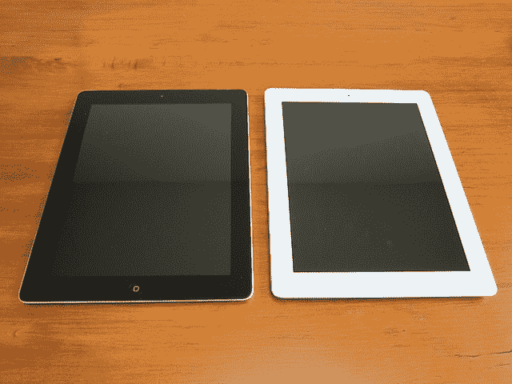

由于从工业设计的角度来看，新款 iPad 与 iPad 2 看起来基本相同，许多人误以为苹果开始自满了。让我说清楚:新 iPad 是一个巨大的技术飞跃。它拥有迄今为止我所见过的最好的屏幕，我可以把它握在手中，触摸并一次使用 10 个小时。

还记得几年前大家都在用分辨率为 800 x600 的 CRT 显示器吗？他们需要插上电源，坐在后面有足够空间的桌子上。它们的重量超过 30 磅。当你拿着这个新 iPad 的时候，想想这个。

回想一下几年前，大多数人通过拨号上网的日子。速度是 14.4 kbps 或 56 kbps，需要一部固定电话。这个新的 iPad 将会以比我现在的宽带连接速度更快的速度连接到整个美国的互联网。它可以在不充电的情况下持续工作大约 9 个小时。

科技很神奇，这款新 iPad 也很神奇。同样令人惊讶的是:目前在这个特定领域唯一能与苹果竞争的公司是苹果。所以唯一真正的问题是:如果你有以前的 iPad 型号，你会升级吗？

如果你有原来的 iPad，我说这是显而易见的。如果你有一台 iPad 2，这是一个更艰难的决定，因为它似乎仍然和新 iPad 一样快。但是，如果你选择不升级(或者现在花 399 美元买 16 GB 的 iPad 2)，同样，当你在苹果商店时，把新 iPad 当作美杜莎。去吧。不是。看啊。在。它。

如果你对苹果产品中的 LTE 感兴趣，显然，买一个新的 iPad 吧。如果你在你的 iPad 上阅读很多，买新的 iPad。如果你拍了很多照片和视频(是的，你，音乐会前排的小丑，你的 iPad 在空中)，买一个新的 iPad。如果你在 iPad 上玩很多游戏，买新的 iPad。

如果你还没有 iPad，买个新的吧。

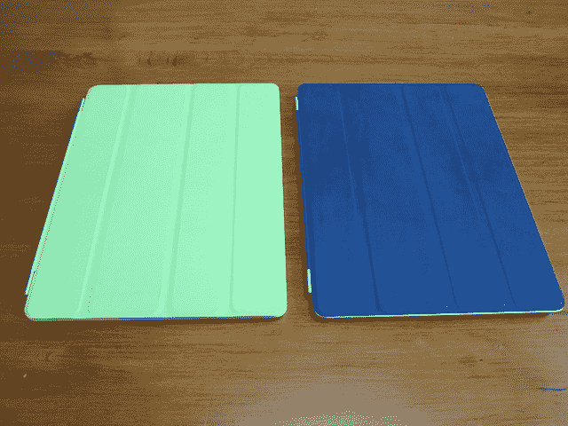

新的 iPad 屏幕:

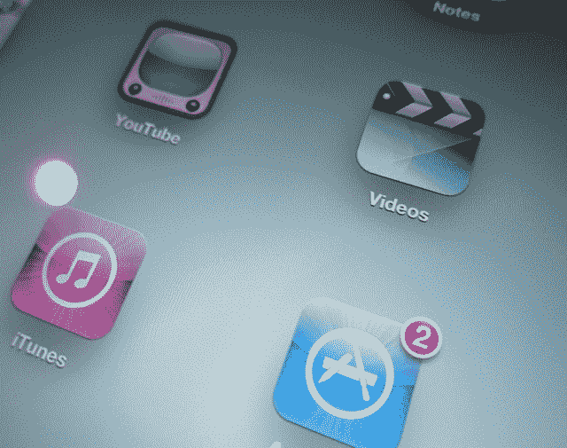

iPad 2 屏幕:

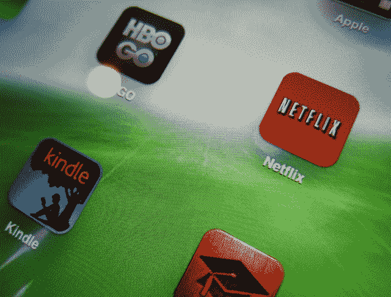

用新 iPad 拍摄的照片:

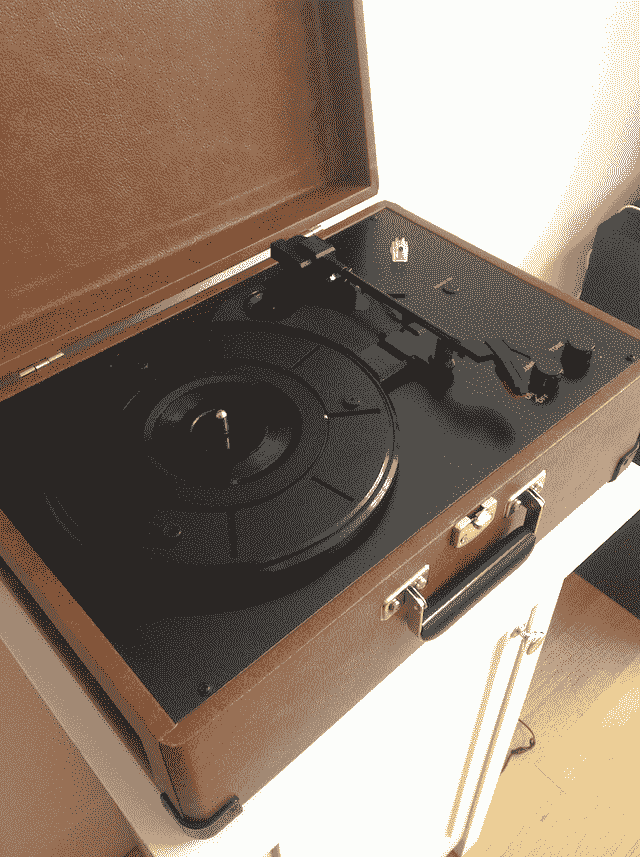

用 iPad 2 拍的照片:

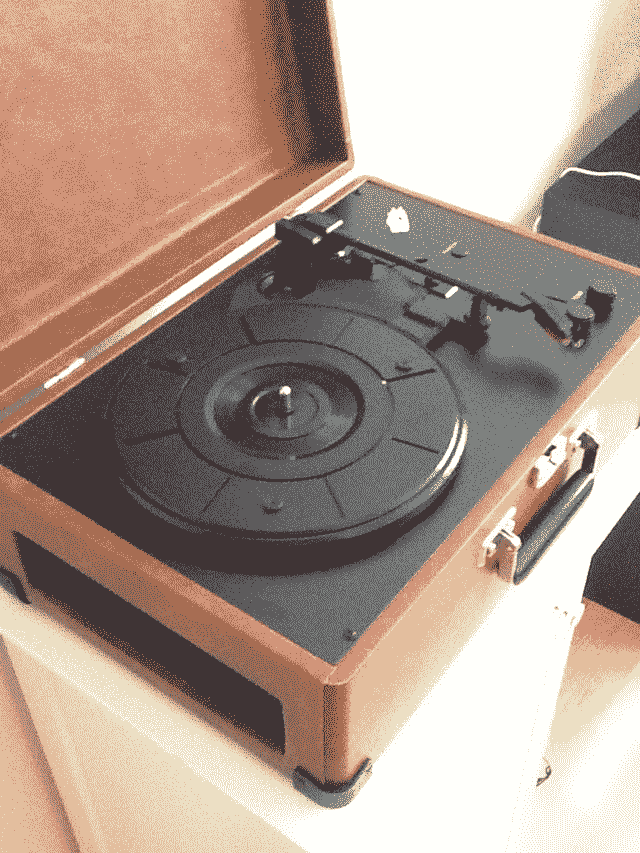

iPad 2 上的旧 Tweetbot 图标特写:

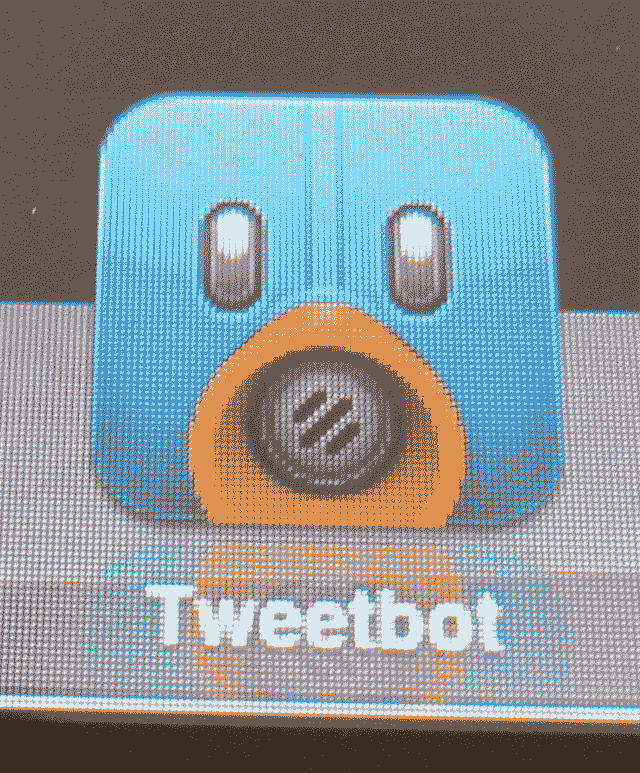

新 iPad 上的新 Tweetbot 图标特写:

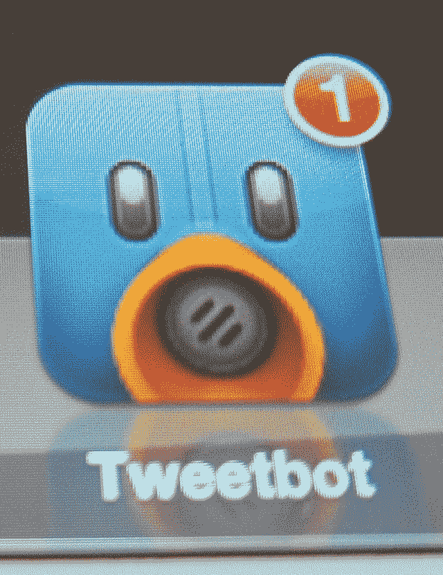