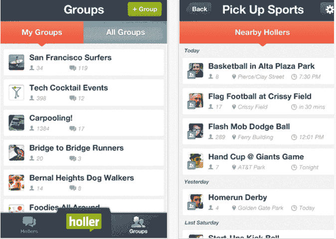
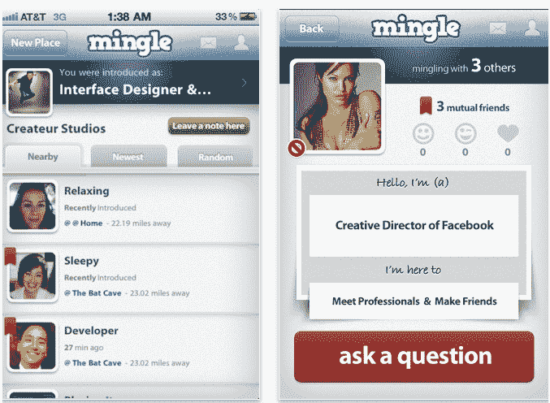
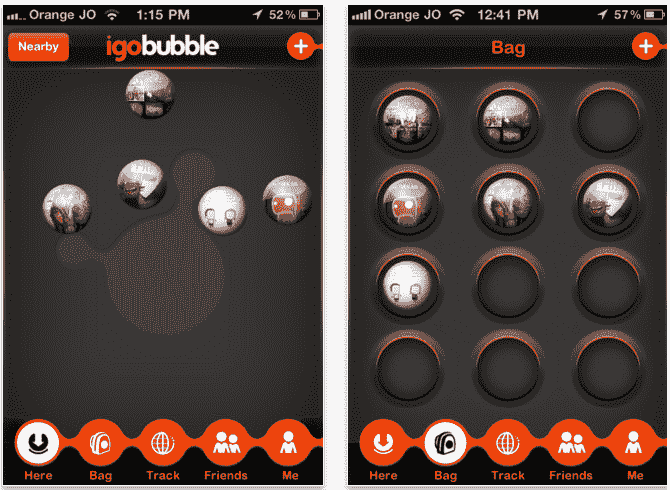

# 新的社交网络:谁在附近，不是你认识的人

> 原文：<https://web.archive.org/web/http://techcrunch.com/2011/09/16/the-new-social-network-whos-nearby-not-who-you-know/>

社交网络服务有一个新概念正在扎根，它不是像脸书今天所做的那样，在网络上重新创建你的离线社交图。这是关于发现那些现在就在你身边的人——那些你可能想认识的人。

许多服务已经使这种发现机制成为可能，包括像 [Foursquare](https://web.archive.org/web/20230315095319/http://foursquare.com/) 和 [Gowalla](https://web.archive.org/web/20230315095319/http://gowalla.com/) 这样的签到应用，通过 [Sonar](https://web.archive.org/web/20230315095319/http://www.sonar.me/) 和 [Banjo](https://web.archive.org/web/20230315095319/http://ban.jo/) 自动发现附近的人，在 [Yobongo](https://web.archive.org/web/20230315095319/http://yobongo.com/) 中的群组聊天，以及通过 [LoKast](https://web.archive.org/web/20230315095319/http://www.lokast.com/) 出现的微型网络。所有这些公司都在玩基于位置的社交网络，试图通过各种方式将你和你周围的人联系起来。

在本周旧金山举行的 TechCrunch Disrupt 大会上，更多的服务也出现在这个领域进行竞争。

今天的移动智能手机的强大功能允许一种新的网络:社交发现服务，而不是社交网络服务。发现服务主要侧重于突出显示您身边的用户，并将您与您可能希望结识的人联系起来。

与此同时，脸书旨在将你与你已经认识的人联系起来。在脸书上的“发现”限于搜索名字或网络(例如，学校、工作场所),在那里介绍他们自己以前发生过。

但是我们每天都在参与一些短暂的、不断变化的社交网络。这些在很大程度上没有被脸书开发:人们在健身房锻炼，购买食品杂货，打篮球，带他们的狗去公园，在操场上看他们的孩子，等等。他们是你每天进出的网络，他们不是由你的密友、脸书朋友或其他人组成的。他们只是在同一时刻和你有共同兴趣的人。这家伙准备好参加篮球比赛了。杂货店的优惠券剪寻找交易。一个新的小狗的主人希望一个小狗玩耍的日期。

Disrupt 的几个优秀应用程序希望通过向你介绍你想认识的人来更好地突出这些类型的网络。

一款名为 [Holler](https://web.archive.org/web/20230315095319/http://itunes.apple.com/us/app/holler/id461565363) (iTunes)的应用基于兴趣和活动。你加入一个团体(例如，冲浪者)，当附近的其他人对同一件事感兴趣时，应用程序会向你推送通知。目前，群组是由 Holler 自己预先建立的，但它正在推出一个用户可以建立自己的群组的系统。但是，会有某种级别的过滤和控制，因此不会创建重复的组。

【T2

Holler 设计得很好，有一个干净和极简的布局，这使得它从第一次启动就很容易使用。不幸的是，它遇到了许多其他“社交”应用一开始都会遇到的问题——没有足够多的人使用它。为了解决这个问题，Holler 的开发者们正在考虑向应用程序的用户公开所有的群组，而不仅仅是附近的用户，这仍然允许围绕兴趣进行社交。虽然这可能会增加参与度，但它剥夺了该应用的核心承诺，即基于邻近的社交——其移动会议正在进行中。

同样，另一家 TechCrunch Disrupt 初创公司 Alley 公司 [Mingle](https://web.archive.org/web/20230315095319/http://minglesocialapp.com/) 也开发了一款移动应用，旨在根据兴趣联系用户。但在 Mingle 的情况下，它是关于向附近的其他人介绍自己，希望你们两个有共同的兴趣，而不是围绕共同持有的兴趣，例如“购物”或“锻炼”。

Mingle 用户填写介绍卡，并将其张贴到他们当前的位置。在该位置“交往”的其他人可以看到彼此，如果需要，还可以离线交谈。这就是 Foursquare 所能做的，如果它不那么拘泥于列出“这里的其他人”,只有一个头像和一个名字，一个姓氏的首字母(可以说是无用的信息，除非这些人已经是现实生活中的朋友)。

第三款应用来自初创企业街，有点另类，但很有趣。这款名为 [igobubble](https://web.archive.org/web/20230315095319/http://igobubble.com/) 的手机应用可以让你在给定位置留下包含文本、照片、视频、音乐等内容的虚拟“泡泡”。其他人可以随后出现，找到你的泡泡并与之互动，甚至改变它。您将看到谁“触摸”了您的气泡，然后可以与他们实时聊天。还有更多的信息，但这些都是基本的。

igobubble 感觉更像是一个艺术项目，而不是移动社交领域的下一个大热门，但至少他们跳出了思维定势。它不仅仅是重新创建传统社交网站的结构(有个人资料、列出的兴趣、头像)，而是认为将内容与位置联系起来是实现移动社交发现的第一步。这当然是一种不同的看法。你是谁不重要，重要的是你在那个地方做了什么。

基于位置的社交空间中其他有趣的想法包括 Disrupt Startup Alley 参与者 [Evertale](https://web.archive.org/web/20230315095319/https://evertale.com/) ，一个将照片映射到位置的移动应用程序的制造商，用于即时剪贴簿和回忆老朋友，以及[观众选择获胜者](https://web.archive.org/web/20230315095319/https://techcrunch.com/2011/09/13/cardflick-hopes-youll-never-use-paper-business-cards-again/) [CardFlick](https://web.archive.org/web/20230315095319/http://www.cardflick.co/) ，一个为附近用户提供的联系人共享应用程序。

但是，当涉及到社交发现时，有任何新的应用程序(或者旧的应用程序)真的一针见血吗？班卓琴和[声纳](https://web.archive.org/web/20230315095319/http://sonar.me/)都很棒，但感觉更像是工具，而不是它们自己的网络。 [Yobongo 的](https://web.archive.org/web/20230315095319/http://yobongo.com/)聊天没有上下文，显得有点欠缺。如果不能聚集足够的参与者，Holler 的移动聚会就无法运作。感觉更多的是商务社交而不是社交。igobubble 是一个有趣的想法，但是没有实施。

看起来每个服务都可能是一个更大整体的一部分——一个新的基于邻近的社交网络，将位置放在第一位，人和内容放在第二位。一个新的网络，还没有人有足够的雄心去尝试设计，所以专注于一个单一的利基或功能。

至少，Foursquare 有足够的资源来实现这一目标，但它在继续强调人工签到方面停滞不前。该公司应该提高定期签到的自动化程度，建立用户档案，让用户通过日常活动中表现出来的共同兴趣联系起来。它应该根据结合了“朋友的朋友关系”的行为来建议新朋友至少，当一大群朋友一起签到时，它应该提醒群中彼此没有联系的用户错过了机会。它甚至应该考虑让用户挑选在应用程序中运行的附加服务。如果 Foursquare 对未来有更广阔的愿景，有一天 Yobongo 的聊天、CardFlick 或 Mingle 的介绍以及 igobubble 的内容共享都可能成为 Foursquare 的功能，而不是独立的应用程序。

与此同时，由于这里提到的新的 TechCrunch Disrupt Alley 初创公司和其他公司，尝试最新和最棒的基于邻近的社交网络很有趣。然而，他们中的任何一个是否会成为热门，将不得不留给市场来决定。

*信用:顶部图像通过[混合](https://web.archive.org/web/20230315095319/http://minglesocialapp.com/)*