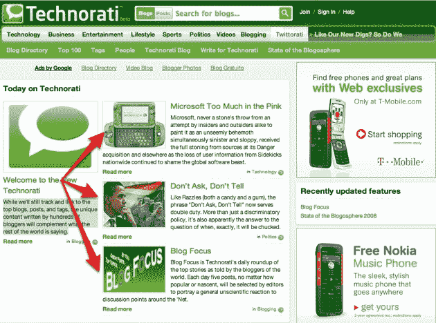

# 新 Technorati 

> 原文：<https://web.archive.org/web/https://techcrunch.com/2009/10/14/the-new-technorati/>

Technorati 今晚重新启动了它的网站，改变并增加了一些关键功能。最值得注意的是一个扩展和更新的 100 大博客列表，以及一个让作者直接在网站上发布内容的新功能。

2007 年，Technorati 对其主页的外观和功能进行了三次重新设计。下面是第一个[。以及第二个](https://web.archive.org/web/20230324083948/https://techcrunch.com/2007/05/23/all-new-technorati/)[。在即将上任的首席执行官理查德·贾利钱德拉的指导下，最后一次变革从那时起基本保持不变。](https://web.archive.org/web/20230324083948/https://techcrunch.com/2007/09/10/technorati-launches-streaming-updates-service/)

与此同时，Technorati 专注于拓展其他领域的业务，尤其是为其他网站处理广告。如今，在 Technorati 每月 2500 万美国独立访问者的总网络流量中，只有一小部分真正访问了 Technorati.com。

但这并不意味着旗舰网站不是一项重要的资产。我们这些写了几年博客的人会记得 Technorati 是一个关键博客工具的日子，它提供了一个高质量的实时搜索引擎，而 Google 每隔几周才索引大多数博客。

今天，Technorati 仍然提供了一个伟大的博客搜索引擎，并保持着许多人所说的权威的博客前 100 名名单。有了这个新网站，他们更加关注直接的 Technorati 内容(更多内容见下文)，并对更受欢迎的博客进行适当的分类。

[自己去看看吧](https://web.archive.org/web/20230324083948/http://www.technorati.com/)，这里是新功能的概要:

**百强博客:**

 [前 100 名博客](https://web.archive.org/web/20230324083948/http://technorati.com/blogs/top100/):直到今天，前 100 名博客是根据前六个月其他博客的独特链接确定的。排行榜是相当静态的。现在，他们更加关注上个月的最新数据，并给予博客 1-1000 的权威排名。评分因素包括发帖频率、上下文、链接行为和“其他输入”该公司表示，随着博客数量的起伏，结果是榜单的波动性大大增加。

Technorati 还将博客按各种主题分类，并为每个主题提供单独的顶级博客列表。[比如这里的商务](https://web.archive.org/web/20230324083948/http://technorati.com/blogs/directory/business/)，还有[小工具](https://web.archive.org/web/20230324083948/http://technorati.com/blogs/directory/technology/gadgets/)。

**直接发布到 Technorati:**

作者现在可以选择[直接](https://web.archive.org/web/20230324083948/http://technorati.com/write-for-technorati/)向 Technorati 发布内容，以获得更广泛的受众。该内容在 Technorati.com 主页的顶部突出显示。对于拥有大量读者的博客来说，这并不具有吸引力。但如果我刚开始写博客，我会在这里发布一些内容以获得曝光，然后交叉发布到我自己的博客。每个作家都有一个[个人资料](https://web.archive.org/web/20230324083948/http://new.technorati.com/people/tuffyr/)，上面有他们网站的链接和他们在 Technorati 上写的内容。

**搜索:**

Technorati 正在改变搜索，让权威性和相关性比新近性更重要。对于像“iPhone”这样的高查询率术语，这可以减少很多噪音，帮助人们更快地找到高质量/权威的内容。用户也可以选择搜索与查询相关的博客或与查询相关的帖子，这取决于他们在寻找什么。

**话题内容:**

Technorati 也仍然以主题为基础展示外部内容。顶部的浅绿色导航栏有“技术”和“运动”等主题该频道上显示的内容包括直接写在 Technorati 上的内容，以及来自该主题权威博客的帖子。