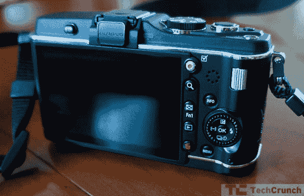
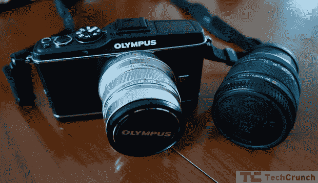
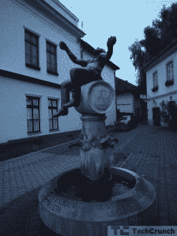

# 奥林巴斯笔式电子 P3:让相机再次充满乐趣

> 原文：<https://web.archive.org/web/http://techcrunch.com/2011/07/22/the-olympus-pen-e-p3-making-cameras-fun-again/>

**特性:**

*   微型 4/3s 镜头安装系统
*   高清视频录制
*   1230 万像素传感器
*   3 英寸触摸屏显示器
*   建议零售价:899 美元，带镜头

**优点:**

*   小巧、轻便、坚固
*   触摸屏和内置闪光灯让初学者更容易上手
*   出色的照片质量

**缺点:**

*   稍微复杂的界面
*   一些轻微的色差
*   一些小的自动对焦问题

**短版**
作为奥林巴斯 Micro 4/3s 系列相机的长期粉丝，来到 E-P3 期待着好东西。我没有失望。这款相机就像迷你库伯(Mini Cooper)或智能汽车:它可以带你去你需要去的地方，你可以在路上玩得开心，由此节省的尺寸、体积以及在某些方面的价格，使它成为 DSLR 爱好者的第二款相机，或者是刚刚开始使用可拆卸镜头的人的第一款相机。

**完整回顾**

E-P3 是奥林巴斯最贵最大的 M4/3 相机。他们目前的产品线包括 E-PL 和 E-PM(分别为 Lite 和 Micro)相机，每一款都比上一款更小更轻。用苹果 fanboi 的话来说，E-P3 就是 iPod Touch，而 E-PL 就是 Nano，E-PM 就是 Shuffle。这些相机都可以安装奥林巴斯生产的任何 M4/3 镜头。

那么，这个 E-P3，就是奥林巴斯‘M4/3 线’的祖师爷。899 美元的建议零售价为你提供一台相机和一个 m . Zuiko Digital ED 14-42mm II R f 3.5/5.6 变焦镜头(或一个 17mm 的主镜头，但这对新手来说可能有点用处)，相机有银色、黑色和白色。它重 13 盎司，宽 5 英寸。它有一个 3 英寸的触摸屏，只需轻轻一点，就可以立即聚焦到图像的任何部分。顶部的模式轮提供各种拍摄模式，而单独的功能按钮允许快速访问相机的各种设置。相机背面有一个专用的视频按钮，开/关开关被小心地隐藏起来，不像以前奥林巴斯 M4/3 相机上的按钮。

没有光学取景器，尽管你可以购买一个适合相机的配件取景器。一个弹出式闪光灯按钮隐藏在左后边缘，而一些快速设置按钮和转盘点缀着后部，用于手动控制光圈和速度。正面除了镜头释放按钮之外毫无特色。

对每个特性的全面测试远远超出了这篇评论的范围，我是从用户的角度来看这个问题的。要明确的是，如果你想看这篇评论，然后在评论中挑剔我的相机实力，请点击这里而不是 T1。我是一个爱好者，写这篇评论是为了初学者，包括但不限于长途旅行的人、初为人父母的人和想要成为街头摄影师的人。我主要是将这款相机与佳能(Rebel 系列，也许是 G12)和尼康(D60 和 D80)的入门级产品进行比较。我完全知道你是一个相机之神，只用一个前面扎了一个洞的旧的贵格会教徒的燕麦盒子和一块盖着明胶卤化银的平纹细布就能拍摄一场婚礼。这个相机显然不适合你。

我试图回答的问题是:一个非专业/专业消费者的摄影师可以用这个相机拍出好照片吗？根据我目前的经验，我发现这不仅仅是可行的，事实上，这款相机可以取代价格和装备相似的入门级 DSLR。速度、自动对焦和功能集使它成为一款出色的相机，适合室内和旅行拍照，专业镜头男(女)将享受其尺寸和便携性以及出色的性能。

**相机**
初学者可能会很快适应这款相机。有了装备镜头、自动和艺术设置，习惯于指向并拍摄的人们可以指向并拍摄他们相对成功的方式。多个屏幕菜单和提示确保您知道幕后发生了什么，艺术模式菜单非常容易使用。即时在屏幕上再现效果和设置，确保当相机拍摄到您意想不到的东西时，您不会感到惊讶。

在 iAuto 模式下(本质上是智能自动，没有强制闪光)，相机提供了许多屏幕提示，用于设置饱和度、亮度以及“运动变焦”(从移动的对象中抓取一点污迹)和“背景模糊”(将模糊的背景添加到人像等)。

场景模式提供多种场景设置，包括微距、运动、“儿童”(快速移动的种类)和晚上/夜间摄影。艺术模式允许你在一个场景中添加多个滤镜，包括棕褐色、粒状胶片和倾斜移动效果。这些起初很有趣，一旦你意识到你可以用这个东西拍出高质量的照片，很快就会变得无聊。

我主要在 P(程序)模式下拍摄，在各种光线下都有出色的效果。除了对焦，我很少调整速度、ISO 或光圈，并在几次短途旅行中拍摄了一些出色的家庭照片。

微型 4/3s 平台最大的优点是能够快速轻松地移除和更换镜头。然而，M4/3 (MFT)相机是无镜的，因此更紧凑。可以说，镜头将图像直接投射到传感器上。我发现自己被新的 12 毫米 f/2.0“专业”镜头(价格高达 800 美元)所吸引，但我从套件镜头以及令人惊讶的有效[M . Zuiko Digital ED 40-150 毫米 f4.0-5.6](https://web.archive.org/web/20230205044108/http://www.olympusamerica.com/cpg_section/product.asp?product=1522) (更容易管理的 299 美元)中获得了类似的性能。你需要很多镜头吗？不(我将在下面深入讨论这一点)，但它有所帮助。

 例如，这张照片是在 ISO320 用 12 毫米镜头以 F/2.0 1/60 秒拍摄的。这是我女儿即兴拍摄的照片，我认为对于一般的摄影师来说已经足够了。事实上，我能让她在拍摄的 1/60 秒内保持不动，这证明了这款相机的速度和自动对焦能力。

 这个巴克斯的镜头，另一方面，是以 F/2.2(用同样的 12mm 镜头)在 ISO1600 用 1/23 秒拍摄的。这是在雨中接近黑暗的时候拍摄的，虽然需要一些光亮，但考虑到当时的条件，这是一个很好的镜头。显然，这两个镜头中的玻璃质量在很大程度上影响了镜头的质量。

不管有没有 899 美元的镜头，总之，我用电子 P3 拍了一些很棒的照片，没有太多的改动。奥林巴斯已经大大改进了自动对焦(并且他们已经减少了视频录制时的噪音)，我很高兴地注意到他们已经提高了开箱即用的色彩质量。以前，大多数 E-P 系列相机都有倾向于橙色和红色的坏习惯，即使白平衡设置得当。这不是这个相机的问题。

**镜片**
如果你是刚入门，套装镜片就可以了。我还非常喜欢用于街拍的[17 毫米、售价 299 美元](https://web.archive.org/web/20230205044108/http://www.olympusamerica.com/cpg_section/product.asp?product=1462)的扁平镜头，因为它允许更完整、对焦更好的框架，并且适合人像和广角拍摄。这是你最初真正需要的仅有的两个镜头，如果你从不购买另一个镜头，这两个就足够了。

前面提到的 [40-150mm](https://web.archive.org/web/20230205044108/http://www.olympusamerica.com/cpg_section/product.asp?product=1522) 是一个狂野的变焦镜头，真的可以把远处的物体拉近(下面画廊里烟囱上的鹳就是用那个镜头拍的)。如果你有现金和动力，899 美元的 12 毫米相机是惊人的，在任何光线下都能拍出好照片。这个镜头在捕捉漂亮、干净的肖像和丰富、明亮的风景时真的很重要。

如果我看到了什么问题，那就是某些主题上的一些轻微的蓝色/紫色模糊。当快速拍摄时，也会出现一些轻微的焦点偏差，但很难重现。

警告是这样的:如果你打算只买一个镜头，你可能还没有准备好或者特别需要一台 MFT 相机(或者 DSLR，就此而言。)有很多优秀的点和拍摄可用，包括佳能的 G12 和 S95 或尼康的 P300。投资一个单一的平台是一个艰难的赌注，但我相当肯定 MFT 线不会消亡，让爱好者孤立无援。虽然有些镜头(比如我最喜欢的 12 毫米)总体来说非常昂贵，但当你进入 DSLR 光谱的高端时，价格会变得更糟。

**底线**
这款相机并不适合所有人，但它提供了足够的价值和性能，可以轻松取代标准的入门级 DSLR，并且由于紧凑的机身和相当合理的价格(考虑到建造质量和性能)，你正在寻找一款价格合理的相机。

虽然我不能真诚地向那些可能或可能不想投资至少一个镜头的人推荐这款相机，但我会推荐它作为旅行者的第二个便携式相机，以及作为新父母和祖父母的不错的室内相机。对一个书呆子来说这已经够强了，但对初学者来说却是如此。

有许多支持和反对 MFT 模式的论点，我期待着在评论中进行热烈的交流。然而，作为一个带着全套 DSLR 相机环游世界的人，能够把像 E-P3 这样强大而小巧的东西放进一个小包里，仍然能拍出好照片，这是一种受欢迎的感觉。这是一个令人印象深刻的套件，非常值得考虑。

**画廊笔记**
我有限的技能拍出了这些照片，但是 [Robin Wong 的照片](https://web.archive.org/web/20230205044108/http://robinwong.blogspot.com/2011/07/olympus-e-p3-review-final-words.html)和 [Koon Yik 的电子书](https://web.archive.org/web/20230205044108/http://www.scribd.com/doc/59027807/OLYMPUS-PEN-E-P3-Opera-Version)提供了更多的质量，尤其是与我笨拙的尝试相比。

[产品页面](https://web.archive.org/web/20230205044108/http://www.olympusamerica.com/cpg_section/cpg_digital_pen.asp)