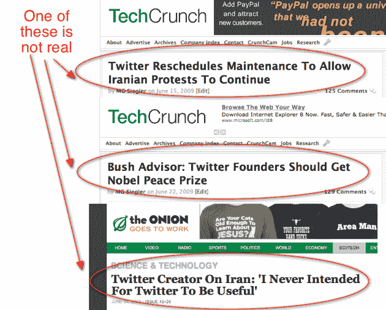

# 《洋葱报》终于报道了伊朗局势“摧毁”Twitter TechCrunch

> 原文：<https://web.archive.org/web/https://techcrunch.com/2009/06/24/the-onion-weighs-in-on-the-iranian-situation-ruining-twitter/>

# 《洋葱报》终于对伊朗局势“毁掉”推特发表了看法

许多人在我们的推特上发表了与伊朗局势相关的评论，怀疑这些评论是否真的是讽刺网站 [The Onion](https://web.archive.org/web/20220930230145/http://theonion.com/) 的文章。我想到了两个例子， [Twitter 重新安排维护时间，允许伊朗抗议活动继续](https://web.archive.org/web/20220930230145/http://www.beta.techcrunch.com/2009/06/15/twitter-reschedules-maintenance-to-allow-iranian-protests-to-continue/)和[布什顾问:Twitter 创始人应该获得诺贝尔和平奖](/web/20220930230145/https://techcrunch.com/2009/06/24/2009/06/22/former-deputy-national-security-advisor-twitter-founders-should-get-nobel-peace-prize/ "Bush Advisor: Twitter Founders Should Get Nobel Peace Prize")。嗯，洋葱终于有了自己的。正如你所料，这很好。

帖子简短，甜蜜，切中要害。但最精彩的部分是推特联合创始人杰克·多西的假话:

> “Twitter 本来是一个让空虚、自我中心的自我主义者与任何可怜到可以阅读他们的人分享他们最平庸和愚蠢的想法的方式，”明显感到困惑的多尔西说。
> 
> “当我听说伊朗人是如何利用我心爱的发明为自己服务的——比如组织一场政治运动，向外界通报一个专制政权的行动——我简直不敢相信他们毁了这么美好、简单而又毫无意义的东西。”多尔西说，他已经在开发一个新网站，这个网站将毫无用处，以至于伊朗人甚至不知道如何操作它。

说真的，Twitter 在这场危机中已经被证明是一个了不起的工具，但我承认，这里和其他地方的标题读起来确实像洋葱新闻标题。

