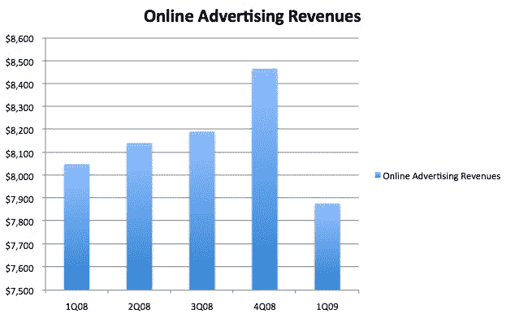
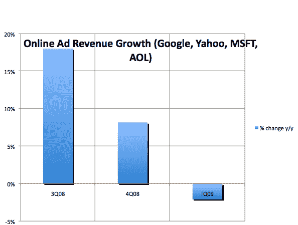
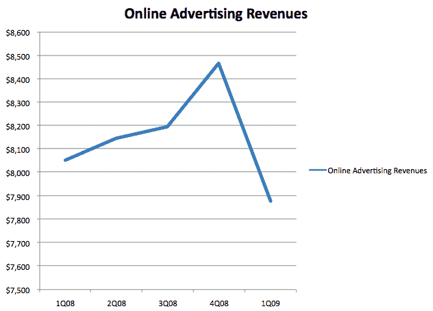

# 在线广告衰退正式来临:收入首次出现季度下滑 

> 原文：<https://web.archive.org/web/https://techcrunch.com/2009/05/01/the-online-ad-recession-is-officially-here-first-quarterly-decline-in-revenues/>

# 在线广告衰退正式来临:收入首次出现季度下滑

这是广告业最后一个下滑的部分，也可能是第一个复苏的部分，但在线广告现在正处于衰退之中。随着四家最大的网络广告公司([谷歌](https://web.archive.org/web/20221207033001/http://www.beta.techcrunch.com/2009/04/16/google-shows-a-3-sequential-dip-in-revenues-first-one-ever/)、[雅虎](https://web.archive.org/web/20221207033001/http://www.beta.techcrunch.com/2009/04/21/carol-bartz-still-looking-for-wow-as-yahoos-first-quarter-revenues-decline-13-percent/)、[微软](https://web.archive.org/web/20221207033001/http://www.beta.techcrunch.com/2009/04/23/microsoft-reports-a-massive-miss-with-net-earnings-down-32-percent/)和[美国在线](https://web.archive.org/web/20221207033001/http://www.beta.techcrunch.com/2009/04/29/aol-posts-23-percent-decline-in-revenues-during-1st-quarter-as-it-prepares-for-spin-off/))公布了三月份的季度财务报告，我们可以对该行业的整体表现有一个很好的了解。如果你把这四家在线广告领头羊的在线广告收入加起来，本季度的在线广告总收入为 79 亿美元，比一年前下降了 2%，比第四季度下降了 7%。

在线广告的增长已经放缓了一段时间，但这是第一个收入实际下降的季度。鉴于所有这些公司在本季度的糟糕表现，这并不令人意外。只有谷歌能够勉强维持年度增长，其他公司的在线广告收入都出现了下降。事实上，谷歌的广告收入占总收入的 68 %,它看到了适度的增长，有助于抑制整体下滑。

以年度为基础，收入增长从第三季度的 18%下降到第四季度的 8%，再到本季度的 2%。从季度环比来看，降幅甚至更大。除了上个季度环比增长小幅反弹 3.4%(这似乎也是季节性的)，环比增长率至少在过去六个季度一直在下降。

这些数字代表了全球广告收入，包括通过 AdSense 和雅虎广告网络支付给分支机构的网络收入。我剔除了谷歌的许可收入，其他公司的季度收益报告中只包括了在线收入中的广告部分。那些有兴趣将这一数据与更多官方数据进行比较的人应该注意到，IAB 最近才发布了第四季度的数据，而 T1 只衡量了该行业的国内收入。

你可以在下表中看到我使用的数字。

**在线广告收入(百万美元)**

|  | 3Q07 | 4Q07 | 1Q08 | 2008 年第二季度 | 3Q08 | 4Q08 | 09 年第一季度 |
| 谷歌 | $4,190 | $4,758 | $5,086 | $5,185 | $5,352 | 5，504 雷亚尔 | $5,331 |
| 美国 Yahoo 公司(提供互联网的信息检索服务) | $1,544 | $1,590 | $1,572 | $1,587 | $1,563 | $1,594 | $1,383 |
| 微软 | $670 | $860 | $840 | $840 | $770 | $866 | $721 |
| 美国境内提供线上加值网络服务的公司(American On Line) | $540 | $620 | $552 | $530 | $507 | $507 | $443 |
| 总数 | $6,994 | $7,828 | $8,050 | $8,142 | $8,192 | $8,467 | $7,878 |
| 环比增长 |  | 12.73% | 2.84% | 1.14% | 0.61% | 3.4% | -6.96% |
| 年增长率 |  |  |  |  | 18% | 8.16% | -2.10% |

**更新**:对于那些在评论中抱怨我的排行榜的人，因为它不是从零开始的，这里有另一个显示完全相同的数据。

