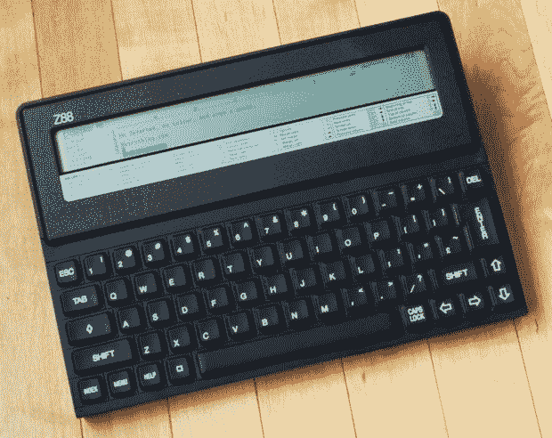

# 原版 iPad:剑桥 Z88 

> 原文：<https://web.archive.org/web/https://techcrunch.com/2010/02/10/the-original-ipad-the-cambridge-z88/>

# 最初的 iPad:剑桥 Z88

[翻新](https://web.archive.org/web/20230325101905/http://www.retrothing.com/2010/02/cambridge-z88-tablet-pc.html?utm_source=feedburner&utm_medium=feed&utm_campaign=Feed:+RetroThing+(Retro+Thing+-+The+vintage+technology+site))有一个对剑桥 Z88 的赞美，这是一个 1987 年制造的聪明的小装置，靠四节 AA 电池运行 20 小时。老实说，我不知道我拥有的任何一台设备可以运行这么长时间。除了文字处理器，你还有一个基本的内置版本和一个漂亮的小液晶显示屏和大键盘。当然 640×64 的分辨率有点粗糙，但是你还想要什么呢？

如果你仔细想想，其他所有东西，包括 [iPad](https://web.archive.org/web/20230325101905/http://crunchgear.com/tag/ipad) ，相比之下都很烂。你仍然可以在这里买到它们你知道吗，道格拉斯·亚当斯在《最后一次见上写了[？](https://web.archive.org/web/20230325101905/http://www.tdv.com/lastchance/)