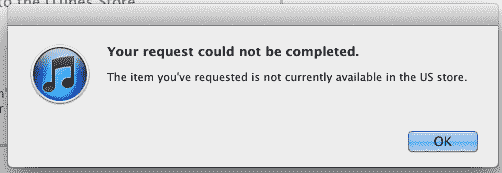

# 最初的 Siri 应用程序从应用程序商店下架，服务器被杀| TechCrunch

> 原文：<https://web.archive.org/web/http://techcrunch.com/2011/10/04/the-original-siri-app-gets-pulled-from-the-app-store-servers-killed/>

# 最初的 Siri 应用程序从应用程序商店被撤下，服务器被杀死

早在今天宣布 Siri 语音助手将成为 iOS 不可或缺的一部分之前，Siri 就是一个第三方应用。它没有那么漂亮，也没有那么好的集成，但它有一个很大的优势:它可以在任何 iOS 设备上运行。

然后苹果[买了 Siri](https://web.archive.org/web/20230306050927/https://techcrunch.com/2010/04/28/apple-buys-virtual-personal-assistant-startup-siri/) 。很明显，苹果正在向语音领域进军——然而，这款应用仍然在商店里。它没有更新，但它仍然存在。然后苹果推出了 Siri……专为 iPhone 4S 设计的。

就这样，Siri(应用程序)的生命走到了尽头，为 Siri(功能)让路。

对于大多数人永远不会注意到的事情，下拉是精心设计的:当 Siri 第一次在舞台上提到时，该应用程序仍然很容易获得。演示结束时，这款应用已经不见踪影——不幸的是，对于那些在过去一年左右时间里可能已经使用了 Siri 的人(或者更糟糕的是，那些已经把 Siri 视为日常生活一部分的人)，Siri(这款应用)所依赖的服务器似乎同时被关闭了。

**更新**:短暂的停机后，服务器恢复运行..带着他们即将灭亡的信息:“*我被取代了！新的 Siri 比我更聪明，更漂亮，在 iPhone 4S 上等着你。我将于 10 月 15 日回家。在那之前……我怎么帮你？”* 

那么，为什么把它拿下来？我想到了两个原因。首先，如果最大的功能之一已经作为第三方应用程序提供(尽管程度有限)，那么向目前的 iPhone 4 用户追加销售 iPhone 4S 是相当困难的。不那么糟糕的是，拥有一个与功能同名的第三方应用程序(尤其是一个大约一年没有更新的应用程序)将不会令人困惑。但是，如果仅仅是为了避免混乱，为什么要为那些已经有应用程序的人关闭服务器呢？

