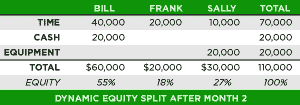

# 你的员工应该得到多少股权？动态拆分模型将其分解

> 原文：<https://web.archive.org/web/https://techcrunch.com/2013/02/09/the-perfect-cap-table/>

**编者按:** *[迈克·莫耶](https://web.archive.org/web/20230330164135/http://www.slicingpie.com/about-mike/)是《切片派的作者，这是一本关于实施[动态股权拆分](https://web.archive.org/web/20230330164135/http://www.slicingpie.com/)的书。在 Twitter 上关注他 [@GruntFunds](https://web.archive.org/web/20230330164135/https://twitter.com/GruntFunds) 。*

很少有话题比[股权分割](https://web.archive.org/web/20230330164135/http://www.slicingpie.com/)在创业团队中引起更多的分歧。如今，绝大多数股权分割都是固定的:在创业初期，创始人会获得固定数量的股权，迫使他们在事情不可避免地发生变化时重新谈判。例如，两个创始人平分股权，一个人做所有的工作。然后呢？个人贡献的意外变化或员工的增减会使团队成员产生分歧，每个人都在争夺自己能得到的最大份额。

然而，还有一种方式在自举创业公司中越来越受欢迎:动态拆分。使用动态分割模型，企业家能够精确地确定初创企业中每个人应得的股权，这在固定分割模型中是不可能的。在固定分割模式中，股权决策基于创始人对团队每个成员贡献的预期。在动态分割模型中，股权决策是基于创始人*实际*的贡献。

动态模型为每个参与者的各种贡献分配一个相对值。例如，时间是主要贡献之一。个人时间的价值是相对于团队的其他成员来计算的。例如，一个高级 Oracle 程序员的时间相对于一个刚毕业的大学生来说更有价值。其他贡献包括现金、知识产权、设施、供应品、设备，甚至与潜在客户或投资者的重要关系。可以为每个贡献设置一个相对值(相对值计算列表可以在[这里](https://web.archive.org/web/20230330164135/http://www.slicingpie.com/grunt-fund-cheat-sheet/)找到)。

动态模型通过将一个人的贡献除以团队所有成员的贡献来确定适当的百分比。这提供了基于一个人对组织的实际影响的所有权的精确计算。

与固定分割不同，动态模型随着时间的推移而变化，因为额外的贡献使得根据需要增加或减少团队成员变得容易。因为所有的价值都是相对的，所以该模型确保了所有参与者的公平性，而不管他们的贡献如何。贡献最大的人会得到最高的回报。

举个例子，一个有两个创始人的小型科技创业公司。比尔是一名经验丰富的销售人员，拥有 20 年的工作经验和发达的人际网络；Frank 是一名年轻有才华的开发人员。比尔和弗兰克决定比尔的“市场价值”可能是弗兰克所能得到的两倍。他们把比尔的时薪定为 200 美元，弗兰克为 100 美元。

此外，比尔向公司投入 5000 美元现金以支付杂费。现金比时间具有更高的相对价值，因为存 5000 美元比赚 5000 美元要难得多(更不用说所有的创业公司都需要现金)。他们把现金的相对价值定为实际价值的四倍。这反映了现金的重要性和比尔可能失去所有现金的风险。

营业的第一个月末，比尔和弗兰克每人工作了 100 小时。因此，比尔及时投入了 20，000 美元，并投入了 20，000 美元现金(5，000 乘以 4)。弗兰克及时捐助了一万美元。所以，公司的总“价值”是 50，000 美元。比尔拥有百分之八十，弗兰克拥有百分之二十。请注意，美元价值并不是公司价值的真实反映；它只是作为一种跟踪每个人贡献的相对价值的方式(我们希望它会更有价值！)

 接下来的一个月，他们雇佣了另一名开发人员莎莉。他们把她的时薪定为 100 美元，因为她的技能和经验与弗兰克相似。Sally 还捐赠了一些价值 10，000 美元的设备。他们同意设备不同于现金，但它仍然比他们的时间更有价值。他们对设备的估价是现金价值的两倍(20，000 美元)。

每个团队成员在下个月工作 100 个小时。Bill 在现有的 40，000 美元基础上增加 20，000 美元，Frank 在 10，000 美元基础上增加 10，000 美元，Sally 贡献 10，000 美元的时间和 20，000 美元的设备。现在公司的总“价值”是 110，000 美元。比尔拥有 55%的股份，弗兰克拥有 18%的股份，萨利拥有 27%的股份。动态模型已经很容易地适应了新的参与者，并且百分比已经进行了适当的调整。比尔所拥有的是他所贡献的完美体现；弗兰克和莎莉也一样。比尔和弗兰克的所有权较低，但他们仍然很高兴，因为公司的价值增加了。

 股权分置在公司组建阶段会不断调整。当公司准备好进行重大投资时，他们的团队将更加稳定。投资者将享受一个公平对待所有人的干净的上限表的好处。如果公司选择不寻求外部投资，资本总额表提供了一个分配利润或股息的工具。

动态股权分割与初创公司最为相关。该模型几乎消除了固定股权模型中常见的股权分配错误，并允许团队在利益完全一致的情况下前进。包含传统期权和归属时间表的股权计划更适合波动性较小的大公司。

完美的工资表是任何企业家都能掌握的。实施动态股权模型将适应公司经历的不可避免的变化，尤其是在创业初期。传统的固定模式存在不公平股权分割的风险，这可能会导致创始人之间的关系问题，往往会导致初创公司的灭亡。