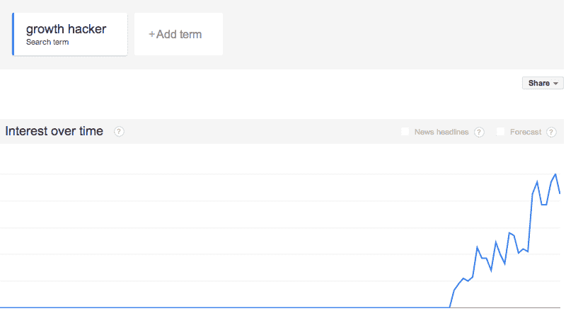

# 真正的增长引擎与增长黑客无关

> 原文：<https://web.archive.org/web/https://techcrunch.com/2014/03/22/the-real-engines-of-growth-on-the-internet/>

More posts by this contributor

**编者按:** *丹·卡普兰帮助初创公司讲述他们的故事。他为 Twilio、Asana 和 Salesforce 做过营销，并在 threading 写过关于[营销、成长和讲故事的博客。](https://web.archive.org/web/20230326052333/http://threadling.com/)*

想象一下，你是洛杉矶一所富裕高中的 17 岁女生，刚刚发现了 Snapchat。在那之前，每次你想给你的恋人发色情照片时，你都不得不担心自己的裸照会出现在互联网上。当你想和你的同龄人谈论热恋对象或朋友或敌人时，你不得不担心你的话落入错误的人手中，被错误的眼睛看到。

但是突然，你有了这个叫 Snapchat 的新东西，你知道当你用它给你的男朋友发短信或者说一些关于你的友敌的垃圾话时，你的信息会自毁。你知道，与脸书或 Tumblr 或 Instagram 不同，Snapchat 不会将这些信息存储在互联网的永久索引中，也不会分享给全世界。

你是这个 17 岁的女孩。你打算怎么办？你要告诉你最酷的朋友。全部都是。你也要告诉你的男朋友，他也要告诉他的朋友。因为他的朋友也希望他们的女朋友与他们分享裸照，他们将告诉自己的女朋友，很快，Snapchat 就成为自脸书近十年前像数字小行星一样着陆以来高中和大学最热门的东西。

如果你问 Ooga Labs 的联合创始人兼 PayPal 增长副总裁 Stan Chudnovsky 这里发生了什么，他会有一个直截了当的回答:

“我知道 Snapchat 很酷；我知道你会觉得这很酷；你会认为我告诉你这件事很酷。”

但是，Chudnovsky 说，Snapchat 与 Hotmail 时代消费者互联网上的任何不可思议的增长故事没有什么特别的不同。

> 在真正的增长专家——那些在高速增长的互联网公司从事增长研究的专家——中，“增长黑客”是一个有分量的术语。充斥着炒作。充斥着关于互联网公司如何成长的糟糕想法:往好里说是空洞的，往坏里说是误导。

“增长最强劲的产品，”他说，“同时做三件事:它们让你在你邀请的人面前看起来很聪明。当你邀请的人加入时，他们会给你带来真正的价值。一旦你邀请的人注册了，他们就会给你带来真正的价值。”

请注意，Chudnovsky 在这里没有提到“增长黑客”事实上，丘德诺夫斯基认为增长黑客是扯淡。

“在许多情况下，”他说，“成长型黑客是到处寻找小技巧的人，或者只是寻找自己可以应用的利基市场的人，就像一年前的数据科学家一样。”

在真正的增长专家——那些在高速增长的互联网公司从事增长研究的专家——中，“增长黑客”是一个有分量的术语。充斥着炒作。充斥着关于互联网公司如何成长的糟糕想法:往好里说是空洞的，往坏里说是误导。

## “增长黑客”的起源

“增长黑客”一词最初是由肖恩·埃利斯在 2010 年 7 月创造的，他因帮助 Dropbox(以及其他公司)早期增长而闻名。但是当埃利斯第一次提出这个术语时，它并没有真正流行起来。

直到 2012 年 4 月，一位名为陈楚翔的博主写了一篇名为“[增长黑客是新的营销副总裁](https://web.archive.org/web/20230326052333/http://andrewchen.co/2012/04/27/how-to-be-a-growth-hacker-an-airbnbcraigslist-case-study/)”的文章，增长黑客的想法才得以实现。

陈的帖子描述了 Airbnb 的团队如何通过精明的营销和智能工程的结合，找到了如何自动交叉发布到 Craigslist 的方法，尽管 Craigslist 不提供 API。结果呢？优步分类广告网站成为 Airbnb 流量、链接和新用户的主要驱动力。

炸药爆炸了。

自从陈的帖子发布后，自认为是“成长黑客”的人数激增。我在 Twitter 上找到了 450 多个这个词，在 LinkedIn 上找到了 1000 多个。去年，一位名叫 Ryan Holiday 的作家写了一本名为“增长黑客营销”的书，这是亚马逊上的顶级营销书籍。TechCrunch 上至少有八篇帖子在讨论这个问题。

这是谷歌趋势的图表:

以防不明显，增长黑客已经得到了很多发挥。

但是，当你停下来想一想，吸引所有注意力的增长黑客是建立在已经引人注目的产品之上的:

*   Dropbox 的共享存储机制帮助 Dropbox 起飞，因为 Dropbox 很棒，也很容易使用。

*   Airbnb 花了一到两年时间来确定他们的产品(例如，手动拍摄上市公寓的专业照片)，然后“入侵”Craigslist，寻找新的增长途径。

当你开始挖掘时，你会注意到的另一件事是，绝大多数自称为“成长型黑客”的人既不是黑客(他们不写代码)，也不为高增长的互联网公司工作。

这两件事表明，大多数“增长黑客”都是空话。

但如果增长黑客是炒作，那我们该怎么办？如果套用一句关于神圣罗马帝国的名言，增长黑客既不是黑客也不是增长，那么互联网上真正的增长引擎是什么？

为了回答这些(以及更多)问题，我采访了三位在高速增长的互联网公司实现了真正增长的人:[Greylock Partners(之前是 Twitter、脸书和 LinkedIn)的乔希·埃尔曼](https://web.archive.org/web/20230326052333/http://twitter.com/joshelman)；[丘德诺夫斯基](https://web.archive.org/web/20230326052333/http://www.crunchbase.com/person/stan-chudnovsky)；以及[财富前线](https://web.archive.org/web/20230326052333/https://twitter.com/ibringtraffic)的安迪·约翰(Andy Johns)【原:脸书、推特和 Quora】。

他们的见解很有启发性。

## 乔希·埃尔曼的 3 条成长原则

在加入 Greylock 成为风险投资人之前，Josh Elman 曾在 Twitter 从事增长方面的工作，他认为口碑仍然是互联网可持续增长的基本原则。

> 如果你的产品没有一个吸引人的故事，让使用它的人很容易向不使用它的人解释，你的成长就会停滞。

他说，虽然“有很多不仅仅是口头传播的东西，但增长的原子单位是一个人向另一个人谈论一种产品。不管是一个应用程序，一家新餐馆，还是一种新牙膏。同样的原则也适用。”埃尔曼认为，当你围绕口碑建立用户基础时，“没有什么神奇的诀窍。”相反，“可持续增长需要大量深思熟虑、努力和考虑。”

对埃尔曼来说，这种不断付出的成长可以归结为三个核心原则或阶段。他称这三个阶段为“目的、开始和采用”

**1。你的产品需要一个目的**

Elman 认为，互联网上最成功的产品都有一个令人信服的目的——满足用户生活中的一个重要需求。“目标不是你的愿景或使命，”他说。“这是人们使用该产品的核心原因。这是他们告诉自己和其他人为什么使用它并热爱它的故事。”

这听起来可能很简单，但实际上这似乎是很多创业公司都忽略的一点:如果你的产品没有一个令人信服的故事，而且使用它的人很容易向不使用它的人解释，那么你的增长将会停滞。

**2。盗梦空间！**

埃尔曼说，“初始阶段，潜在用户听到你的产品后会想‘我现在就想要这个’。”"

为了说明这个概念，埃尔曼讲了一个关于柯南·奥布莱恩的故事:

> 当柯南·奥布莱恩失去了他在《今夜秀》的工作，并在 Twitter 上宣布他的单口喜剧巡演时，你可以用两种方式来讲述这个故事。你可以说“柯南·奥布莱恩发了一次推特，在推特上卖完了他的喜剧巡演。”或者你可以说“如果柯南·奥布莱恩宣布他的巡演时你在推特上，你就可以在票卖完之前买到票了。”

正如 Elman 指出的，第二个故事对 Twitter 的潜在用户更有吸引力。“对错过的恐惧，”他说，“是行为的巨大驱动力。”

埃尔曼说，要掌握《盗梦空间》,初创公司应该问问自己，如何设计和扩大口碑。虽然实际的机制取决于你产品的性质，Elman 强调了三个有用的策略:

*   **越来越紧迫。“媒体是一个强大的开端工具，但你需要确保他们在为你讲述正确的故事。”**
*   **广告。**“广告有点像付费口碑:你把你的信息放在用户已经在的地方。但你需要克服的困难更多，因为人们通常一开始会跳过或忽略广告。”
*   **病毒式分享。**“你应该一直寻找方法来帮助你的用户病毒式地分享你的产品，并且寻找方法来激励他们分享。”

当然，如果你不能让人们接受和采用你的产品，那么世界上所有的初始策略都没有意义。

**3。领养不仅仅是为了孩子**

用埃尔曼的话来说，采纳是潜在用户上门后发生的一切:“你已经让他们感兴趣了。现在，你必须清楚地解释你的产品，让他们对它感到兴奋，一旦他们开始使用它，就让他们感到高兴。”

作为一个例子，他指出了他和他的团队对 Twitter 新用户体验的改变:

> 当我开始在 Twitter 工作时，最初的入职体验是这样的:“嘿，Twitter 来了！写个更新！进城！”我们重新编写了介绍，教新用户如何跟进。我们必须教他们什么是跟随，它是如何工作的，以及为什么跟随很重要。然后我们必须让他们真的跟踪人们。

如果在埃尔曼和他的团队重新调整入职流程之前，你是 Twitter 的新用户，你就被扔进了狼群。没有人关注你，没有人追随你，Twitter 要求你分享你的第一次状态更新。在 Elman 和他的团队重组之后，Twitter 对新用户来说更有意义，而且(尽管采用仍然是一个持续的挑战)更多的用户开始坚持使用。

正如 Elman 的 Twitter 例子所示，采用不仅仅是发送自动电子邮件。这是向新用户传授理解你的产品并从中获取价值所需的重要技能的整个过程。

“问问你自己，”埃尔曼建议，“新用户需要掌握什么样的主要技能才能获得成功？作为过程的一部分，我们如何教会他们这种技能？”

## 斯坦·丘德诺夫斯基:“语言定义产品”

对 Stan Chudnovsky 来说，真正增长的基础是你用来描述你的产品的语言。他说，如果你想打造一个增长的产品，就专注于此。

“许多人和公司忽视了语言的重要性，”丘德诺夫斯基说。“但是语言定义了产品。想想“分享照片”和“存储照片”从表面上看，他们看起来一样。但它们会引导你建立完全不同的东西:分享是脸书或 Instagram。商店是 Dropbox。"

这是一个迷人的概念:你用来谈论你的产品的语言不仅仅是为了吸引顾客，而是为了你的整个团队。正如丘德诺夫斯基所说:

> 当你考虑你的产品时，不断调整你的语言。你可能会想出一个更容易解释的惊人短语。这些简单的解释更容易让您的客户和工程师理解。当你能简单地解释你的产品时，很有可能你的产品最终会更容易使用。

当然，就像他会告诉你的，文字只是开始。

**做而不是展示或讲述**

像乔希·埃尔曼一样，丘德诺夫斯基说，互联网上最有效的产品教会人们如何将它们作为自然过程的一部分来使用，而不是简单地用视频告诉他们怎么做，或者用书面说明告诉他们怎么做:

> 想想脸书的照片标签。当你收到通知时，你不可能不去看看，因为那是你的照片。与此同时，收到通知会告诉你标记照片是可能的。脸书没有解释你应该上传照片并给人加标签，他们只是给你看。

作为另一个例子，他强调了 LinkedIn 的背书功能，这种功能可以让你对他人的技能进行简单的一键式背书:

“只需轻轻一点，我就可以向很多人表达赞美。我不用做太多工作，我给了他们一些价值。我对自己感觉很好，对应用感觉很好，我代言的人对我感觉也很好。”

**了解留存用户的心理**

根据 Chudnovsky 的说法，像脸书的照片标签通知和 LinkedIn 的背书这样的功能不是来自增长黑客，而是来自对“保留用户心理”的深刻理解

Chudnovsky 是一名计算机科学毕业生，他在莫斯科的学校也学习心理学，他认为消费互联网的发展正好位于工程学和人性的交汇处。

“要实现真正的增长，”他说，“你必须了解心理学、技术、数据、产品和营销。除非你掌握了所有这些东西，否则你不能称自己为成长型黑客。”

> 丘德诺夫斯基认为，消费互联网的发展恰恰位于工程学和人性的交汇处。

丘德诺夫斯基认为，如果你想在增长方面取得成功，你必须抓住用户动机的核心:他们为什么会留下来？是什么让他们分享你的产品？你如何让他们做你想让他们做的事情，同时始终为他们增加价值？他认为，如果没有这些问题的答案，你就会倾向于用抑制增长而不是鼓励增长的方式来制造你的产品。他指出，在线体验试图让新用户在使用产品之前邀请大量用户:

> 许多新用户体验试图让人们在开始时邀请尽可能多的人。但是 70%的邀请应该来自那些回头客:那些已经了解你的服务的人，同时也了解当你和其他人一起使用它时，它会变得更好。

这种方法很有意义:为什么我要邀请我的同事、朋友或队友来看我从未用过的产品呢？如果我不了解我要求他们加入的产品，他们为什么会接受呢？

丘德诺夫斯基说，如果你希望你的邀请成功，就要确保大多数邀请来自那些能够用清晰、令人信服和可信的语言解释你的产品价值的人。

来自还没有使用过你的产品的人的邀请通常不会被接受。

## 安迪·约翰斯:为明确定义的用户而构建

[Andy Johns](https://web.archive.org/web/20230326052333/http://www.crunchbase.com/person/andy-johns-2) ，脸书原始增长团队的创始成员，现在在 Wealthfront 从事增长方面的工作，他认为在头脑中有一个明确定义的用户是打造一个疯狂增长的产品的关键之一。

脸书做到了这一点，通过为其早期用户的学生提供体验而一举成名。它成了大学生的主流社交网络，然后是高中生，然后是全世界。

Johns 将这一经验应用到他在 Wealthfront 的产品角色中，该公司的用户群在去年增长了 300%以上。

“Wealthfront 的增长源于为千禧一代投资者打造合适的产品:精通技术、关心长期投资的 20-35 岁年轻人。”

约翰斯表示，Wealthfront 的成功来自于对其目标用户的全面了解，打造一款让他们满意的产品，然后让他们尽可能容易地理解并释放其价值。

对他来说，这是关于清楚地描述你的产品，然后一路减少摩擦。“对于我参与过的每一个产品，”他说，“仅仅是用更清晰、更有说服力的方式解释产品，就已经取得了巨大的成功。”

这很像 Elman 的目的和开端的概念，以及 Chudnovsky 对语言的关注:当人们用简单的表达他们需求的术语理解你的产品时，你的产品就流行起来了。

当然，接下来是消除摩擦的漫长而艰难的过程。

真正的成长是寻找和消除摩擦

约翰斯说，“真正的增长是寻找和消除摩擦。”

他说，假设你有那个伟大的产品，消除摩擦的机会通常是巨大的。事实上，它们是如此巨大，以至于可能需要数年才能完全揭开。

“当你开始沿着这条路走下去，”他说，“你开始发现如此多的机会，这不是几个星期的工作。这不是几个月的工作。这需要几年的努力。”

> 当你确定了你的产品，你会知道的。你的留存率会很高，人们会很乐意关注你的邮件或推送通知。

好消息是，通常在过程的早期会发现重大的胜利。约翰斯说，为了找到这些成功，初创公司应该“理解你今天的成功来自哪里，并加倍努力已经奏效的东西。如果这些渠道在你不付出任何努力的情况下为你工作，那么你就有巨大的机会去拓展它们。”

**做不成规模的事情**

在约翰斯看来，最强大、最可持续的增长是有机发生的，而创造这种增长在一开始往往是一个缓慢的手工过程:

> 追逐最容易获得并为其付费的客户有一种天然的吸引力，但最好的增长是通过手工实现的。看看 Airbnb。他们深入一至三年，在一个城市获得渗透，了解什么可行，什么不可行。这是更多公司应该投资的增长类型。正如保罗·格拉厄姆所写的:[做不成规模的事情](https://web.archive.org/web/20230326052333/http://paulgraham.com/ds.html)。

约翰认为，为明确定义的用户开发一个伟大的产品，然后亲手接触到早期用户是非常重要的，这让他对“增长黑客”颇有微词。

“增长，”他说，“不是关于‘黑客’或寻找生产产品的技巧。当你还没有打造出合适的产品时，通常会求助于这种方式。”

事实上，约翰斯热衷于增长黑客概念的缺点:

> 成长黑客强调个人，所以你认为你可以雇佣一个聪明的人，让他们在一个角落里为你的成长而工作。但那完全不着边际。如果做得好，成长是一个团队的集体努力，公司的每个人都很清楚你的公司是如何成长的。

他指出，Twitter 的增长团队增加到了 20 人，脸书增加到了 40 人——这与孤独增长黑客的理想化模式相去甚远，他们从不毛之地赶来拯救你的初创公司。

## “你不能持续种植一些糟糕的东西。”

我采访的所有增长专家都同意这一点:没有增长黑客可以让无助的产品成功。

安迪·约翰斯(Andy Johns)说:“你不能持续种植一些糟糕的东西。”

没有一个故事(无论多么引人注目)、没有一个开端(无论植入得多么好)、没有一次入门体验(无论多么精彩)能弥补一个不能给用户带来持久价值的产品。

考虑到所有这些，似乎很明显，现代互联网真正增长的基础是人们喜爱、依赖、谈论个不停的产品。正如约翰斯所说，此后致力于增长是“在已经令人惊叹的产品上火上浇油”

当你确定了你的产品，你会知道的。你的留存率会很高，人们会很乐意关注你的邮件或推送通知。然后，当你准备好开始专注于增长时，不要考虑聪明的技巧或快速的胜利。想想如何让你的故事简单、连贯、引人注目，以及如何将这个故事传播给每一个关心它的人。

正如乔希·埃尔曼所说:

> 最重要的是偏向于只做不做。进行分析并尝试预测最佳特性真的很容易。但这只会让你在执行上落后。通过构建来构建和学习，但是要确保不要停留在调整和增量特性上:它们和大的、核心的原则东西在数量级上没有任何关系。

换句话说，如果你想建立一个像疯了一样成长或通过主导其利基市场赢得市场的公司，首先不要担心优化。钉主要的东西。

“你需要有远大的目标，”埃尔曼说。“你需要大幅波动才能推动大幅增长。”

图片由[bocman 1973/Shutterstock](https://web.archive.org/web/20230326052333/http://www.shutterstock.com/gallery-472024p1.html)T3 拍摄