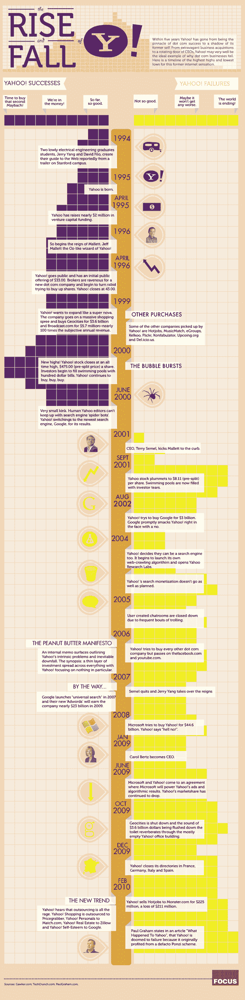

# 雅虎的兴衰:信息图 

> 原文：<https://web.archive.org/web/http://techcrunch.com/2011/01/19/the-rise-and-fall-of-yahoo-the-infographic/>

# 雅虎的兴衰:信息图

众所周知，雅虎正处于困境之中。已经有一段时间了。我们刚刚得知消息，雅虎(T2)正在寻求出售书签服务 Delicious，并“放弃”其他一些网络服务。在这次崩溃之前是[的大规模裁员](https://web.archive.org/web/20230202231641/https://techcrunch.com/2010/12/14/yahoo-confirms-layoffs/)，影响了 500 多名员工。许多人试图找出雅虎哪里出了问题(例如，产品战略、领导力等)。)，但这张名为[“雅虎的兴衰”](https://web.archive.org/web/20230202231641/http://www.focus.com/images/view/47944/)的信息图向你展示了该公司的历史、收购、涨跌等等。

由[焦点制作，](https://web.archive.org/web/20230202231641/http://www.focus.com/)时间线截止于 2010 年 2 月。当然，雅虎的螺旋式下降持续超过了这一点，在 12 月的事件中达到顶点。这张始于 1994 年的信息图确实遗漏了雅虎历史上一些更复杂的细节。但它确实抓住了一个事实，即在过去几年里，雅虎的失败多于成功。

下周雅虎将公布财报，所有的目光都将聚焦于该公司，因为它试图重组，并可能找到摆脱困境的方法。

*点击大图:*

