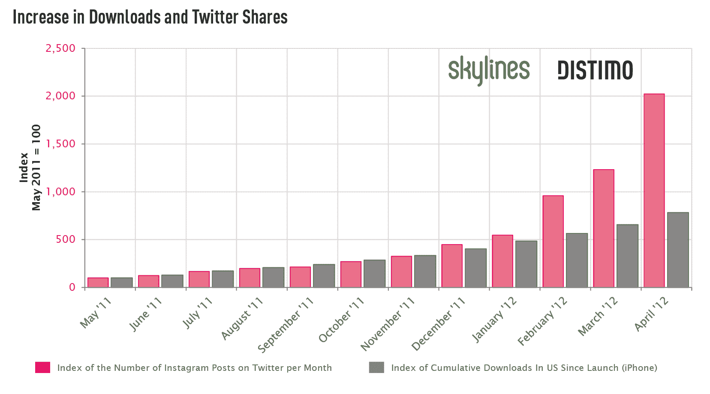
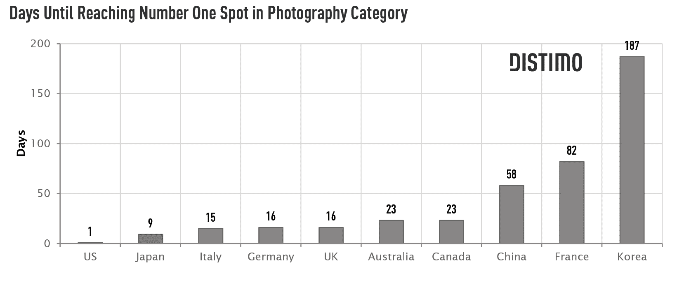
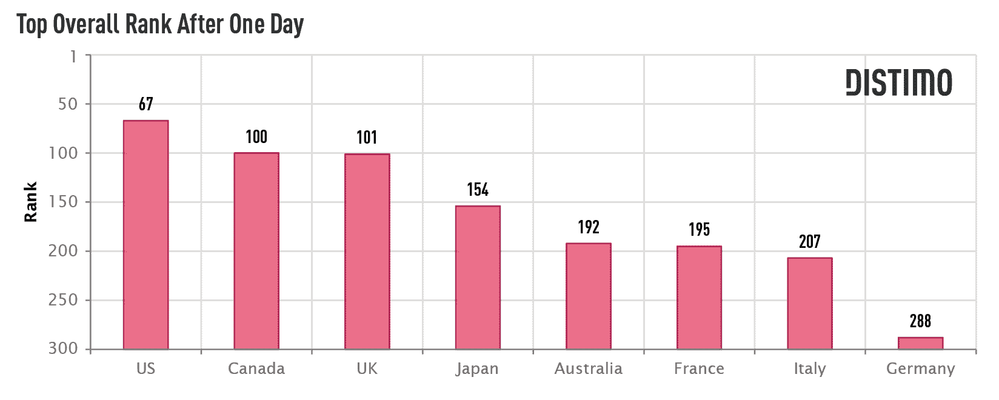
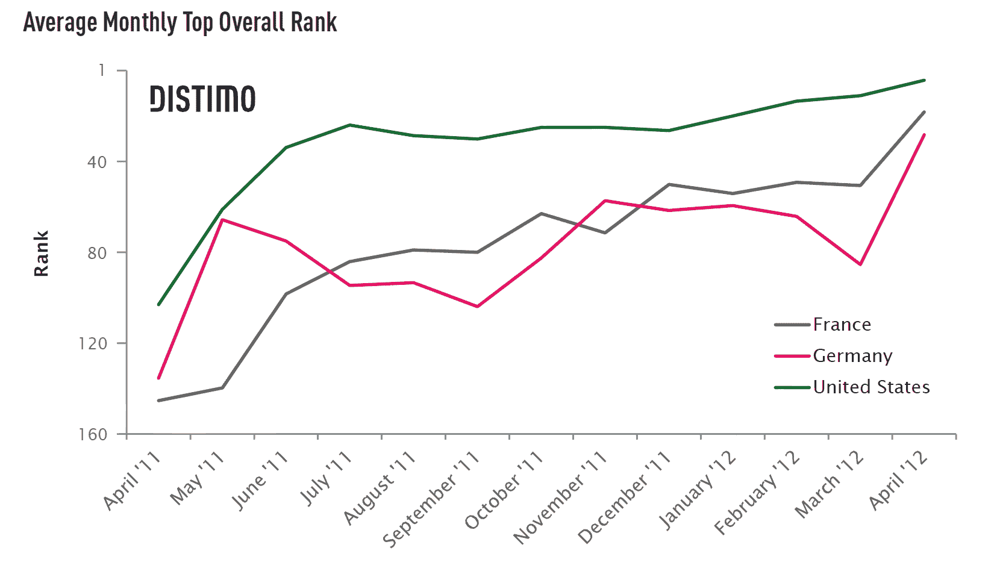
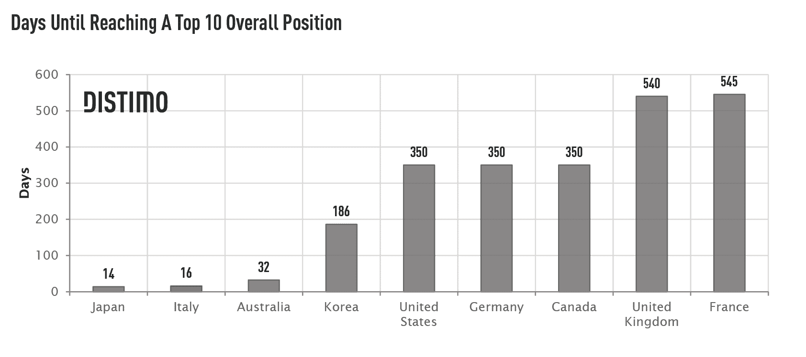

# Instagram 的崛起:追踪该应用在全球的传播 

> 原文：<https://web.archive.org/web/https://techcrunch.com/2012/04/24/the-rise-of-instagram-tracking-the-apps-spread-worldwide/>

行业无法停止分析 Instagram 的成功故事，本月，应用商店分析公司 [Distimo 的](https://web.archive.org/web/20221208023526/http://www.distimo.com/)开始尝试。该公司通常会发布报告，揭示移动应用和应用市场的显著趋势，现在它已经将注意力转向 Instagram 的崛起。在[的最新报告](https://web.archive.org/web/20221208023526/http://www.distimo.com/report/download-latest)中，Distimo 研究了 Instagram 是如何成功的，它是如何在世界范围内传播的，该应用的使用情况与其收到的下载量相比如何，等等。

Instagram 大约在一年半前，即 2010 年 10 月推出。当时，Distimo 表示，该应用在美国每天的下载量不到 1 万次。然而，到 2012 年 4 月，Instagram 在美国 iTunes 应用商店每天的下载量远远超过 10 万次

Distimo 使用实时照片搜索引擎 [Skylines](https://web.archive.org/web/20221208023526/http://skylin.es/) 的数据，结合自己的数据，绘制了从 2011 年 5 月到今年 4 月的应用程序下载增长图表，发现 2012 年 3 月 Instagram 的累计下载量比 2011 年 5 月高出约 7 倍。Instagram 在 Twitter 上的份额也增长了 12 倍以上——这一指标在某种程度上甚至比下载量更重要，因为它表明活跃用户和每个用户的平均份额数都在增加。

在发布 Android 应用程序和[收购脸书](https://web.archive.org/web/20221208023526/https://beta.techcrunch.com/2012/04/09/facebook-to-acquire-instagram-for-1-billion/)之后，Instagram 下载量增加到 2011 年 5 月的八倍左右。股价也飙升至 2011 年 5 月的 20 多倍。

Distimo 随后通过分析非美国主要市场的趋势，考察了这款应用在美国以外的表现。这些市场包括澳大利亚、加拿大、中国、法国、德国、意大利、日本、韩国和英国。加上仅占 iPhone 应用商店免费下载量 25%的美国，这些国家的免费应用下载量约占 72%。

有趣的是，Instagram 在所有这些市场上并不同样成功。Instagram 仅用了一天时间就在美国 iPhone 应用商店的摄影类别中排名第一，但在韩国用了一年半多，在中国用了近两个月。增长较慢的原因是这些市场[显示出对 Instagram](https://web.archive.org/web/20221208023526/http://technode.com/2011/06/07/tencent-launched-its-instagram-like-photo-sharing-app-q-pai/) 等[应用的偏好](https://web.archive.org/web/20221208023526/http://technode.com/2012/04/11/facebook-buys-instagram-tencent-made-an-instagram/)，但这允许分享到新浪、QQ 空间和 me2day 等本地网络。

在中国和韩国，Instagram 从未在发布一天后进入前 300 名应用榜单，在德国，它仅在发布一天后排名第 288 位，然后在前 300 名榜单上消失了一周。

然而，在英语国家，该应用程序遵循了与美国相同的一般过程。它在第一个月的受欢迎程度上升，在 2010 年 12 月有所下降，然后在 2011 年逐渐上升，最终成为整个 iTunes 应用程序商店中最受欢迎的应用程序。

2012 年 3 月和 4 月期间，Instagram 在英语国家的排名从未低于前 35 名。在澳大利亚、美国和加拿大，它从未同时跌出前 25 名。

与此同时，在意大利，Instagram 在过去一年中遵循了与美国相同的总体模式，但在法国、德国、中国和韩国，与美国相比，它的受欢迎程度落后。Instagram 在日本整个时期都相当受欢迎，但它在日本的受欢迎程度在这一年中的增长不如在其他地方，其平均月排名在 35 至 85 之间。

在日本、意大利和澳大利亚，Instagram 在推出一个月内就成为了前 10 名的应用。在德国、美国和加拿大，大约需要 350 天。当 Instagram 宣布达到 1000 万用户(T4)的时候，它就出现了。Twitter 分享也有所增加，一天之内通过 Instagram 发布的图片超过 20 万张，比一周前增加了 14%。

在中国，Instagram 从未进入前 10 名。它的最高纪录是 2012 年 4 月 11 日达到的第 12 名。

虽然 Distimo 的大部分报告着眼于 iTunes 的趋势，但 Instagram 确实于 2012 年 4 月 3 日在 Android 上推出。当谷歌的算法在发布几天后开始对应用程序进行排名时，它已经取得了巨大的成功。到 4 月 6 日，它在美国 Google Play 商店排名第三。与 iPhone 趋势类似，这款应用在美国最受欢迎，在韩国和中国不太受欢迎。它在韩国从未进入前 300 名，在中国排名第 48 位。在所有英语国家和意大利，Instagram 在几天内就登上了榜首，在法国，Android 版本比 iPhone 版本更受欢迎，排名第九。然而在德国，Instagram 仅达到#51。

行业、媒体、专家和评论家都在分析 Instagram 在过去几个月中的惊人增长，并讨论脸书支付的 10 亿美元是否值得。Distimo 表示，Instagram 肯定“在应用程序市场上留下了印记”，并指出 Instagram 是一种新型的社交网络——完全由应用程序构建而成。我们可以说，仅此一点就足以让脸书感兴趣。Distimo 补充道:“Instagram 无疑证明了应用商店经济是每个人都应该关注的事情，因为下一件大事可能就来自应用商店。”