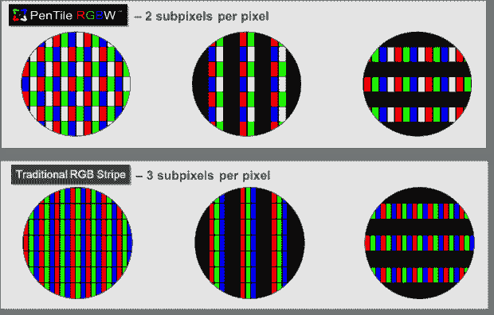

# Pentile 的灾难随着 Galaxy Nexus  回归

> 原文：<https://web.archive.org/web/http://techcrunch.com/2011/10/20/the-scourge-of-pentile-returns-with-the-galaxy-nexus/>

# Pentile 的灾难随着星系 Nexus 回归

正如一个人曾经说过的:“愚弄我一次，可耻——可耻的是你。骗我吧——你不会再被骗了。”关于高清手机屏幕的承诺，这句话是多么的正确。三星曾经用 [Galaxy S](https://web.archive.org/web/20230313210520/https://techcrunch.com/2010/07/26/review-samsung-galaxy-s-aka-att-captivate-t-mobile-vibrant-verizon-fascinate-sprint-epic-4g/) 系列愚弄了我一次，它的 [Pentile 显示屏](https://web.archive.org/web/20230313210520/https://techcrunch.com/2011/05/12/samsungs-new-high-resolution-screens-too-good-to-be-true/)光是看着就让我头疼。现在，在他们解决了 Galaxy S II 的问题后，我听说他们已经[为 Galaxy Nexus 带回了这个问题](https://web.archive.org/web/20230313210520/http://www.flatpanelshd.com/news.php?subaction=showfull&id=1319022037)？不能再被忽悠了，三星。不能再上当了。

如果你不熟悉 Pentile 显示器，这里有一个快速的纲要:在传统的 LCD 中，每个像素由一个红点、一个绿点和一个蓝点或子像素组成。如果你从某些角度仔细看屏幕，你通常可以分辨出来。然而，Pentile 显示器通过使用不同的点布局和算法来确定什么像素何时获得哪个点，从而让像素共享点。最终结果在技术上是更高的分辨率，因为您可以从相同数量的点中获得更多像素:

没有比 Galaxy Nexus 本身更好的证明了这一点:其屏幕上的红绿蓝点总数为 1843200 个。巧合的是，这与 iPhone 4 的子像素数量完全相同。但这些子像素在 Galaxy Nexus 上构成了 1280×720 = 921，600 像素，在 iPhone 上构成了 960×640 = 614，400 像素。对你来说，一个显示器可以将由许多子元素构成的像素数量增加三分之一，而不会受到不良影响，这似乎合乎逻辑吗？

他们在 Galaxy S 上做不到，而且肉眼可见。文字和边框有一种锯齿效果，这是像素之间共享点的方式造成的。Galaxy Note 在高对比度的东西上显示出多色伪像效果，如白底黑字。和 Galaxy Nexus 会一样吗？我手里没有拿过，所以我不能确定，但我猜测 Pentile 子像素布局和更大的像素间距的结合确实会使它可见。

有些人没注意到，有些人不在乎。但是如果你对你的展示质量很挑剔，确保你在购买之前看到了这个东西。对我个人来说，这是一个看不见的交易破坏者。一个男人应该有原则。