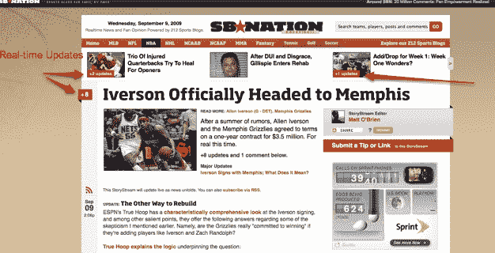
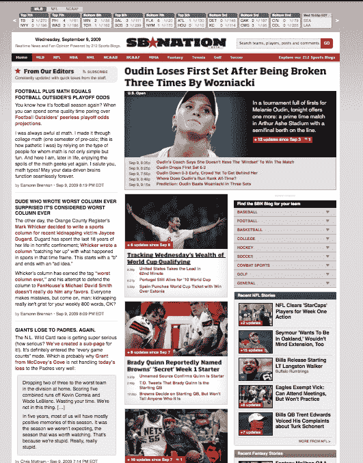

# 体育新闻来到 SBNation | TechCrunch

> 原文：<https://web.archive.org/web/https://techcrunch.com/2009/09/09/the-sportsstream-comes-to-sbnation/>

这整个[流](https://web.archive.org/web/20230405152226/https://techcrunch.com/2009/05/17/jump-into-the-stream/)的想法开始流行起来。就连体育博客网络 [SBNation](https://web.archive.org/web/20230405152226/http://www.sbnation.com/) 也采用了首席执行官吉姆·班克夫所说的故事流来重新设计，并将于今晚发布。班克夫说，故事流是“推动一个重大体育故事的最新新闻、推文、视频和评论”。

SBNation 是 212 个体育博客[的集合，涵盖篮球、棒球、足球和曲棍球](https://web.archive.org/web/20230405152226/https://techcrunch.com/2008/10/29/former-aol-exec-raises-funding-for-sports-blogs-network/)[等主要体育项目。到目前为止，它的主网站 SBNation.com，仅仅是所有博客的美化目录。但今晚，它凭借自己的权利变成了一个真正的体育目的地网站，一个编辑小组从 212 个博客中挑选最好的故事，以及来自其他地方的文章、视频和推文。每一项不同的主要运动都有自己的聚合页面，新的项目会源源不断地出现。](https://web.archive.org/web/20230405152226/https://techcrunch.com/2009/04/13/sb-nation-scores-a-link-deal-with-the-nhl/)

但那不是真正的溪流部分。一个大的体育新闻，比如篮球运动员阿伦·艾弗森转会孟菲斯灰熊队(他在想什么？)，有时会在标题旁边显示一个数字，表示有多少单独的条目出现在这个大新闻中。如果你点击其中的一个标题，你会看到这个故事的故事流页面，有关于艾弗森搬到孟菲斯的博客帖子，编辑评论，视频，推特等等。

体育新闻就像财经(和科技)新闻一样，它吸引了体育迷，他们喜欢不断刷新他们最喜欢的体育网站，以查看他们最喜欢的球队和球员的最新比分或更新。为什么不把这些故事流传给他们，让他们永远不会离开呢？这就是 SBNation 的 StoryStream 背后的想法，我更愿意认为它是一个体育节目。

SBNation 的 212 个博客已经吸引了快速增长的受众。Bankoff 表示，整个网络每月有多达 750 万独立访客(Quantcast 有 380 万)。SBNation.com 只是其中的一小部分。Quantcast 的数据显示，自 4 月份以来，SBNation.com 每月的美国独一无二人数增加了两倍，达到 35 万人，而 comScore 也显示出类似的趋势(见下图)。把 SBNation 变成一个中心体育中心应该会大大提升它，让它不那么微不足道。在主页上添加更多的内容和有组织的标题，然后用连续不断的标题和最热门的体育新闻链接让访问者停留更长时间，这应该有助于在中心网站和相关博客上提高这些数字..

