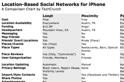
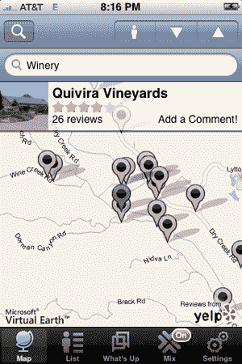
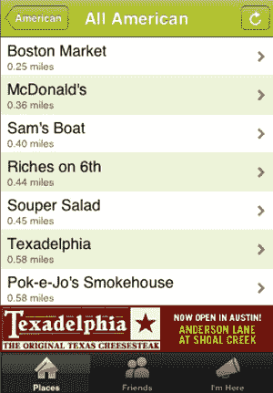
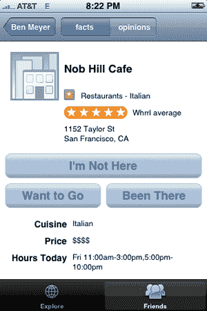
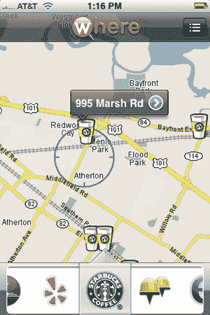
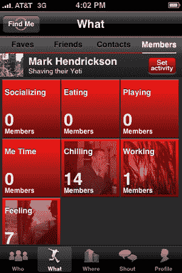
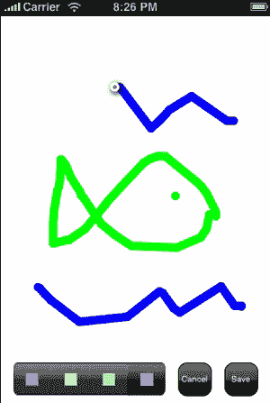

# iPhone 上基于位置的社交网络的现状 

> 原文：<https://web.archive.org/web/https://techcrunch.com/2008/09/28/the-state-of-location-based-social-networking-on-the-iphone/>

我们已经[看好](https://web.archive.org/web/20221207203427/http://www.beta.techcrunch.com/2008/04/09/i-saw-the-future-of-social-networking-the-other-day/)基于位置的社交网络有一段时间了，尤其是自从苹果宣布将向开发者开放 iPhone 之后。随着本周这一领域的两项重大发展(下文将详细介绍)，我们认为这是一个后退一步，看看苹果应用商店目前可用选项的好时机。

是什么让“基于位置”的社交网络不同于普通的社交网络？至少就目前的情况来看，基于位置的社交网络主要运行在智能手机上，这些手机能够确定用户的当前位置，通常是通过利用 GPS 或蜂窝塔三角测量来确定。然后，社交网络使用你的位置来显示附近的朋友和名胜。参见我们的[定位技术初级读本](https://web.archive.org/web/20221207203427/http://www.beta.techcrunch.com/2008/06/04/location-technologies-primer/)了解更多信息。

目前有六个主要的基于位置的社交网络可供 iPhone 使用(点击右边的对比图)。所有这些网站都告诉你其他会员离你有多远，大多数网站专注于帮助你找到你的朋友，但有些网站主要是为发现陌生人而设计的。他们中的一些人会在交互式地图上标出你朋友的位置(实际上我认为他们都应该这么做)。它们提供了广泛的隐私设置，但当你简单地关闭应用程序时，它们都会停止报告你的位置(苹果尚未发布其[推送通知系统](https://web.archive.org/web/20221207203427/http://www.beta.techcrunch.com/2008/07/31/apple-releases-push-notification-services-developer-kit-background-apps-ftw/)，该系统将让这些应用程序在后台不断报告你的位置)。他们在识别其他成员位置的精确程度上也有很大差异，尽管除了一个人之外，他们都在美国的任何地方工作。

在测试了这一整批产品之后，我得出的结论是，它们都还没有准备好实现主流使用。我认为，在基于位置的社交网络成为新的“杀手级应用”之前，必须发生以下大部分(如果不是全部)事情:

*   他们需要强大的通知系统，在感兴趣的人在附近时主动通知你。这种系统可以通过单独指示哪些朋友是“感兴趣的”来手动建立。但是，如果系统能够从你的互动(消息、戳、墙贴等)和联系(个人资料、共同的朋友、群组)中学习，并自动识别出你想要会见的某些人，那就更好了。
*   当手机放在你的口袋里时，这些应用程序绝对需要更新你的位置。现在，当用户想通知朋友他们在哪里时，打开应用程序对他们的要求太高了。有了完全安全的自动位置更新系统，偶然相遇将会更加普遍。
*   当邀请朋友使用某项服务时，您需要能够确定您的哪些朋友实际上拥有支持的电话。否则，你只是在向大量对你重要的人发送垃圾邮件，而收效甚微。
*   这些应用需要变得更加稳定；他们撞车太多了。
*   我们需要更多的网络应用程序，这样我们不仅可以与其他移动用户分享我们的位置和基于位置的活动，还可以与整个网络分享。
*   那些让你在附近看到和遇到陌生人的应用程序需要突出朋友的朋友和那些有共同兴趣和联系的人。

这些是当前所有基于 iPhone 位置的社交网络应用共有的弱点，我们将在下面简要介绍。

### 老兵——Loopt

也许是这些公司中最著名的， [Loopt](https://web.archive.org/web/20221207203427/http://www.loopt.com/) 多年来一直致力于将其技术应用于各种手机上(iPhone 只是其中最新、功能最强的一款)。它可能也是这一批中最先进的，也是最通用的。主要用于在地图上查看您的朋友在附近的位置。餐馆和其他当地评论是次要的，它们是通过与 Yelp 的合作被引入应用程序的。获取其他用户的路线，查看他们的最新状态更新(通常包含在现场拍摄的照片中)，并在他们有一段时间没有更新位置时 ping 他们。

这家总部位于山景城的公司本周加入了一个名为“Mix”的新功能，首次在 Loopt 上向你展示你附近的陌生人。你可以看到附近所有打开了混合功能的人，也可以按类型(年龄、性别、标签、约会状态、社区)进行过滤。这是 Loopt 帮助人们在酒吧勾搭的尝试(这个想法被许多企业家抛出，也一直困扰着我)。但如果它起飞了，它可能会比 Loopt 的核心交友功能产生更大的社会学影响。

### 街区的新成员——勇气

本周刚刚推出私人测试版， [Moximity](https://web.archive.org/web/20221207203427/http://www.moximity.com/) 是一个新的基于位置的社交网络，位于得克萨斯州奥斯汀，它希望帮助你找到你的朋友和当地机构。采用保罗·布拉吉尔的营销建议，Moximity 正在一次推出一个地理区域，从奥斯丁本身开始。一切都是本地的——餐厅列表、用户，甚至广告(是的，这是这些网络中目前唯一一个真正在 iPhone 上赚钱的)。

Moximity 与众不同的一个主要特点是它处理用户账户的方式。当你加入并开始配置时，你并没有交到“勇敢的朋友”。相反，这项服务会从脸书(以及后来的其他网站)获取你的联系人，并让你追踪你现有的也使用 Moximity 的朋友。当你发布状态信息时，它也会被推送至你的脸书和 Twitter 账户。

“勇气”将受益于一个使用大头针显示你朋友位置的交互式地图。然而，与 Loopt 不同的是，Loopt 会给你朋友的准确街道地址，而 Moximity 总是会将你与特定的地点(餐馆、商店等)匹配，因此用户的个人 pin 可能不合适。联合创始人 Bryan Jones 表示，下一个版本将会包含一些地图功能。

如果你住在奥斯汀，你可以通过电子邮件发送你的姓名和邮政编码[到这里](https://web.archive.org/web/20221207203427/mailto:techcrunch-austin@moximity.com)，立即获得这项服务。

### 贝佐斯、T-Mobile 和 iFund 支持的竞争者——Whrrl

其中资金最雄厚的是一家名为 [Pelago](https://web.archive.org/web/20221207203427/http://www.pelago.com/) 的西雅图初创公司，它有一款名为 [Whrrl](https://web.archive.org/web/20221207203427/http://www.whrrl.com/) 的应用，主要是识别和评估附近所有类型的企业。与你应该与你认识的人分享类似 Yelp 的评论的想法相比，查找朋友有点退居其次。

关于地点的信息很全面。你可以找到菜肴类型、价格、营业时间、电话号码、网站、街道地址、评分和评论。虽然您可以查看每个成员的(5 星)评分和评论，但我们鼓励您关注您朋友的评分和评论。例如，当您查看朋友的个人资料时，他们的评论会突出显示。也就是说，如果你喜欢陌生人的口味，你可以“迷”他们(尽管显然只能通过 Whrrl 的[彻底开发的网络应用](https://web.archive.org/web/20221207203427/http://www.beta.techcrunch.com/2007/11/02/whrrl-map-and-mobile-centric-social-reviews/))。

Whrrl 还可以识别您所在地区正在发生的事件。活动和地点信息的结合很棒，但我觉得这个应用程序必须离开它的“评论”根源一点，才能成为一个被广泛接受的服务。当我不想分享或收集意见时，需要更多的通用社交功能(如墙和通知)来让我使用 Whrll。

Pelago 已经从 iFund、杰夫·贝索斯和 T-Mobile 等公司筹集了资金。

### 施摩根堡–ul ocate 的“哪里”

[其中](https://web.archive.org/web/20221207203427/http://www.where.com/)是一款 iPhone 应用，由波士顿一家名为 [uLocate](https://web.archive.org/web/20221207203427/http://www.ulocate.com/) 的初创公司开发，该公司在过去几年中获得了大量资金(至少[1550 万美元](https://web.archive.org/web/20221207203427/http://www.crunchbase.com/company/ulocate))。除了厨房水槽，它什么都有。该应用程序的底部是一个类似 dock 的菜单，显示了各种子应用程序，每个子应用程序都旨在帮助您找到您所在地区的一些东西:

*   好友信标:查找附近的朋友
*   GasBuddy:找附近价格低的加油站
*   星巴克:寻找附近的星巴克连锁店
*   Quibblo:查看你所在地区基于位置的投票结果
*   HeyWhatsThat:识别你附近的山峰
*   天空地图:了解你头顶天空中的星星和星座
*   Zipcar:查找 Zipcar 租赁的提货点
*   Yelp:找到 Yelp 上列出和评论的附近的地方
*   多事之秋:了解附近的活动及其场地

UI 需要一点工作(太多弹出窗口)，但不管怎样，这个应用程序可以方便地在交互式地图上快速找到最近的特定事物(咖啡、友谊、车轮等)。

### 分类程序——地狱边缘

[Limbo](https://web.archive.org/web/20221207203427/http://www.limbo.com/) 是由一家多年来似乎经历了相当多转变的公司提供的。2006 年 5 月我们回顾了这家公司，当时它是一家基于短信的奇特拍卖服务公司。当时它位于 41414.com，你仍然可以在现在的标志中看到它的祖先(只要看看它的倒影)。

从本质上来说，这款应用比上述任何一款应用都更侧重于定位陌生人，了解他们在做什么。所有用户分为四类:成员、联系人、朋友和收藏。你可以选择与他们中的每一个或所有人分享你的位置，其中“成员”是你不认识的所有人，“联系人”是从你的手机通讯录中调出的人，“朋友”是对你更重要的人，“收藏”是对你最重要的人。

用户根据他们当前的“活动”(或状态)被进一步分类。他们要么是在社交、吃饭、玩耍、放松、工作、感受，要么是享受一点“自我时间”。您可以在“什么”页面上按特定类别查看用户，该页面在网格中显示类别。

Limbo 既不会在地图上显示你朋友的位置，也不会给出他们的确切位置(只是他们的大致区域，例如旧金山)。这两者都会让这个应用程序变得更加有用。

### 长城——津廷

Zintin 在帮助你与附近的陌生人交流方面走得更远，而不是帮助你找到你已经存在的朋友。附近的用户连同他们的当前状态消息一起显示在包括一切的列表中。当你选择一个特定用户的名字时，它会把你带到他们的墙上，在那里任何用户都可以张贴简短的笔记、照片和涂鸦。

这堵墙是 Zintin 提供的核心功能，也是唯一重要的功能(也提供了所谓的“公告板”,但它们本质上是针对特定区域的墙)。如果你发现某人的墙上挂着特别酷的东西，你可以要求交换你的联系方式并与他们见面。但大多数人只会用这个应用程序来看看周围的人决定分享什么样的青少年内容。如果您打开了“允许成熟内容”设置，那么该内容主要是露骨的内容，所以要小心。

自 2007 年末以来，几个斯坦福计算机系的研究生一直在开发 Zintin，目前它主要是一种好奇心。然而，你可以快速涂鸦并张贴给别人的涂鸦功能应该会进入其他应用程序。

### 房间里的大象——脸书和 MySpace

美国两大社交网络都还没有增加位置感知服务，但是[他们即将到来](https://web.archive.org/web/20221207203427/http://www.beta.techcrunch.com/2008/07/16/facebook-myspace-ignore-location-on-iphone-at-their-peril/)。在向他们学习之后，预计他们会超越这些服务中的几个，如果不是全部的话。