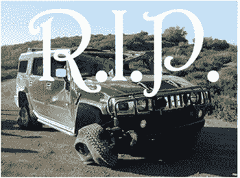

# 静态文档模型正在消亡。doc，。xls，还有。PPT TechCrunch

> 原文：<https://web.archive.org/web/https://techcrunch.com/2009/03/08/the-static-document-model-is-dying-rip-doc-xls-and-ppt/>

*我的 TechCrunch 实习已经结束，在我的最后一篇 TechCrunchIT 文章中，我想把我在企业空间中看到的点连接起来。谢谢你带来的美好时光。*

当三年前 [Writely](https://web.archive.org/web/20221208040846/http://en.wikipedia.org/wiki/Google_Docs) 和 [Zoho Writer](https://web.archive.org/web/20221208040846/http://en.wikipedia.org/wiki/Zoho_Writer#Zoho_Writer) 推出时，一些人很快预言了微软 Office 的[终结。显而易见:免费胜过付费，无处不在的访问胜过以设备为中心的胖客户端模式。](https://web.archive.org/web/20221208040846/http://blogs.zdnet.com/Gillmor/?p=223)

但是 IT 部门担心安全性，Excel 爱好者仍然对减少的功能持怀疑态度，航空旅客现在才开始在飞机上使用宽带。如果有足够的时间，这些问题将会得到解决。与此同时，微软并不是一个笨蛋。一旦笨重的雷德蒙德巨人转向 SaaS 模式，并在边缘赚钱，这些微软 Office 的在线克隆将成为商品。你喜欢香草糖霜还是巧克力糖霜……谷歌还是微软？

办公室文件都死了。

不是因为 Zoho Office 和 Google Docs 是免费的。而是因为当 office 套件上线时，他们抓住了内容创建方法，并迅速将其推翻。撰写文档从一次完成多份草稿转变为一份经过多次修订的草稿。在线办公套件扼杀了静态文档模型和文件格式。(甚至可能是 toolbelt 办公套件。)

从历史上看，技术通过解决特定的问题而成为主流。文字处理器取代了打字机，因为它们可以修正打字错误。Dropbox 消除了我对硬盘故障的担忧。在线常见问题解答替换帮助文件。谷歌文档让我可以在任何浏览器上工作。

一旦成为主流，新技术就会从促进工作流程转变为重组流程。在意识到合作写作的力量之前，我用了几个月的谷歌文档。我们三个人在不同的计算机上处理同一个文档，而不是复制/粘贴。( [Lotus Notes](https://web.archive.org/web/20221208040846/http://www.lotus.com/) 在 20 年前开创了这一功能，但它要求每台机器上都有 Notes。)

突然之间，企业维基由用户维护，Dropbox 的链接取代了电子邮件附件，静态文档的概念也不复存在。 [Slideshare](https://web.archive.org/web/20221208040846/http://www.slideshare.com/) 就是一个经典的例子。最初是幻灯片的在线存储库——一个增强的 PowerPoint FTP——现在是一个目标网站。目前，元数据——标签、收藏夹、评论、浏览量、下载量等——位于静态幻灯片之上。但是 Slideshare 加入编辑功能还需要多久？然后我修改了措辞，删除了一张非[的展示图片，在这里添加了一整张幻灯片，留下了我的评论。](https://web.archive.org/web/20221208040846/http://www.presentationzen.com/)

当 Slideshare 衍生出自己的讲故事迷因时，[《遇见亨利》，](https://web.archive.org/web/20221208040846/http://www.slideshare.net/group/meet-henry)用户根据自己的需求对原始幻灯片进行了修改。如果他们能改变原作呢？数据和元数据之间的界限会变得非常模糊。(随之而来的版权噩梦不在本帖讨论范围之内。)

无论在防火墙的哪一边，它都是一份活的文件——Slideshare 的 Rashmi 告诉我:“许多公司使用 slide share 隐私选项进行共享，并嵌入到他们的内部网中……我们无法深入研究它(出于隐私原因)——但我们的一个大推荐人是微软。”

类似地，wiki 正在从解决今天的问题演变成明天创建、聚合和过滤内容的新方式。据 Chris Yeh 所说， [PBwiki](https://web.archive.org/web/20221208040846/http://pbwiki.com/) 有一个长远的愿景，“成为整个企业真正简单的粘合剂。通过在特定类别(销售人员、电子邮件、文档等)之上添加上下文，wiki 成为一种强大的企业搜索形式。”

Slideshare、wiki、SaaS 办公套件——当它们整合在一起时会发生什么？(你已经可以从 PBwiki 查看[谷歌文档，从 SocialText](https://web.archive.org/web/20221208040846/http://pbwikimanual.pbwiki.com/EmbedGoogleDocs) 查看 [Slideshare。)](https://web.archive.org/web/20221208040846/http://www.socialtext.net/help-en/index.cgi?third_party_widgets)

在不可避免的混乱之后，新技术和旧工作流程的油水将融合成新的信息视角。实时协作将杀死静态文档模型。文档之间的界线会让人感觉不自然——就像数据库视图仅仅限制了输出。当社区可以创建元数据时，“Word 文档”就变成了 wiki
页面的“打印视图”——可能会排除评论，或者可能会限制它们只包含营销团队在过去一周内的评论。( [Prezi](https://web.archive.org/web/20221208040846/http://www.prezi.com/) 已经在重写 UI 和交互上的规则了。)

对于微软来说，使用“.doc“，”。xls”，和”。ppt”和“floppy”以及“AOL”放在同一个句子中是一个令人恐惧的前景。然而也许不应该是这样。如果你不能主宰一个平台，退而求其次就是确保你的竞争对手也不能赢。当文件变得通用时，平台所有权是不可能的-例子包括。html，。txt 和. jpg。

撕开。doc，。xls，还有. ppt 大家会想你的。