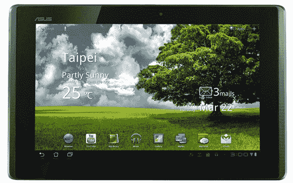
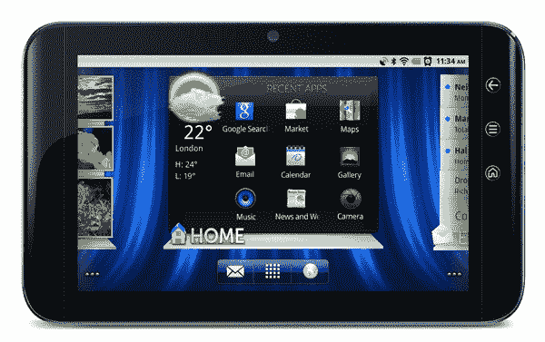
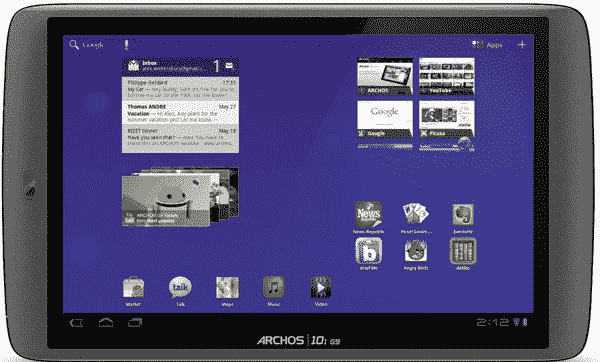
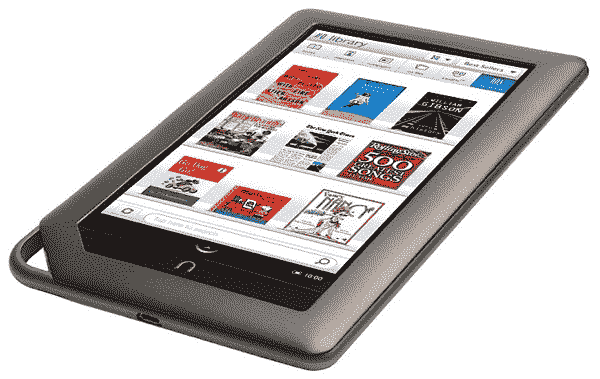
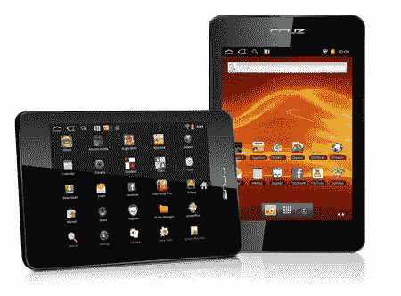

# Kindle Fire 的 6 大替代品 

> 原文：<https://web.archive.org/web/http://techcrunch.com/2011/09/29/the-top-6-alternatives-to-the-kindle-fire/>

亚马逊 Kindle Fire 并不是唯一的低价平板电脑选择。当然，它可能是热门的新品，但有许多平板电脑售价 300 美元或更低。有些很便宜，显然只面向发烧友。其他标签是在现代 CPU 上提供蜂巢的合法交易。最重要的是——亚马逊也知道这一点——他们都可以运行 Kindle 应用程序，立即成为 Kindle Fire 的竞争对手。

**华硕变压器**

由于供应有限，华硕变压器的需求量很大。华硕低估了需求，低估了平板电脑的产量。据说华硕增加了产量，但为时已晚。这款平板电脑 15 分钟的名气已经过去，现在只需 300 美元就能买到，如果你想找一家声誉好的零售商，价格可能会稍微高一点。

这个变压器很便宜。它可以说是最顶级的 Android 3.x 平板电脑之一，拥有细长的框架，令人惊叹的 IPS 屏幕和大量端口。有一个充满活力的开发者社区和一些第一和第三方附件。变压器是一种安全、低成本的测试蜂巢味道的好方法。而且，像名单上的其他人一样，可以运行亚马逊的所有安卓应用，包括 Kindle 阅读器。

**黑莓 Playbook**

很难爱上 Playbook，但如果你是一个铁杆黑莓迷，并且喜欢一款操作系统流畅、屏幕出色的平板电脑，这可能就是你要的那款。尽管 Playbook 的故事情节令人难过——发布太早，电子邮件和日历应用程序不能正常工作，同步系统不稳定——但它对黑莓用户来说是一款可靠的设备。

在官方可能降价之前，主要零售商目前正在下调 PlayBook 的价格。Staples 和 Office Depot 目前都提供 399 美元的平板电脑和 100 美元的礼品卡，而百思买在 T4 以 299 美元的价格出售。

PlayBook 安装了 Kobo reading 应用程序，但 Kindle 云阅读器只通过 PlayBook(或任何设备)的网络浏览器提供 Kindle 阅读体验。

**戴尔连胜 7**

戴尔 Streak 7 是该系列中最老的平板电脑，但它仍然有一些腿。Android 2.2 平板电脑对于 Android 粉丝来说是一款很棒的小型平板电脑。它体积小巧，高度可定制，可与大量 Android 应用程序(包括 Kindle 应用程序)配合使用，价格不到 250 美元。有传言称，Streak 7 甚至将在不久的将来获得官方的 Honeycomb 更新——或者你可以[自己安装](https://web.archive.org/web/20230205005914/http://forum.xda-developers.com/showthread.php?t=1087886)。

**亚克士 80 G9**

爱可视涉足平板电脑领域的时间几乎比其他任何公司都长。他们的最新产品是从他们的传统配方中炮制出来的，包括略微领先的硬件和激进的定价。售价 299 美元的 Archos 80 G9 配备了双核 1GHz ARM Cortex CPU、8 英寸屏幕和 8GB 存储空间。

然而，买家要小心。虽然 80 G9 在纸面上看起来很棒，但我们对这款平板电脑的早期体验并不愉快。期待未来几天的全面评论，但平板电脑的制造质量有点粗糙。

**Nook Color**

没有比 Nook Color 更好的廉价平板了。修改者已经把几乎所有版本的 Android 都移植到了 ereader 上(结果好坏参半)，或者你可以只使用已经有应用程序、电子邮件和全功能网络浏览器的普通操作系统。股票操作系统有足够的能力来满足大多数，但如果没有，有一个几乎无穷无尽的供应 Nook 颜色模块，黑客和一般的愚蠢行为。你甚至可以在 B&N 阅读器上安装一个 Kindle 应用。亵渎？当然，但它也把小阅读器变成了终极电子阅读机器。

Barnes & Noble 认为 Nook Color 超越了传统电子书阅读器的界限。他们没有仅仅生产另一款电子书阅读器，而是发布了一款小巧但完全可破解的平板电脑，价格只有 iPad 的一半。它是成功的。这就是亚马逊希望通过 Fire 和后续平板电脑实现的目标。

**速度微克鲁兹 T408**

克鲁兹 T408 在 4:3 的 8 英寸屏幕上运行 Android 2.3。有一个 1GHz 的 Cortex A8 CPU，512 MB 的内存，一个前置摄像头，它的建议零售价仅为 239.99 美元。

这款平板不贵，感觉很便宜。我桌子上有一份评论样本。这不是 iPad 杀手，但可能会动摇一些潜在的 Nook Color 或 Kindle 买家。它比 Nook 的颜色略大，形状和大小也不太好。然而，T408 预装了姜饼，以及一系列应用程序，包括愤怒的小鸟、Kindle 和亚马逊的 Appstore。如果你购买 Nook Color 只是为了运行 Android，为什么不买一个更大的屏幕呢？

* * *

亚马逊大举进入平板电脑领域，可能会偷走这些平板电脑的一些荣耀。Kindle 和亚马逊品牌是值得信赖的名字，这正是大多数低价平板电脑所缺乏的。火的只是一个被清新 UI 层掩盖的低价平板。这种策略对大多数消费者来说都很棒，但有些买家，比如我，希望从我们的非 iPad 平板电脑中获得更多乐趣。然而，我们希望 Fire 和 iPad 的成功不会影响未来的平板电脑创新，并将我们留在一个充斥着大众市场移动操作系统的世界。