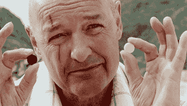

# 重塑自我的终极秘籍

> 原文：<https://web.archive.org/web/https://techcrunch.com/2013/10/19/the-ultimate-cheat-sheet-for-reinventing-yourself/>

**编者按:** *[James Altucher](https://web.archive.org/web/20230326051057/http://jamesaltucher.com/) 是一位投资人、程序员、作者，也是数次[创业者](https://web.archive.org/web/20230326051057/http://www.jamesaltucher.com/2011/01/how-i-screwed-yasser-arafat-out-of-2mm-and-lost-100mm-in-the-process/)。他的新书**是[“选择你自己！”](https://web.archive.org/web/20230326051057/http://www.amazon.com/Choose-Yourself-ebook/dp/B00CO8D3G4/ref=cm_cr_pr_product_top)*** *(推特 CEO 迪克·科斯特罗作序)。在推特上关注他 [@jaltucher](https://web.archive.org/web/20230326051057/http://twitter.com/jaltucher) 。*

规则是这样的:我从零开始过几次，回来过几次，一遍又一遍地做。我开始了全新的职业生涯。当时认识我的人，现在都不认识我了。诸如此类。

我不得不换了几次职业。有时候是因为我的兴趣变了。有时是因为所有的桥梁都被烧得面目全非，有时是因为我急需钱。有时候只是因为我讨厌以前工作中的每个人或者他们讨厌我。

重塑自我还有其他方法，所以对我说的要有所保留。这是对我有用的。

我见过它对其他几百个人有效。通过采访，通过人们给我写信，通过过去 20 年的历程。可以试也可以不试。

再造从未停止。

每天你都在重塑自己。你总是在运动。但是你每天都在决定:前进还是后退。

你从零开始。

你声称你以前的每一个标签都只是虚荣心。你是医生吗？你是常春藤联盟的？你有几百万？你有家人吗？没人在乎。你失去了一切。你是一个零。不要试图说你是别的什么。

你需要一个导师。

否则，你会沉入水底。必须有人告诉你如何移动和呼吸。但是不用担心找不到导师(见下文)。

**D)三种类型的导师**

1.  **直接。站在你面前的人会告诉你他们是怎么做的。“它”是什么？等等。顺便说一下，导师不像《空手道小子》里的那个日本老头。最终大多数导师会讨厌你。**
2.  **间接。**书籍。电影。你可以将 90%的辅导外包给书籍和其他材料。200-500 本书等于一个好导师。人们问我，“读什么书好？”我从来不知道答案。有 200-500 本好书可以读。我会附赠励志书籍。无论你的信念是什么，通过每天阅读来强调它们。
3.  **万物皆良师。**如果你是一个零，并对重塑有热情，那么你所看到的一切都将是你想做的事情的隐喻。你看到的树，有你看不到的根，有滋养它的地下水，如果你把这些点连接起来，这是计算机编程的隐喻。你看到的每样东西，你都会把它们联系起来。

【T2

如果你对任何事情都没有激情，也不要担心。

你对自己的健康充满热情。从那里开始。一步一步来。你不需要激情就能成功。带着爱去做你所做的事情，成功是一种自然的症状。

重塑自我所需的时间:五年。

以下是对这五年的描述:

*   第一年:你开始阅读所有的东西，并且刚刚开始做。
*   第二年:你知道你需要和谁交谈和交往。你每天都在做的事情。在你的新尝试中，你终于知道垄断董事会是什么样子了。
*   第三年:你已经足够优秀，可以开始赚钱了。它可能还不是一种生活。
*   第四年:你过得很好
*   第五年:你在创造财富

有时候我会在 1-4 年级感到沮丧。我说，“为什么还没有发生？”我猛击地板，弄伤了我的手，然后用一种奇怪的仪式把一个椰子扔在地板上。没关系。继续走。或者停下来选择一个新的领域。没关系。最终你会死，然后很难重塑自己。

如果你做得更快或更慢，那么你就做错了。

谷歌就是一个很好的例子。

这不是钱的问题。但是钱是一个不错的衡量标准。

当人们说“这不是钱的问题”时，他们应该确保他们有不同的衡量标准。

“做自己喜欢的事怎么样？”会有很多天你不爱你在做的事情。如果你只是为了爱而做，那么这将比五年要长得多。

快乐只是来自我们大脑的积极感知。有些日子你会不开心。我们的大脑是我们使用的工具。我们不是这样的人。

**I)什么时候可以说“我做 X！”哪里 X 是你的新职业？**

今天。

**J)我什么时候可以开始做 X？**

今天。如果你想画画，那今天就买块画布画画，开始一次买 500 本书，开始画画。如果你想写作，做这三件事:

*   阅读
*   写
*   拿起你最喜欢的作者，逐字键入你最喜欢的他的故事。想知道他为什么写每个字。他是你今天的导师。

如果你想创业，就开始为你的生意设想。重塑从今天开始。每天都是。

(T4)我如何赚钱？

到第三年，你已经投入了 5000-7000 个小时。这足以让你在任何方面都进入世界前 200-300 名。几乎任何领域的 200 强都是以此为生的。

到第三年，你会知道如何赚钱。到了第四年，你就可以扩大规模，谋生了。有些人在第四年就停止了。

到第五年，你已经进入前 30-50 名，所以你可以创造财富。

**M)什么是“它”？我怎么知道我应该做什么？**

你想读 500 本书的任何领域。去书店找吧。如果三个月后你觉得无聊，就回到书店去。

幻想破灭是正常的。这就是失败的意义。成功比失败好，但最大的教训是在失败中找到的。

非常重要:不要着急。你会在有趣的生活中多次重塑自己。你会失败很多次。那也很有趣。

许多革新使你的生活成为一本故事书，而不是教科书。

有些人希望他们一生的故事成为教科书。无论好坏，我的是一本故事书。

这就是为什么每天都有创新。

你今天所做的选择将会写进你明天的传记里。

做出有趣的选择，你就会有一本有趣的传记。

N1 你今天所做的选择将会影响你明天的生物学。

**O)喜欢晦涩难懂的东西怎么办？比如圣经考古或者 11 世纪的战争？**

重复上面所有的步骤，然后在第五年你将会创造财富。我们不知道怎么做到的。当你还在第一步的时候，不要指望找到路的尽头。

如果我的家人希望我成为一名会计怎么办？

你向你的家人承诺了多少年的生命？十年？你的一生？那就等到下辈子吧。好消息是:你可以选择。

选择自由胜过家庭。超越偏见的自由。对政府的自由。人之上的自由-令人愉悦。那你会很高兴的。

我的导师希望我按照他的方式去做。

那很好。学习他的方式。那就按你的方式去做。恕我直言。

希望没人拿枪指着你的头。那你就得按他们的方式做，直到枪放下。

我的配偶担心谁来抚养/照顾孩子？

然后当你一周七天，一天工作 16 个小时的看门人之后，用你的空闲时间重新创造。

正在重塑的人总是有空闲时间。重塑的一部分是收集时间的点点滴滴，然后按照你想要的方式重塑它们。

如果我的朋友认为我疯了怎么办？

什么朋友？

如果我想成为一名宇航员怎么办？

那不是重新发明。那是一项具体的工作。如果你喜欢“外太空”，有很多职业。理查德·布兰森想成为一名宇航员，并创办了维珍银河。

如果我喜欢出去喝酒和聚会怎么办？

一年后再看这个帖子。

如果我忙于欺骗我的丈夫或妻子或背叛伴侣怎么办？

两三年后，当你破产失业，没人喜欢你的时候，再读读这篇文章。

**W)我一点技能都没有怎么办？**

再读一遍 B。

**X)我没有学位或者有个没用的学位怎么办？**

再读一遍 B。

**Y)如果我不得不集中精力偿还债务和抵押贷款怎么办？**

再读一遍“R”。

我怎么总觉得自己在外面往里看？

阿尔伯特·爱因斯坦是局外人。当权派中没有人会雇佣他。

每个人在某些时候都觉得自己是个骗子。创造力的最高形式诞生于怀疑主义。

我读不了 500 本书。我应该读哪一本书来获得灵感？

放弃吧。

**如果我病得太重而无法重塑自我怎么办？**

重塑将促进你体内每一种健康的化学物质:血清素、多巴胺、催产素。继续前进，你可能不会变得健康，但你会变得更健康。不要以健康为借口。

最后，重塑健康第一。多睡几个小时。吃得更好。锻炼身体。这些是重塑的关键步骤。

如果我的上一个合伙人欺骗了我，而我还在起诉他呢？

停止诉讼，永远不要再想他。一半的问题是你，不是他。

如果我要坐牢怎么办？

完美。重读《b》，在监狱里读了很多书。

如果我很害羞怎么办？

让你的弱点成为你的优势。内向的人听得更好，注意力更集中，也更讨人喜欢。

**FF)等不了五年怎么办？**

如果你计划在五年内活着，那么你最好从今天开始。

我应该如何建立关系网？

做同心圆。你在中间。

下一个圈子是朋友和家人。

下一个圈子是在线社区。

之后的圈子是聚会和咖啡。

再后面一圈是会议和思想领袖。

再后面一圈是导师。

之后的圈子是顾客和财富创造者。

开始穿过圆圈。

当我对自己所做的事感到自负时会发生什么？

在 6-12 个月内，你会回到“B”

如果我对两件事都充满热情呢？如果我决定不了怎么办？

将它们结合起来，你将成为世界上最好的组合。

**JJ)如果我很兴奋，想教我正在学的东西，该怎么办？**

开始在 YouTube 上教学。从一个观众开始，看看它是否能建立起来。

KK)如果我想在睡觉的时候赚钱怎么办？

第四年，开始外包你所做的事情。

我如何会见导师和思想领袖？

一旦你有了足够的知识(读了 100-200 本书之后)，为 20 个不同的潜在导师写下 10 个想法。

他们都不会回应。为 20 位新导师再写下 10 个想法。每周重复。

为没有回复的人准备一份简讯。不断重复，直到有人回应。记录你的学习成果。作为专家，在你周围建立社区。

**MM)想不出点子怎么办？**

然后不断练习提出想法。意念肌肉萎缩。你必须把它建立起来。

如果我不是每天都这样做，我很难摸到我的脚趾。每天都要做一段时间才能轻松摸到脚趾头。不要指望在第一天就想出好主意。

**NN)还要看什么？**

书之后，看网站，论坛，杂志。但是大部分都是垃圾。

如果我照你说的做了，但还是没有效果，该怎么办？

会有用的。就等着吧。每天坚持改造。

不要试图寻找路的尽头。在雾中你看不见它。但是你可以看到下一步，你知道如果你迈出下一步，最终你会到达路的尽头。

**PP)如果我得了抑郁症怎么办？**

每天静坐一小时。你需要回到你的核心。

如果你认为这听起来很愚蠢，那就不要做。保持沮丧。

**QQ)没有时间静坐怎么办？**

然后每天静坐两个小时。这不是冥想。这只是坐着。

如果我害怕了怎么办？

每天睡 8-9 个小时，从不八卦。睡眠是健康成功的第一要诀。这不是唯一的关键。只是第一。有些人写信给我说，“我只需要四个小时的睡眠”或者“在我的国家，睡觉意味着懒惰。”嗯，那些人会失败，会英年早逝。

八卦呢？大脑在生物学上想要有 150 个朋友。然后当你和你的一个朋友在一起时，你可以谈论其他 150 个人中的任何一个。如果你没有 150 个朋友，那么大脑想要阅读八卦杂志，直到它认为它有 150 个朋友。

不要像你的大脑一样愚蠢。

如果我一直觉得没有一件事适合我，该怎么办？

每天花 10 分钟练习感恩。不要压抑恐惧。注意愤怒。

但也要允许自己对你所拥有的东西心存感激。愤怒从来都不是鼓舞人心的，但感激却是。感激是你的世界和所有创意所在的平行宇宙之间的桥梁。

**TT)如果我不得不一直处理个人的废话怎么办？**

寻找新的伙伴。

一个正在重塑自我的人会不断地找人试图搞垮她。大脑害怕重新发明，因为它可能不安全。

从生物学上来说，大脑希望你安全，重塑是一种风险。所以它会把那些试图阻止你的人扔到你的路上。

学会如何说“不”

如果我对自己的隔间工作很满意呢？

祝你好运。

我为什么要相信你——你已经失败了这么多次了。

不要相信我。

你愿意做我的导师吗？

你刚刚读了这篇文章。

*【参见*