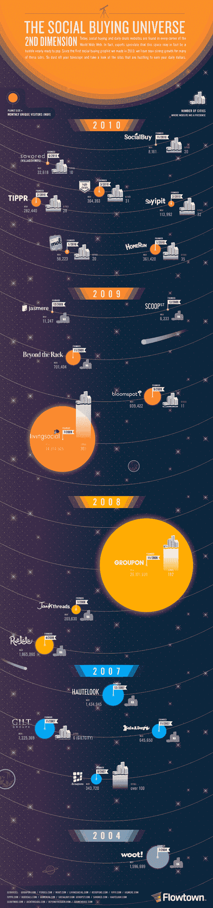

# 美国团购世界[信息图 

> 原文：<https://web.archive.org/web/http://techcrunch.com/2011/07/01/the-us-group-buying-universe-infographic/>

# 美国团购界[信息图]

当[关于团购作为一个整体是否是一种可行的商业模式的争论在后 Groupon 时代](https://web.archive.org/web/20230203140652/https://techcrunch.com/2011/06/13/why-groupon-is-poised-for-collapse/) [S-](https://web.archive.org/web/20230203140652/https://techcrunch.com/2011/06/02/groupon-files-for-ipo/) 1 在激烈进行的时候，毫无疑问，这些社交交易的东西不断涌现——昨天有人向我介绍自己是一家面向妈妈们的 Groupon 的首席执行官(是的，我认为这是一个好主意)。

我们已经有了面向技术人员的 Groupons，面向犹太人的 Groupon，下一个 Groupon 会是什么呢？？等等，请不要回答。

尽管如此，人们想要分一杯羹也是有道理的，因为 2012 年美国市场的规模估计为 27 亿美元(高于去年的 11 亿美元)。为了让你对一些玩家和他们的相对规模有所了解， [Flowtown](https://web.archive.org/web/20230203140652/http://www.flowtown.com/) 的人们已经[修改了](https://web.archive.org/web/20230203140652/http://www.flowtown.com/blog/the-social-buying-universe-2nd-dimension?display=wide)他们最初的信息图，以反映社交购买热潮。

从上面我们能看出什么？首先，空间是新生的，它的物理学也是如此；先行者不一定会得到回报。 [Woot，](https://web.archive.org/web/20230203140652/http://www.woot.com/)成立于 2004 年，目前拥有超过 140 万的独立月访问量，而主要玩家 [Groupon 的](https://web.archive.org/web/20230203140652/http://www.groupon.com/)(成立于 2008 年，以该模式为基础)为 2910 万。甚至不在图上的墨尔卡塔在 2001 年被 T21 关闭。

目前排名第二的 LivingSocial 的规模大约是 Groupon 的一半，月独立访问量为 1430 万次，美国有 301 个城市，而 Groupon 只有 182 个。是的，大约有 5%的美国人每月都会访问这个网站；享受你的牙齿美白伙计们！