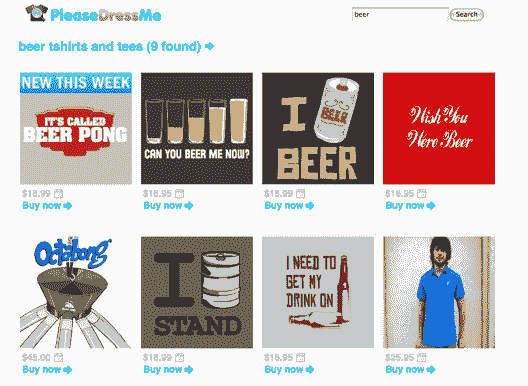

# Vaynerchucks 推出的 t 恤搜索引擎 pleased reme TechCrunch

> 原文：<https://web.archive.org/web/https://techcrunch.com/2008/09/01/the-vaynerchucks-launch-t-shirt-search-engine-pleasedressme/>

# Vaynerchucks 推出的 t 恤搜索引擎 PleaseDressMe

 加里·韦内楚克不只是喜欢一杯好酒。他也喜欢好的 t 恤。支持[酒库电视](https://web.archive.org/web/20220930231111/http://tv.winelibrary.com/)的视频博主刚刚与他的兄弟 AJ 和 Digg 首席架构师乔·斯坦普一起推出了一个名为[pleased reme](https://web.archive.org/web/20220930231111/http://pleasedress.me/)的 t 恤搜索引擎。网站很简单。它可以让你通过关键词、标签、颜色或价格搜索 t 恤，并从像 [Threadless](https://web.archive.org/web/20220930231111/http://www.threadless.com/) 和 [BustedTees](https://web.archive.org/web/20220930231111/http://www.bustedtees.com/) 这样的地方返回结果。它并没有试图搜索所有的 t 恤网站，只是那些很酷的网站。

我不会对这个网站太苛刻，因为它是一个 t 恤搜索引擎。而且只是个副业。但是我尝试了很多关键词搜索，都没有结果。(拜托，加里，你找不到任何[“葡萄酒”t 恤吗？](https://web.archive.org/web/20220930231111/http://pleasedress.me/?q=wine))。不过，我确实找到了[“啤酒”。我建议使用标签云来找到你正在寻找的东西，直到网站抓取更多的 Ts。](https://web.archive.org/web/20220930231111/http://pleasedress.me/?q=beer)

