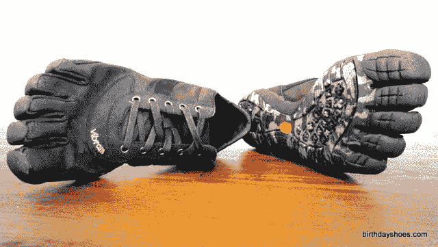
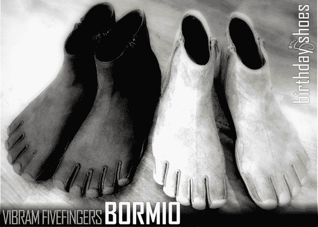

# Vibram Trek LS 和 Bormio:丑陋、疯狂的猴子鞋变得更加疯狂 TechCrunch

> 原文：<https://web.archive.org/web/http://techcrunch.com/2011/08/19/the-vibram-trek-ls-and-bormio-ugly-crazy-monkey-shoes-get-even-crazier/>

# Vibram Trek LS 和 Bormio:丑陋、疯狂的猴子鞋变得更加疯狂

我希望你没有吃任何东西，因为你马上就要看到一些真正的 Jame Gumb 的东西。Vibram 是 Sergey 的疯狂猴子鞋(我实际上在跑步时穿，这让我妻子很懊恼)的著名制造商，它发布了两个新型号，风格尚可的 Trek LS，一个系带的 trail 鞋/运动鞋，以及绝对令人讨厌(但奇怪地诱人)的 Bormio 靴子。

[BirthdayShoes](https://web.archive.org/web/20230203105206/http://birthdayshoes.com/) 对 [Bormio](https://web.archive.org/web/20230203105206/http://birthdayshoes.com/bormio-vibram-fivefingers-review) 和 [LS](https://web.archive.org/web/20230203105206/http://birthdayshoes.com/trek-ls-vibram-fivefingers-review) 都有评论，但我们将在下面强调几点。

LS 鞋更像是一款运动鞋，配有 Vibram 鞋底和鞋头口袋。如果你忽略猴子脚的话，它们实际上是非常优雅的。如果你足够男人，在街上穿它们，你实际上可能会得到赞美而不是责备。它们售价 139 美元，有棕色和黑色两种。

这是博尔米奥斯:

如果你和我一样，你现在正在想象霍比特人在他们的洞里。这些基本上都是带鞋头的靴子，这让它们看起来非常神奇。生日鞋注意事项:

> 就 Vibram FiveFingers 而言，Bormio 并不像乍一看那样引人注目——这是假设你穿着牛仔裤或裤子。显然，脚踝高度的设计让他们“空”坐在地板上时看起来非常不寻常(就像皮革或冻伤的脚在脚踝处被砍掉)，但正如 BirthdayShoes 夫人所说，当他们穿上时，Bormios 看起来就像任何其他的振动鞋一样。
> 
> 也就是说，除了一件事，那就是 Bormio FiveFingers 的低调设计也让人们更难看出你穿着鞋子。显然，没有人有扁平的黑脚(除了 Deeds 先生)，但是光滑的哑光皮革看起来有点像皮肤，尤其是棕色的 Bormios。你可以有深棕色的脚，我这么说是因为至少有一个人对我的棕色疯马 Bormios 有双重看法，认为我有晒黑的赤脚。如果你没注意到的话，我不是很黑(文书工作 FTL！).我的另一个朋友——当时是 VFF 的粉丝——说，“你有狮子般的脚力。”我更喜欢那样。

如果你一生都在想“我想要狮子的脚”，那么你显然很幸运。

这些恶魔般的东西售价 160 美元，有棕色和黑色两种颜色。两者都是由袋鼠皮制成的，我个人很好奇他们从哪里得到这些东西的袋鼠。

现在你知道了:这是蒂姆·费里斯(Tim Ferriss)、谢尔盖·布林(Sergey Brin)和所有阿谀奉承的 SXSW 搜索引擎优化(SEO )/社交媒体/谷歌(Google+ Guru)专家下一季要穿的鞋子。极客们，准备好穿上你们的猴脚吧。