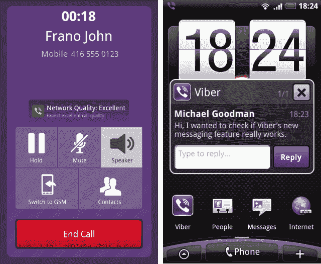

# 等待结束了:Viber 发布 Android 应用，拥有 1200 万活跃用户 

> 原文：<https://web.archive.org/web/https://techcrunch.com/2011/07/19/the-wait-is-over-viber-releases-android-app-boasts-12-million-active-users/>

# 等待结束了:Viber 发布了 Android 应用，拥有 1200 万活跃用户

让 [iPhone 用户](https://web.archive.org/web/20230203055707/https://techcrunch.com/2010/12/02/viber-iphone/)通过 3G 和 WiFi 免费给联系人打电话和[发信息](https://web.archive.org/web/20230203055707/https://techcrunch.com/2011/03/31/skype-challenger-releases-viber-2-0-free-text-messages-and-more/)的 Viber ，已经[戏弄](https://web.archive.org/web/20230203055707/https://techcrunch.com/2011/02/02/viber-android-video/)它的安卓应用有一段时间了。

去年 5 月，VoIP 初创公司终于[发布了一款安卓应用](https://web.archive.org/web/20230203055707/https://techcrunch.com/2011/05/04/viber-to-release-free-calling-messaging-app-for-android-this-week/)的测试版，但只面向大约 5 万名用户的有限子集。今天，他们正式为所有人推出应用程序[。](https://web.archive.org/web/20230203055707/https://market.android.com/details?id=com.viber.voip&feature=search_result)

该应用程序包括几个 Android 版本独有的功能，如每当收到 Viber 呼叫时的完整呼叫屏幕，弹出短信通知和默认拨号设置，允许用户使用 Viber 拨号程序进行所有电话呼叫。

Viber 还宣布，它已经获得了超过 1200 万活跃用户(过去 30 天，在 2000 万注册用户中)，并且每个季度的呼叫流量超过 10 亿分钟。

该公司表示，活跃用户平均每天在 Viber 上通话 1100 万分钟，平均每次通话 6 分钟。

[YouTube http://www.youtube.com/watch?v=0nQN5w5ct_E&w=640&h=390]