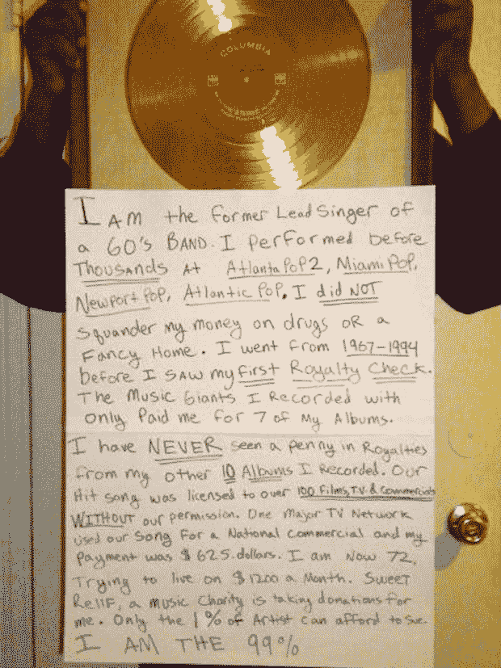

# 每周好:一个明星是(重新)出生，莱斯特钱伯斯的故事| TechCrunch

> 原文：<https://web.archive.org/web/https://techcrunch.com/2013/01/04/the-weekly-good-a-star-is-reborn-the-lester-chambers-story/>

**【注:这是每周一期的系列。如果你的公司正在做一些令人惊讶的事情来帮助慈善事业或在你的社区做一些好事，[请联系](https://web.archive.org/web/20230330234134/mailto:drew@beta.techcrunch.com)。]**

你的歌在 Billboard Hot 100 排行榜上名列第 11，你和你的兄弟们曾与披头士和吉米·亨德里克斯这样的人一起演奏，一切都很棒，你火了。你成功了，对吗？不对。[莱斯特·钱伯斯](https://web.archive.org/web/20230330234134/http://www.twitter.com/lesterchambers)就是一个活生生的例子，仅仅因为你变得“受欢迎”，并不意味着你会因此得到适当的回报。

莱斯特的故事是多方面的，始于 1966 年与“钱伯斯兄弟”发行的热门单曲“今天是时候了”这首歌你可能在广播、广告和许多越南题材的电影中听过。钱伯斯先生从唱片公司得到了少得可怜的 1300 美元，作为他的才华和与这首歌有关的工作的报酬。

回到 2012 年，莱斯特在 Reddit 上发布了一张自己的照片，这张照片你可能已经看过了:

 他的[甚至在](https://web.archive.org/web/20230330234134/http://www.reddit.com/r/IAmA/comments/14sk6a/i_am_lester_chambers_ama/)网站上做了一个 AMA(随便问我)。昨天大部分时间，我都和莱斯特、他的家人、乐队(Mud Stompers)以及 Reddit 的联合创始人亚历克西斯·奥哈尼安(Alexis Ohanian)在一起。我看到的是一群人想要纠正多年前发生在不知情的莱斯特·钱伯斯身上的错误。你看，莱斯特没有完全阅读他的合同，也没有要求律师这样做。可悲的是，他一次又一次地被利用，尽管唱片公司承诺“修复它”他们从未修复它，所以在 Ohanian 和 Reddit 的帮助下，互联网有机会再次闪耀。

[Spotify id = " Spotify:track:5 QA 1 zrjjvlh1 cl 9 gzofdnm " width = " 300 " height = " 380 "/]

### 社区的力量

由于莱斯特足够勇敢，在互联网上发布了那张照片，Reddit 上的人知道了他是谁，并把照片发给了 Ohanian。他向莱斯特伸出手，当莱斯特回应时，他感到很惊讶。其余的，正如他们所说，都是历史了。

社区的力量，无论大小、形状或形式如何，都是值得一看的奇迹。Reddit 一直以培养一种可以为公共利益服务的暴民心态而闻名。当奥哈尼安决定自己去对抗 SOPA 和琵琶时，这一点非常明显。最终，互联网赢了。

说到莱斯特和他的事业，你会发现他是一个出色而有才华的人，一个从未挥霍财富、吸毒、伤害任何人或做任何“错事”的人。他做错的是太在乎他最爱的东西，他的音乐。

> 当人们走过来对我说他们有我的音乐时，我不会问他们从哪里得到的，我只会说谢谢你的聆听。莱斯特·钱伯斯

### 为了对音乐的热爱

莱斯特昨天和我以及亚历克西斯分享的故事让我们大吃一惊。钱伯斯兄弟和甲壳虫乐队一起巡演，和吉米·亨德里克斯一起演奏，还有鲍勃·迪伦的粉丝——所有这些都是你作为一名崭露头角的艺术家所希望和祈祷的。莱斯特的故事应该有一个快乐的结局，就像这首音乐一样，但这是不可能的。

这种情况现在可以改变；莱斯特有了第二次机会。

> 当我们第一次看到我们的专辑封面“今天是时候了”时，上面有四个白人，而不是我和我的兄弟们。莱斯特·钱伯斯

莱斯特和他的兄弟们不仅被剥夺了版税，作为非裔美国人，他们受到了非人的待遇。当他们去巡回演出时，他们被迫和厨房工作人员一起坐在后排，希望得到一份“火腿三明治”或其他“残羹剩饭”钱伯斯家没有贵宾待遇。据莱斯特说，他们曾经被告知“我们不能允许四个黑人和一个白人鼓手在我们的舞台上面对白人观众表演。”这是错误的，我们现在知道了，但莱斯特必须经历过。

他的儿子迪伦像其他儿子一样看着莱斯特，眼中闪烁着光芒。不管事情变得多么糟糕，他总是为他的父亲和他的遗产感到骄傲。莱斯特和迪伦一度无家可归，家人的朋友小野洋子帮助了他们。是的，这些人是国家和全球的财富，但唱片公司不关心他们。

不过，互联网有。

### 启动

在奥哈尼安的帮助下，有一个 [Kickstarter 项目](https://web.archive.org/web/20230330234134/http://www.kickstarter.com/projects/1195088551/lesters-time-has-come-today)在短短五天内结束。自然，这笔钱将用于资助他和他的乐队“泥浆跺脚者”的下一张专辑。

> 如果你弹，我就唱。莱斯特·钱伯斯

> 如果你唱，我就弹。巴伦·蔡斯，泥踩者

迄今为止，已经有超过 2000 人筹集了超过 56000 美元，我想这张专辑可能是莱斯特有史以来最好的一张，如果仅仅是因为他对他如此热爱的音乐重新充满了信任和活力。他从未失去对音乐的热爱，但他的世界被别人对他的态度所打破。也许这一次，事情会有所不同；事实上，我知道他们会的。

昨晚，莱斯特和泥浆跺脚乐队在三藩市的合作空间 [WeWork Labs](https://web.archive.org/web/20230330234134/http://weworklabs.com/san-francisco/) 表演。我不确定那里有多少人，但是我听说有一百多人报名参加了免费问答和音乐会。请听莱斯特解释他与披头士的关系:

莱斯特珍惜他所拥有的一切，不管他经历了多少可怕的事情，他都不会渴望他没有的东西。所有这些最棒的部分是，你可以看到和感受到他对继续创作和分享音乐的道路是多么兴奋，这是并将永远是他所知的。

他的时代已经到来，今天，明天。下一个。莱斯特·钱伯斯的故事永远不会结束，他希望年轻的音乐家们能从他的困境中吸取教训，建议你在签订合同时“确保所有的细节都到位，所有的细节都在正确的地方交叉”。

跳上火车，你不需要车票或行李，[只需登上](https://web.archive.org/web/20230330234134/http://www.kickstarter.com/projects/1195088551/lesters-time-has-come-today)。

**如果你错过了我们之前的每周好片，看看这里的，[这里的](https://web.archive.org/web/20230330234134/https://techcrunch.com/2012/11/30/the-weekly-good-gurbaksh-chahal-beproud-org-and-putting-an-end-to-hate/)，[这里的](https://web.archive.org/web/20230330234134/https://techcrunch.com/2012/12/07/the-weekly-good-maya-baratz-and-hunter-walk-team-up-for-the-startup-chef-cookbook/)，[这里的](https://web.archive.org/web/20230330234134/https://techcrunch.com/2012/12/14/the-weekly-good-twitter-gives-back-with-tweet4good-heres-the-behind-the-scenes-look/)，[这里的](https://web.archive.org/web/20230330234134/https://techcrunch.com/2012/12/21/the-weekly-good-googles-director-of-giving-discusses-global-concerns-and-action/)，还有[这里的](https://web.archive.org/web/20230330234134/https://techcrunch.com/2012/12/28/the-weekly-good-donorschoose-and-big-hairy-audacious-goals-to-help-teachers/)。**