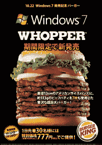

# Windows 7 汉堡王太恶心了

> 原文：<https://web.archive.org/web/https://techcrunch.com/2009/10/22/the-windows-7-burger-king-whooper-is-gross/>

# Windows 7 汉堡王太恶心了

 看那个巨型汉堡。它有五英寸高，当然是用七块牛肉饼做成的，以纪念 [Windows 7](https://web.archive.org/web/20230308181752/http://www.crunchgear.com/tag/windows-7/) 。这里有什么信息？吃这个汉堡感觉像 Windows 一样缓慢臃肿？我不明白。我也希望我们的日本读者不会真的买 777(8.50 美元)[汉堡](https://web.archive.org/web/20230308181752/http://www.burgerkingjapan.co.jp/news/win7.php)。但如果有人知道，给我们发张照片。我很想看看现实生活中的汉堡是如何伪装的。[via [ Electronista](https://web.archive.org/web/20230308181752/http://www.electronista.com/articles/09/10/21/microsoft.promos.win.7.with.bk.deal/)