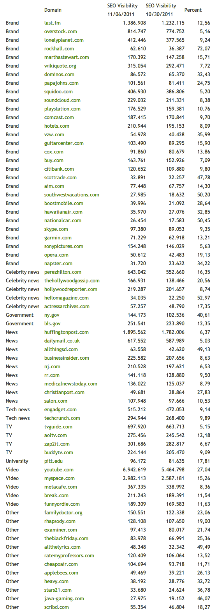
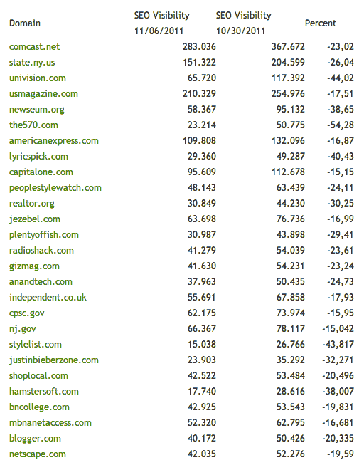

# 谷歌新鲜度更新的赢家和输家揭晓

> 原文：<https://web.archive.org/web/http://techcrunch.com/2011/11/07/the-winners-losers-of-googles-freshness-update-revealed/>

# 谷歌新鲜度更新的赢家和输家揭晓

搜索分析提供商 [Searchmetrics](https://web.archive.org/web/20230324115615/http://www.searchmetrics.com/) 周末研究了上周谷歌算法的[变化的影响——谷歌表示，这些变化将影响约三分之一的网络搜索。根据该公司的初步分析，像谷歌承诺的那样，拥有更新鲜、更新内容的网站，包括许多新闻网站、博客、广播公司和品牌网站，确实从更新中得到了促进。这包括 TechCrunch 母公司《赫芬顿邮报》、《Salon.com》、英国《每日邮报》等网站，以及一些博客、名人新闻网站和大量品牌。](https://web.archive.org/web/20230324115615/https://techcrunch.com/2011/11/03/googles-new-algorithm-update-impacts-35-of-searches/)

然而，在这些变化后失去搜索引擎优化可见性的网站似乎并不代表任何一个群体，因为它们也包括一些品牌，博客，广播公司，甚至谷歌自己的 Blogger.com，下降了 20%以上。

上周，谷歌宣布了最新的算法更新，作为其之前“咖啡因”更新的延伸。所谓的“新鲜度更新”旨在提供更多当前和相关的搜索结果，特别是在最新内容重要的领域。这包括时事、热门话题、评论和突发新闻。

为了确定各种网站是如何受到影响的， [Searchmetrics](https://web.archive.org/web/20230324115615/http://www.searchmetrics.com/) 使用自己的 SEO 数据库进行分析，该数据库使用“SEO 可见性”指标对网站进行排名。该指标基于关键词的搜索量、搜索类型(信息、导航或交易)以及相关 URL 的排名。

在最初的赢家和输家名单中(见下文)，Searchmetrics 提供了截止到 10 月 30 日的网站 SEO 可见性和截止到 11 月 6 日的当前排名。百分比变化也显示在最右边，而站点类型显示在最左边。

**获奖者**

**失败者**

完整的列表也可以在 Searchmetrics [博客](https://web.archive.org/web/20230324115615/http://blog.searchmetrics.com/us/2011/11/06/google-freshness-update-many-winners-few-losers/)上找到，在那里你可以点击各个 URL 来查看更多细节的变化。Searchmetrics 的软件可以在[这里](https://web.archive.org/web/20230324115615/http://suite.searchmetrics.com/en/research/domains/visibility)买到。

*图片来源:Searchmetrics*